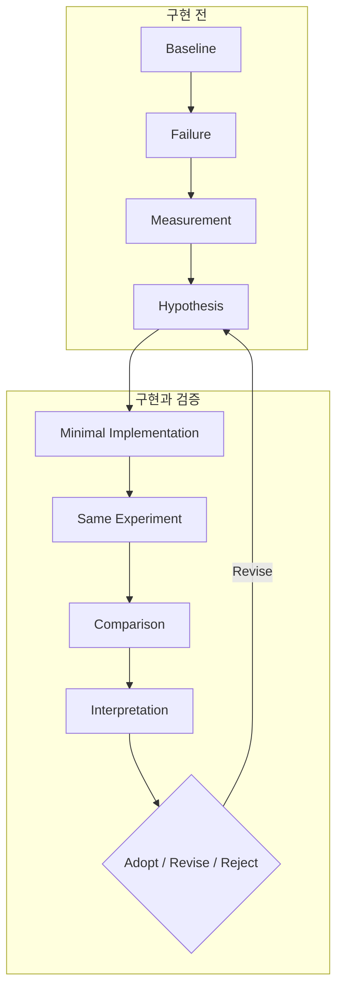

# 접근 방식

## Lab의 진행 방식

모든 Lab은 다음 사이클을 거친다.

| 단계 | 하는 일 |
| --- | --- |
| Baseline | 바꾸기 전의 harness를 commit이나 tag로 고정한다 |
| Failure | baseline으로 task를 실행해 실제 실패를 재현한다 |
| Measurement | 그 실패를 어떤 지표로 관찰할지 정하고 측정한다 |
| Hypothesis | 무엇을 바꾸면 무엇이 좋아질지, **어떤 결과가 나오면 가설을 버릴지** 적는다 |
| Minimal Implementation | 가설을 검증하는 데 필요한 최소한만 바꾼다 |
| Same Experiment | baseline과 같은 조건으로 다시 실행한다 |
| Comparison / Interpretation | 무엇이 달라졌는지, 그것으로 무엇을 말할 수 있고 무엇은 아직 모르는지 정리한다 |
| Adopt / Revise / Reject | 변경을 채택하거나, 가설을 고쳐 다시 하거나, 버린다 |

> [!IMPORTANT]
> 가설이 틀려도 실험 결과와 해석은 문서에 그대로 남긴다.

## 가설에는 기각 조건이 있어야 한다

가설은 구현하기 전에 적는다. 최소한 다음 네 가지가 들어가야 한다.

1. 무엇을 바꾸는가
2. 무엇이 개선될 것으로 예상하는가
3. 어떤 지표로 판단하는가
4. 어떤 결과가 나오면 가설을 기각하는가

예를 들어 "전용 검색 tool이 bash만 쓸 때보다 관련 파일에 도달하기까지의 tool 호출 수와 context 사용량을 줄일 것이다"라는 가설이라면, "tool 호출 수가 줄지 않거나 task 성공률이 떨어지면 기각한다"까지 적는다.

## 같은 조건으로 다시 측정한다

가능한 한 다음을 그대로 유지하고 baseline과 비교한다.

- model과 설정
- task와 repository 상태
- budget (최대 turn 수, 시간 제한 등)
- 판정 규칙

실험 조건은 구현을 시작하기 전에 Lab 정의 파일(`evals/labs/hXX.yaml`)로 고정한다. 결과를 본 뒤에 조건을 바꿨다면 무엇을 왜 바꿨는지, 바뀐 결과를 어떻게 해석할지 다시 기록한다.
