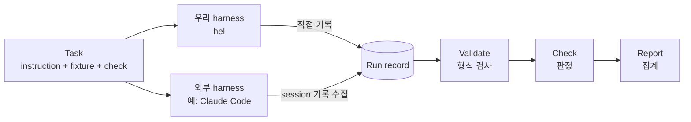

# 측정 방법

## 한눈에 보기



1. **Task**는 harness 바깥에 있다. 어떤 harness든 같은 task를 받는다.
2. 각 harness를 실행한 결과는 같은 형식의 **run record**로 남는다.
3. record의 형식 검사를 진행한 뒤, task에 정의된 기준으로 **판정**하고, 여러 run을 **집계**한다.

## Task

task는 세 부분으로 이루어진다.

| 구성 | 내용 |
| --- | --- |
| instruction | harness에 그대로 전달하는 자연어 지시 |
| fixture | run마다 새 임시 디렉터리로 복사되어 harness의 작업 디렉터리가 되는 파일들 |
| checks | 결과를 판정하는 규칙 |

H0의 첫 task는 이렇게 생겼다.

```yaml
id: read-echo-01
instruction: >
  Read the file hello.txt and print its contents exactly as they are.
  Do not add anything else.
fixture: fixture/          # 안에 hello.txt가 있다
checks:
  - id: output-exact       # 최종 출력이 hello.txt 내용과 같은가
    type: output_exact_match
    expected_file: fixture/hello.txt
  - id: single-read        # 읽기 tool을 정확히 한 번, hello.txt에 대해 호출했는가
    type: tool_calls
    category: read
    count: 1
    path: hello.txt
    not_applicable: [baseline]
```

Lab 별로 확인할 규칙이 달라진다. H0에서는 두 가지뿐이다.

| check | 판정 |
| --- | --- |
| `output_exact_match` | 최종 출력이 기대 파일과 같다. 양쪽 끝의 줄바꿈 하나만 무시하고, 공백 정리나 code fence 제거 같은 다른 보정은 하지 않는다 |
| `tool_calls` | 지정한 범주의 tool 호출이 정확히 N회이고, 대상 경로가 맞다 |

## 비교 조건

한 실험에는 보통 세 종류의 조건이 있다.

| 조건 | 의미 |
| --- | --- |
| `baseline` | 이번 Lab에서 바꾸기 전의 harness |
| `variant` | 이번 Lab에서 바꾼 harness. 가설 검증 대상 |
| `external-<이름>` | 외부 harness. 같은 task를 같은 절차로 실행해 직접 만든 harness와 비교 |

H0를 예로 들면 baseline은 tool 없이 model을 한 번 호출하는 프로그램이고, variant는 loop와 파일 읽기 tool을 붙인 harness다. external은 같은 model로 실행한 Claude Code다.

## Run record

run 하나가 끝나면 다음이 남는다.

```text
results/<lab>/<run-id>/
├── record.json      # 무슨 일이 있었는가 (수집 결과)
├── verdict.json     # 판정 결과
└── raw/             # 원본 기록 사본
```

record에는 사실만 담고, 판정은 따로 둔다. record에 담기는 주요 항목은 다음과 같다.

| 항목 | 예 |
| --- | --- |
| 실행 식별자 | 실험 ID, task, 조건, 반복 번호, 시작과 종료 시각 |
| harness | 이름, 버전(commit), 비교 등급 |
| model | 요청한 model, **실제로 응답한 model**, 설정값 |
| 결과 | 최종 출력, 종료 사유(완료, 최대 turn, 시간 초과, 오류) |
| 비용 | 입력/출력 token, model 호출 수, 걸린 시간 |
| tool 호출 | 순서, 공통 범주(read / search / edit / exec / other), 원래 이름, 인자, 성공 여부 |

### 모르는 값은 모른다고 적는다

외부 harness에서는 어떤 값을 얻을 수 없을 때가 있다. 그럴 때 0이나 빈 값을 넣으면 "token을 하나도 안 썼다"처럼 잘못 읽힌다. 그래서 수치 항목에는 값과 함께 상태를 붙인다.

```json
"input_tokens": { "value": 812, "status": "measured" }
```

| 상태 | 의미 |
| --- | --- |
| `measured` | 기록이나 API 응답에서 직접 얻은 값 |
| `derived` | 다른 값에서 계산한 값 |
| `unavailable` | 이 harness에서는 얻을 수 없는 값 (`value`는 `null`) |

## 외부 harness와 비교하기

외부 harness는 우리 코드가 아니므로 내부를 바꿀 수 없다. 대신 harness마다 **collector**를 하나 만들어, 그 harness가 남긴 session 기록을 같은 형식의 record로 바꾼다. 새 harness를 추가할 때 바뀌는 부분은 실행 방법(driver)과 collector뿐이고, 판정과 집계는 모든 harness가 같은 코드를 쓴다.

외부 harness의 결과는 어떤 model로 실행했는지에 따라 다르게 해석한다.

| 등급 | 의미 | 해석 |
| --- | --- | --- |
| `same-model` | 우리 실험과 같은 model로 실행 | harness의 차이 확인 가능 |
| `reference` | 다른 model로만 실행 가능 | 참고용으로만 사용 |

외부 harness는 실행할 때마다 별도의 설정 디렉터리를 쓰고, 사용자의 설정, plugin, memory를 읽지 않게 격리해서 실행해야 한다.
