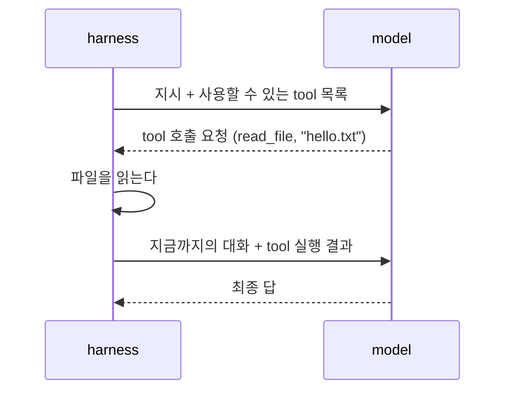

# H0 — Hello Harness!

> [!NOTE]
> - 시작 상태: `h00` tag · 완료 상태: `h01` tag *(예정)*
> - 논문: [§6 Agent Loop Design](https://arxiv.org/html/2609.00006v1#S6), [§7 LLM Integration and Model–Agent Co-design](https://arxiv.org/html/2609.00006v1#S7)

```bash
git checkout -b my-h00 h00
```

LLM을 agent로 만드는 최소 구조는 무엇인가?

## 들어가며

### tool calling과 agent loop

model은 텍스트를 받아 텍스트를 만든다. 이게 model이 할 수 있는 전부다. 파일을 읽거나 명령을 실행하진 못한다. 이러한 model이 바깥세상에 영향을 주려면 harness가 그 일을 대신 해 줘야 한다. 이때 쓰는 방식이 **tool calling**이다.



- model은 tool을 실행하지 않는다. "이 tool을 이 인자로 호출해 달라"는 요청을 harness에게 전달한다.
- harness는 요청받은 tool을 실행하고, 결과를 대화에 붙여 model을 다시 부른다.
- model은 이전 호출을 기억하지 못한다. 그래서 harness는 이전 대화 정보를 누적해 다시 보낸다.

그리고 이 반복을 **agent loop**라고 부른다. 이번 Lab에서는 model이 tool 호출 없이 답하면 loop가 종료되도록 설정할 것이다.

tool 목록과 tool 호출 요청을 주고받는 형식은 공식 표준이 없다. provider마다 API 형식은 다르지만, OpenAI Chat Completions 형식을 다른 provider도 지원("OpenAI 호환")하면서 사실상 많이 쓰이는 형식이 되었다(2026-10 기준).

| | [OpenAI Chat Completions](https://developers.openai.com/api/docs/guides/function-calling) | [Anthropic Messages](https://platform.claude.com/docs/en/agents-and-tools/tool-use/overview) |
| --- | --- | --- |
| tool 목록 | `tools[].function` (`name`, `description`, `parameters`) | `tools[]` (`name`, `description`, `input_schema`) |
| tool 호출 요청 | assistant message의 `tool_calls`. 인자는 JSON 문자열 | content의 `tool_use` block. 인자는 JSON 객체 |
| tool 결과 | `role: "tool"` message | user message 안의 `tool_result` block |

두 형식 모두 tool의 인자를 JSON Schema로 정의한다. model 내부에서 tool 정의와 호출이 어떤 텍스트로 바뀌는지는 provider가 처리하고 API 밖으로 드러나지 않는다. 이 Lab의 `hel`은 OpenAI 호환 형식을 쓴다. DeepSeek는 두 형식을 모두 제공해서([OpenAI 호환](https://api-docs.deepseek.com/guides/tool_calls/), [Anthropic 호환](https://api-docs.deepseek.com/guides/anthropic_api/)), Anthropic 형식을 쓰는 Claude Code도 같은 model로 실행할 수 있다.

### agent loop란?

[Harness Engineering 논문](https://arxiv.org/html/2609.00006v1)은 coding harness 11개를 소스 코드로 분석했다. agent loop를 다루는 §6의 내용은 이렇다.

- agent loop는 model 추론과 action 실행을 번갈아 하고, 언제 멈출지와 실패했을 때 어떻게 할지를 정하는 harness의 뼈대다.
- loop의 형태는 세 가지로 나뉜다.

| 형태 | 내용 | 예 |
| --- | --- | --- |
| 반복형(action-observation) | 행동하고 결과를 보고 다음 행동을 정함 | 11개 중 9개 |
| 되돌아보기 추가형(reflection) | 결과를 검토하는 단계를 loop에 추가 | Aider |
| 조정자-작업자형(coordinator-worker) | 한 agent가 작업을 나눠 다른 agent에게 맡김 | Claude Code, Codex |

- 같은 반복형 안에서도 구현 차이가 크다. Mini-SWE-Agent는 bash 위의 단순한 while loop이고, OpenHands는 대화를 event 기록으로 남기며, Claude Code는 응답을 streaming으로 받으면서 tool을 동시에 실행하고, Codex는 비동기 state machine으로 만들었다.
- 논문은 loop가 정교하다고 task를 더 잘 끝내지는 않는다고 본다. 약 100줄인 Mini-SWE-Agent가 훨씬 복잡한 OpenHands와 비슷한 결과를 낸다고 했다.

model 호출을 다루는 §7에는 이번 Lab과 관련된 내용이 두 가지 있다.

- prompt를 만드는 방식은 템플릿 하나로 한 번에 만드는 것(Mini-SWE-Agent)부터 여러 단계로 조립하고 cache 경계를 두는 것(Claude Code)까지 다양하다.
- model provider와 묶이는 정도도 다르다. 한 provider에 맞춰 만든 harness가 있고, 여러 provider를 추상화한 harness가 있다.

### 참고 자료

- [Mini-SWE-Agent](https://github.com/SWE-agent/mini-swe-agent)는 약 100줄이다. tool calling API를 쓰지 않고, model이 쓴 텍스트에서 bash 명령을 찾아 실행한다. 대화는 순서대로 쌓기만 한다.

## 이번에 해볼 것

`h00`에는 실행 기록 형식(`crates/record`)과 측정 도구(`crates/evals`)만 있고 harness는 없다. 여기서부터 직접 harness `hel`을 처음부터 만든다.

먼저 만드는 것은 model을 한 번만 부르는 프로그램이다. model에게 지시를 보내고 받은 답을 출력하고 끝난다.

이 프로그램에 "hello.txt를 읽고 내용을 그대로 출력하라"고 지시하면 model은 파일을 읽을 방법이 없다. 실제로 실행하면 model은 파일에 접근할 수 없다고 답한다.

이 Lab에서 확인할 수 있는 내용은 이렇다.

- model API를 직접 호출하는 방법과 응답 구조
- tool 정의, tool 호출 요청, tool 결과가 오가는 형식
- agent loop의 시작과 끝을 정하는 조건
- loop가 token 사용량을 어떻게 바꾸는가

논문의 분류로 보면 가장 단순한 반복형 loop이고, Mini-SWE-Agent 쪽 끝에서 출발한다. 다른 점은 두 가지다. 텍스트에서 명령을 찾는 대신 API의 tool calling을 쓰고, bash 대신 파일 읽기 전용 tool `read_file` 하나만 둔다. tool 등록 구조는 만들지 않는다. tool이 하나뿐이라 아직은 필요가 없다.

## 실습

### 1. model을 한 번 호출하기

workspace에 `hel` crate를 만든다. workspace 안에서는 `--vcs none`을 붙여야 crate 폴더에 `.git`이 생기지 않는다.

```bash
cargo new --vcs none crates/hel
```

`crates/hel/Cargo.toml`에 쓰는 의존성은 이렇다.

```toml
[dependencies]
record = { path = "../record" }
reqwest = { version = "0.13", features = ["blocking", "json"] }
serde = { version = "1", features = ["derive"] }
serde_json = "1"
humantime = "2"
```

DeepSeek Chat Completions API에 지시 하나를 보내고 답을 출력하는 프로그램을 만든다. 요청은 이렇게 생겼다.

```text
POST https://api.deepseek.com/chat/completions
Authorization: Bearer $DEEPSEEK_API_KEY

{
  "model": "deepseek-flash",
  "messages": [{ "role": "user", "content": "<지시>" }],
  "max_tokens": 8192
}
```

응답에서 쓰는 필드는 네 가지다.

| 필드 | 용도 |
| --- | --- |
| `choices[0].message.content` | 최종 답 |
| `choices[0].finish_reason` | 종료 사유. `length`면 출력 token 한도에 걸림 |
| `usage.prompt_tokens`, `usage.completion_tokens` | 사용한 token |
| `model` | 실제로 응답한 model |

> [!WARNING]
> reqwest의 blocking client는 기본 timeout이 30초다. reasoning이 긴 응답은 30초를 넘을 수 있으므로 timeout을 직접 지정한다.

다 만들었으면 직접 실행해 본다.

```bash
cd evals/tasks/read-echo-01/fixture
```

```bash
cargo run -p hel -- --instruction "Read the file hello.txt and print its contents exactly as they are."
```

`hel`은 실행한 폴더를 작업 디렉터리로 쓴다. 이 폴더에는 `hello.txt`가 있지만, 지금의 `hel`은 model에게 지시만 전달하므로 model은 파일에 접근할 수 없다고 답한다.

### 2. `evals`로 지금 상태 확인하기

`evals`는 task를 실행하고 채점하는 도구다. 저장소 루트에서 설치한다.

```bash
cargo install --path crates/evals --locked --target-dir target
```

task 하나를 실행해 본다. `--build`는 설치된 `hel` 대신 작업 중인 코드를 빌드해서 쓴다는 뜻이다.

```bash
evals try read-echo-01 --build
```

출력은 이런 순서로 나온다.

| 항목 | 내용 |
| --- | --- |
| `task` | task ID, 실행한 harness와 버전, model |
| `input` | harness에 전달한 지시 |
| `tool calls` | harness가 실행한 tool 호출. 지금은 `(none)` |
| `output` | 최종 출력 |
| `checks` | 채점 결과. `output-exact`는 출력이 파일 내용과 같은지, `single-read`는 읽기 tool을 정확히 1번 호출했는지 본다 |
| `usage` | input/output token, model 호출 수, 걸린 시간 |
| `saved` | 기록이 저장된 폴더 (`results/try/`) |

지금은 `output-exact`가 실패한다. 코드를 고치기 전에 이 상태를 기록해 둔다. `baseline`은 Lab을 시작한 상태를 가리키는 이름이다.

```bash
evals run h00 --conditions baseline --build
```

같은 task를 3번 실행해 `results/h00/`에 기록한다. 코드를 고친 뒤에는 이 상태로 돌아가 다시 기록할 수 없으므로 지금 해 둔다.

### 3. `read_file` tool 붙이기

요청에 `tools`를 붙이면 model이 이 tool을 호출할 수 있다. tool을 따로 등록하는 절차는 없다. provider가 tool 정의를 model 입력에 넣고, model은 tool을 부를지 직접 답할지 정한다. model이 tool을 부르면 provider가 그 출력을 `tool_calls`로 바꿔 돌려준다. 실행은 harness가 한다.

아래 예시는 OpenAI Chat Completions 양식을 바탕으로 `tools[].function`을 작성한 것이다.

```json
{
  "type": "function",
  "function": {
    "name": "read_file",
    "description": "Read a UTF-8 text file in the working directory and return its full contents.",
    "parameters": {
      "type": "object",
      "properties": {
        "path": { "type": "string", "description": "Path of the file, relative to the working directory." }
      },
      "required": ["path"]
    }
  }
}
```

tool을 실행할 때는 경로를 작업 디렉터리 기준으로 정규화하고, 작업 디렉터리 밖이면 거부한다. model이 요청한 파일 내용은 그대로 API로 전송되기 때문이다. 오류도 text로 model에 돌려준다.

### 4. agent loop 만들기

```text
messages = [user 지시]
최대 turn 수만큼 반복:
    응답 = model 호출(messages, tools)
    messages에 응답의 assistant message를 그대로 추가
    tool 호출이 없으면 → content가 최종 답, 종료
    tool 호출마다:
        결과 = tool 실행
        messages에 { role: "tool", tool_call_id, content: 결과 } 추가
최대 turn 수에 닿으면 → 종료
```

- tool 호출의 `function.arguments`는 JSON을 문자열로 담은 값이다. 한 번 더 parse해야 한다.
- assistant message는 고치지 않고 그대로 다시 보낸다. thinking이 켜진 model은 `reasoning_content`도 함께 온다.

### 5. 실행 기록 남기기

`evals`가 채점하려면 `hel`이 실행 기록(record)을 남겨야 한다. `evals`는 `--context`로 실행 정보를 넘기고, `--record`로 기록할 경로를 준다. 형식은 `evals/schema/record.md`, 실행 규약은 `evals/harnesses/hel/PROFILE.md`에 있다.

- tool 호출마다 `events`에 이름, 인자, 성공 여부를 남긴다.
- 원본 요청과 응답은 `raw/`에 남기되 `Authorization` header는 저장하지 않는다.

`read_file`처럼 결과를 미리 정할 수 있는 부분은 test로 확인한다.

```bash
cargo test -p hel
```

## 결과 확인

같은 task(`read-echo-01`)를 조건마다 3번씩 실행했다. 단발 호출은 실습 2단계에서 남긴 기록이고, loop + `read_file`은 5단계까지 마친 `hel`이다. Claude Code도 같은 model(`deepseek-flash`)로 실행했고 읽기 tool(`Read`)만 열어 두었다.

```bash
evals run h00 --conditions variant --build
```

```bash
evals run h00 --conditions external-claude-code
```

```bash
evals report h00
```

| | 단발 호출 | loop + `read_file` | Claude Code |
| --- | --- | --- | --- |
| `output-exact` | 0/3 | 3/3 | 3/3 |
| 읽기 tool 호출 | 0회 | 3번 모두 1회 | 3번 모두 1회 |
| model 호출 | 1 | 2 | 2 |
| input / output token (평균) | 50 / 528 | 755 / 94 | 1274 / 104 |
| 걸린 시간 (평균) | 3.4초 | 1.8초 | 2.0초 |

### 단발 호출

3번 모두 파일에 접근할 수 없다고 답했다.

```text
I don't have access to the file hello.txt.
I can’t access local files.
I can't access the file hello.txt.
```

출력 token은 368–721이었고, 거의 전부가 reasoning이었다(예: 721 중 709).

### loop + `read_file`

3번 모두 같은 순서로 끝났다. 첫 번째 run의 요청과 응답 원본(`raw/requests.jsonl`)을 [들어가며](#tool-calling과-agent-loop)의 다이어그램 순서대로 보면 이렇다. 반복되는 tool 정의는 생략했다.

**① harness → model: 지시 + 사용할 수 있는 tool 목록**

```json
{
  "model": "deepseek-flash",
  "max_tokens": 8192,
  "messages": [
    { "role": "user", "content": "Read the file hello.txt and print its contents exactly as they are. Do not add anything else.\n" }
  ],
  "tools": [{
    "type": "function",
    "function": {
      "name": "read_file",
      "description": "Read a UTF-8 text file in the working directory and return its full contents.",
      "parameters": {
        "type": "object",
        "properties": { "path": { "type": "string", "description": "Path of the file, relative to the working directory." } },
        "required": ["path"]
      }
    }
  }]
}
```

**② model → harness: tool 호출 요청**

model은 답(`content`) 대신 `read_file`을 고르고 인자를 채웠다. `finish_reason`이 `"tool_calls"`이고, `arguments`는 JSON이 문자열에 담겨 온다.

```json
{
  "finish_reason": "tool_calls",
  "message": {
    "role": "assistant",
    "content": "",
    "reasoning_content": "The user wants me to read hello.txt and print contents exactly. Let me read the file. Note: I should call the tool first.",
    "tool_calls": [{
      "id": "call_00_C5bVwDYo0rT2WV3hSk0T4242",
      "type": "function",
      "function": { "name": "read_file", "arguments": "{\"path\": \"hello.txt\"}" }
    }]
  }
}
```

**③ harness: 파일을 읽는다**

`hel`이 `name`으로 `read_file`을 찾고, `arguments`를 parse해 `hello.txt`를 읽었다. 결과는 `Hello, harness!\n`이다.

**④ harness → model: 지금까지의 대화 + tool 실행 결과**

```json
"messages": [
  { "role": "user", "content": "Read the file hello.txt and print its contents exactly as they are. Do not add anything else.\n" },
  { "role": "assistant", "content": "", "reasoning_content": "The user wants me to ...", "tool_calls": [ ...②와 같음... ] },
  { "role": "tool", "tool_call_id": "call_00_C5bVwDYo0rT2WV3hSk0T4242", "content": "Hello, harness!\n" }
]
```

②의 assistant message를 그대로 붙이고, tool 결과는 `tool_call_id`로 어떤 호출의 결과인지 표시한다. tool 목록도 다시 보낸다.

**⑤ model → harness: 최종 답**

```json
{
  "finish_reason": "stop",
  "message": { "role": "assistant", "content": "Hello, harness!", "reasoning_content": "" }
}
```

`tool_calls`가 없으므로 loop가 끝났다.

tool이 하나뿐이라 model이 고를 수 있는 것은 `read_file`을 부르거나 바로 답하는 것 두 가지였다. 여러 tool 중에서 고르는 모습은 tool이 늘어나는 이후 Lab에서 볼 수 있다.

두 번째 호출의 reasoning은 3번 중 2번이 0 token이었고, 1번은 46 token이었다.

### Claude Code

3번 모두 `Read`를 1번 부르고 `Hello, harness!`를 출력했다. `hel`과 다른 점은 두 가지다.

- 경로를 절대 경로로 넘겼다. `hel`에서는 3번 모두 `hello.txt`였다.
- 읽기 결과에 줄 번호와 탭이 붙어 있었다. 파일 끝의 줄바꿈 때문에 빈 2번째 줄도 함께 왔다(`\t`는 탭).

```text
1\tHello, harness!
2\t
```

model은 번호를 떼고 내용만 출력했다.

같은 model이지만 Claude Code는 Anthropic 형식으로 주고받았다. tool 호출 요청은 `tool_use` block으로 오고 인자는 JSON 객체다.

```json
{ "type": "tool_use", "id": "call_00_...", "name": "Read", "input": { "file_path": "/.../hello.txt" } }
```

```json
{ "type": "tool_result", "tool_use_id": "call_00_...", "content": "1\tHello, harness!\n2\t" }
```

## 돌아보기

### 무엇이 달라졌나

harness를 달아주니 model이 파일을 읽을 수 있게 됐다. model의 능력은 그대로이고, 바뀐 것은 harness가 model 대신 파일을 읽어 준다는 점이다.

### 대가는 무엇인가

token 사용량을 호출별로 보면 이렇다(run 하나 기준).

| | 호출 | input | output (그중 reasoning) |
| --- | --- | --- | --- |
| 단발 호출 | 1 | 50 | 721 (709) |
| loop + `read_file` | 1 | 333 | 67 (28) |
| | 2 | 416 | 5 (0) |

- **input은 늘었다.** 매 호출에 tool 정의(약 280 token)가 붙고, 두 번째 호출에는 첫 응답과 tool 결과까지 다시 보낸다. loop가 길어질수록 다시 보내는 대화도 길어진다.
- **output은 줄었다.** 단발 호출에서 model은 파일을 읽을 수 없는 상황에서 어떻게 답할지 709 token 동안 고민했다. tool이 있으면 28 token 만에 `read_file`을 부르기로 했고, 결과를 받은 뒤에는 고민 없이 내용을 출력했다.

지금은 호출 두 번이라 비용이 작지만, tool 호출이 많아지면 매번 다시 보내는 대화가 비용의 대부분이 된다. Production 레벨의 harness는 이러한 문제를 고민하고 해결하기 위해 메모리 관리와 compaction을 제공한다. 우리도 추후에 이를 다룰 것이다.

### 논문의 내용 또는 다른 harness와 비교하면

- **Claude Code**: §7의 여러 단계 prompt 조립이 첫 호출 크기에 보인다.

| | `hel` | Claude Code |
| --- | --- | --- |
| 첫 호출 input token | 333 | 581 |
| 두 번째 호출 input token (그중 cache) | 407–444 (256) | 690–698 (512) |
| 읽기 tool 결과 | 파일 내용 그대로 | 줄마다 번호와 탭을 붙여 전달 |

- system prompt와 tool 설명이 길어서 첫 호출이 더 크다. 실제 개발 작업 전반을 다루려면 model에게 알려줄 것이 많다.
- 줄 번호는 파일의 특정 위치를 가리킬 때 유용한 출력 형식이 될 것이다.
- 두 harness 모두 두 번째 호출의 앞부분을 provider cache에서 읽었다. DeepSeek API는 앞부분이 같은 요청을 [자동으로 cache한다](https://api-docs.deepseek.com/guides/kv_cache)(2026-10 기준). `hel`은 cache를 따로 요청하지 않았다. 대화가 길어질수록 의미가 커진다.
