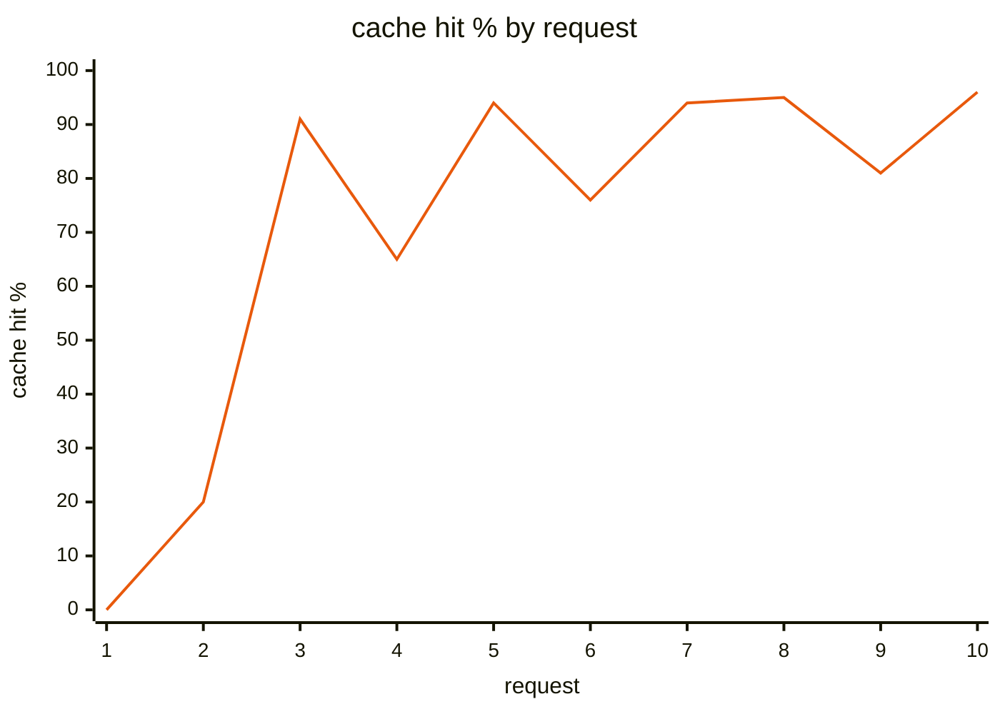
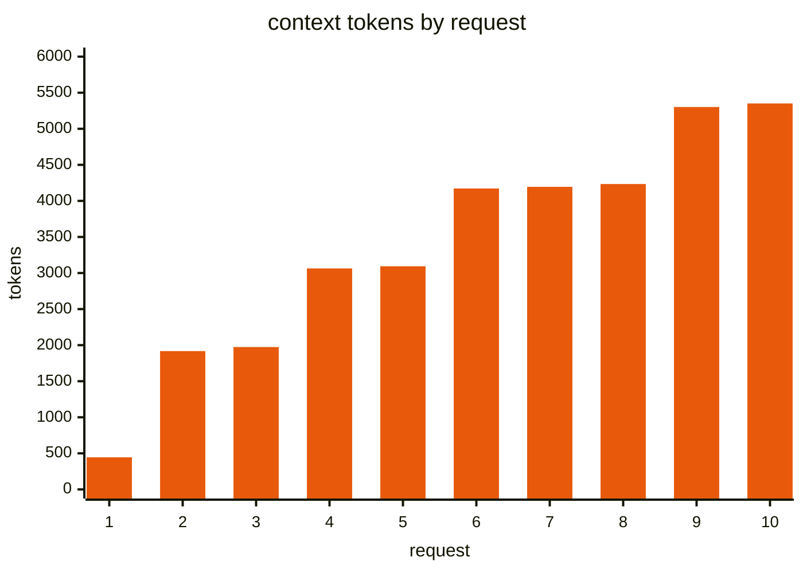
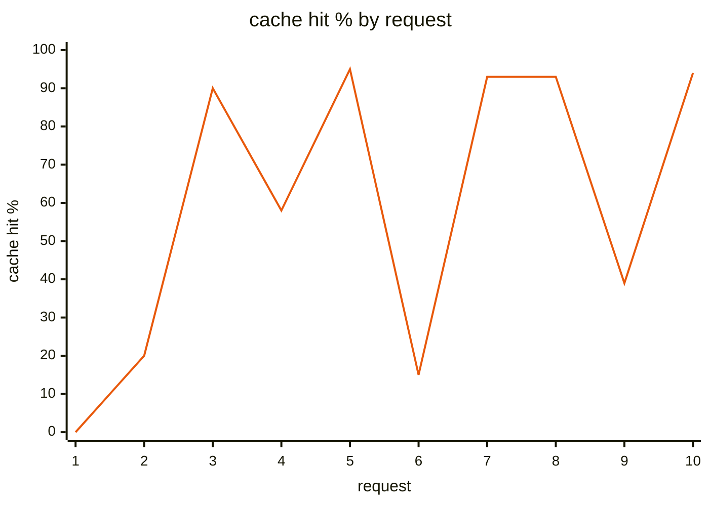
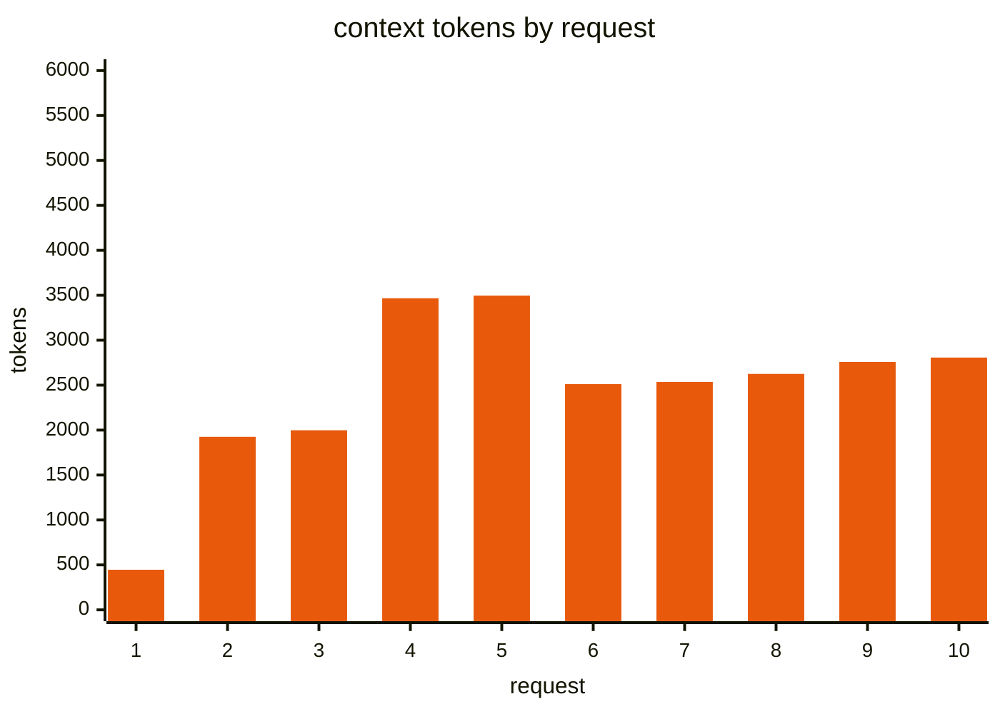

# H6 — Compaction

> [!NOTE]
> - 시작 상태: [`h06`](https://github.com/jammer-droid/HEL/tree/h06) · 완료 상태: [`h07`](https://github.com/jammer-droid/HEL/tree/h07)
> - 논문: [§9.5 Threshold Compaction](https://arxiv.org/html/2609.00006v1#S9.SS5), [§16.5 Memory and Context](https://arxiv.org/html/2609.00006v1#S16.SS5)

```bash
git checkout -b my-h06 h06
```

기존 작업과 같은 환경에서 compaction을 일찍 일으킨 뒤 이어서 작업하면, 작업은 계속되고 호출마다 cache hit는 다시 올라가는가?

## 들어가며

### 논문이 본 compaction

[§9.5](https://arxiv.org/html/2609.00006v1#S9.SS5)에 정리된 시스템들은 context가 기준에 닿으면 compaction(컨텍스트 압축)을 한다. model에게 오래된 대화를 요약하게 하고 최근 기록 일부를 원문으로 남기는 방식이다. [Recommendation 7](https://arxiv.org/html/2609.00006v1#S16.SS5)은 이 방식에 더해 이전 요약에 새 내용을 합치고, window를 넘는 오류가 나면 같은 압축을 실행하라고 권한다. 근거는 여러 시스템이 같은 구조로 모였다는 관찰이고, 압축 뒤에 작업이 이어지는지나 cache 비용이 얼마인지는 측정하지 않았다.

### 이번 Lab에서 다룰 compaction

[H5](../h05-context-budget/README.md)에서 정한 압축 구조를 `hel`에 만든다.

압축하면 그 뒤의 기록은 앞이 바뀌었기 때문에 cache hit에 실패한다. 이번에는 이 하락을 확인하는 데서 멈추지 않고, 압축 뒤에 작업을 이어 가면서 호출마다 cache hit가 어떻게 다시 쌓이는지 본다. 실제 window(1M token)까지 채우지 않고, 압축 기준을 낮춰 기존 작업 도중에 압축이 일어나게 한다.

### 참고 자료

- [Codex의 context budget](../h05-context-budget/codex.md)
- [DeepSeek Harness의 context budget](../h05-context-budget/deepseek-harness.md)

## 이번에 해볼 것

지금까지의 작업은 지시 하나에 호출 3~6번으로 끝나서, 압축이 일어난 뒤 cache hit가 다시 오르는 과정을 볼 구간이 없었다. 그래서 한 세션에서 지시 6개를 차례로 보내는 작업을 새로 만들었다. 작업 디렉터리에는 서비스 설정 파일 4개(`alpha`, `bravo`, `charlie`, `delta`)가 있고, 파일 하나가 6KB 정도라 읽을 때마다 context가 크게 늘어난다.

| 순서 | 지시 | 확인할 것 |
| --- | --- | --- |
| 1~3 | alpha, bravo, charlie 파일을 읽고 port만 답하라 | 요청이 이어질수록 cache hit가 오르는지 |
| 4 | 파일을 다시 읽지 말고 alpha의 owner를 답하라 | 압축 뒤에도 앞에서 읽은 내용이 남아 있는지 |
| 5 | delta 파일을 읽고 port만 답하라 | 압축 뒤 cache hit가 다시 오르는지 |
| 6 | 파일을 다시 읽지 말고 `OWNER:SUM` 형식으로 alpha의 owner와 port 4개의 합을 답하라 | 마지막 답이 `mira:29900`과 같은지 |

지시마다 tool 호출과 답으로 요청이 1~2번 생겨서 한 세션은 요청 10번 정도가 된다. 압축 기준을 낮춰 3번 지시 뒤에 압축이 일어나게 하고, 압축 없이 같은 세션을 실행했을 때와 요청 순서별 cache hit와 context 크기를 그래프로 비교한다. 정답 여부는 마지막 답으로만 판정하고, 4번 지시의 답과 파일을 다시 읽었는지는 실행 기록으로 확인한다.

`hel`에는 지시 목록을 JSON 파일로 받아 한 세션에서 차례로 실행하는 `--turns-file` 옵션을 더했다. 실행 기록은 세션 하나에 하나만 남고, raw log에는 요청마다 몇 번째 지시였는지 함께 적는다.

## 결과 확인

### 1. 압축 없이 세션을 이어 갔을 때

먼저 지금의 `hel`(압축 없음)로 세션을 세 번 실행했다.

```bash
cargo run -q -p evals -- run h06 --conditions baseline --build
```

```text
condition  task               pass  output-exact  in/out tokens  cached · peak ctx  calls  tools
baseline   session-recall-01  3/3   3/3           33749 / 310    27477 · 5351       10     bash 4.0
```

세 번 모두 마지막 답이 `mira:29900`으로 맞았고, 세 번 모두 요청이 10번이었다. 첫 번째 실행의 요청을 차례로 보면 다음과 같다.

| 요청 | 지시 | 보낸 내용 | prompt_tokens | cache hit | hit 비율 |
| --- | --- | --- | --- | --- | --- |
| 1 | 1 | `cat services/alpha.toml` 요청 | 445 | 0 | 0% |
| 2 | 1 | alpha 파일 내용 → `7310` | 1,916 | 384 | 20% |
| 3 | 2 | `cat services/bravo.toml` 요청 | 1,963 | 1,792 | 91% |
| 4 | 2 | bravo 파일 내용 → `7420` | 3,424 | 1,920 | 56% |
| 5 | 3 | `cat services/charlie.toml` 요청 | 3,454 | 3,200 | 93% |
| 6 | 3 | charlie 파일 내용 → `7530` | 4,904 | 3,456 | 70% |
| 7 | 4 | 파일을 읽지 않고 → `mira` | 4,927 | 4,736 | 96% |
| 8 | 5 | `cat services/delta.toml` 요청 | 4,966 | 4,736 | 95% |
| 9 | 5 | delta 파일 내용 → `7640` | 6,404 | 4,992 | 78% |
| 10 | 6 | 파일을 읽지 않고 → `mira:29900` | 6,453 | 6,272 | 97% |

세 번의 평균을 요청 순서대로 그리면 다음과 같다(`evals report`가 그린 그래프).





- cache hit 비율은 톱니 모양으로 올라간다. 파일 내용(약 1,450 token)이 새로 붙는 요청(2, 4, 6, 9번)은 그만큼 cache miss가 되고, 그다음 요청은 앞 요청 전체가 cache hit에 성공해 90%를 넘는다. 새로 붙는 양이 일정하면 context가 커질수록 miss 비율이 작아져서, 같은 종류의 요청끼리 비교하면 hit 비율이 오른다(파일 내용이 붙는 요청: 20% → 56% → 70% → 78%).
- 실행 전체로는 input의 81~83%가 cache hit였다.
- 두 번째 실행은 파일 전체 대신 `sed -n '1,20p'`로 앞 20줄만 읽어서 최대 context가 3,098 token이었다. 나머지 두 실행은 `cat`으로 전부 읽어 6,453, 6,502 token까지 커졌다. 평균 그래프의 context가 실제 실행보다 낮은 것은 이 실행이 섞였기 때문이다.
- 4번과 6번 지시는 세 번 모두 파일을 다시 읽지 않고 앞의 대화에서 답했다.

### 2. 압축 기능 만들기

`hel`에 압축 기준을 정하는 `--compact-at`과 `--keep-recent` 옵션을 더했다. 옵션을 주지 않으면 기본 기준([돌아보기](#변경-사항) 참고)으로 압축하고, `--no-compaction`으로 끈다. 이번 측정에서는 압축이 일찍 일어나도록 압축 기준을 4,000 token, 원문으로 남길 최근 구간을 1,500 token으로 두었다.

model을 호출하기 전마다 지금 context를 추정한다. 마지막 응답이 알려 준 `prompt_tokens`에 그 뒤 붙은 메시지의 글자 수를 4로 나눠 더한다.

`prompt_tokens`는 직전에 보낸 요청의 input 크기다. 그 요청에 대한 model의 응답과, 그 응답을 보고 `hel`이 실행한 tool의 결과는 그 뒤에 생겨서 아직 한 번도 보낸 적이 없으므로 token 수를 모른다. 이렇게 새로 붙은 메시지만 글자 수로 어림해 더한다.

```text
① 요청 1 보냄:   [system·사용 가능한 tool 목록] [user: alpha 읽어라]
                 └─────────── 445 token ───────────┘   ← 응답 1의 prompt_tokens
② 응답 1:       assistant: cat services/alpha.toml (tool 호출)
③ tool 실행:    tool 결과 = alpha 파일 내용

④ 요청 2 직전:   [system·사용 가능한 tool 목록] [user] [assistant: tool 호출] [tool: 파일 내용]
                 └─── 445 (알고 있음) ───┘ └──── ②+③ 6,665글자 ÷ 4 ≈ 1,667 ────┘
                 추정 2,112 token  (실제로 보낸 요청 2는 1,916 token)
```

요청을 보내고 응답을 받으면 정확한 값을 다시 알게 되므로, 어림하는 부분은 항상 마지막 요청 이후에 붙은 것뿐이다. 이번 작업에서 파일 내용의 어림값은 실제보다 11~13% 컸다. 글자 수에 JSON의 따옴표와 `role` 같은 구조가 포함되기 때문이다.

이 추정이 압축 기준을 넘으면 다음 순서로 줄인다. 기준은 지시가 바뀔 때만 확인하지 않고 요청마다 확인하므로, 한 지시 안에서도 tool을 호출한 결과가 대화에 추가된 직후에 압축이 일어날 수 있다.

```rust
pub fn before_request(messages: &mut Vec<Value>, policy: &Policy, meter: &mut Meter,
                      log: &mut RunLog, summarize: &mut dyn FnMut(&[Value]) -> Result<Exchange, ApiError>) {
    let before = meter.estimate(messages);
    if before <= policy.at {
        return;
    }
    // 1. 8,192자를 넘는 이전 tool 결과를 앞 4,096자와 뒤 1,024자만 남긴다
    if prune_tool_results(messages) > 0 { /* (중략: 다시 추정해 기준 아래면 끝) */ }

    // 2. system 다음부터 최근 구간 앞까지를 model에게 따로 보내 요약을 받는다
    let first = first_compactable(messages);
    let Some(tail) = tail_start(messages, first, policy.keep_recent) else { return };
    let exchange = summarize(&summary_request(messages, tail))?;   // (중략: 실패 기록)
    log.auxiliary(&exchange, "compaction");
    let summary = summary_text(&exchange)?;                       // tool 호출·빈 응답이면 쓰지 않음

    // 3. 그 구간을 요약 메시지 하나로 바꾼다
    messages.splice(first..tail, [checkpoint(&summary)]);
    meter.reset();
}
```

(설명을 위해 오류 처리를 줄였다.) 압축 한 번은 다음 네 단계로 진행된다. 숫자는 §3의 첫 번째 실행에서 처음 압축이 일어났을 때의 기록이다.

**① 원문으로 남길 구간 고르기.** 대화 기록은 메시지의 목록이고, 메시지마다 누가 만든 것인지(`role`)가 붙어 있다.

| role | 만드는 쪽 | 예 |
| --- | --- | --- |
| system | `hel` | 실행 환경(OS, shell, 작업 디렉터리) |
| user | 사용자 | "alpha 파일을 읽고 port만 답하라" |
| assistant | model의 응답 | tool 호출(`cat services/alpha.toml`) 또는 답(`7310`) |
| tool | `hel`이 tool을 실행한 결과 | alpha 파일 내용 |

model이 tool을 부르면 assistant 메시지에 호출마다 `id`가 붙고, `hel`은 실행 결과를 tool 메시지로 돌려주며 어느 호출의 결과인지 그 `id`를 적는다. 그래서 tool 메시지는 항상 자기를 부른 assistant 메시지 바로 뒤에 짝으로 붙어 있다. 첫 압축 직전의 기록은 다음과 같았다.

```text
 0  system     실행 환경
 1  user       alpha 읽어라
 2  assistant  호출 call_A (cat alpha)
 3  tool       call_A 결과: alpha 파일 내용
 4  assistant  답: 7310
 5  user       bravo 읽어라
 6  assistant  호출 call_B (cat bravo)
 7  tool       call_B 결과: bravo 파일 내용
 8  assistant  답: 7420
 9  user       charlie 읽어라
10  assistant  호출 call_C (cat charlie)
11  tool       call_C 결과: charlie 파일 내용     ← 대화의 맨 끝
```

압축은 이 목록을 한 위치에서 둘로 나눠, 앞쪽(1번부터)은 요약으로 바꾸고 뒤쪽은 원문으로 둔다. `tail_start`는 맨 끝에서부터 거슬러 올라가며 메시지 크기를 더하고, 나눌 위치는 user나 assistant 메시지(10, 9, 8, …)에서만 고른다. tool 메시지(11, 7, 3)는 후보에서 뺀다. 호출과 결과의 짝이 요약 쪽과 원문 쪽으로 갈라지지 않게 하기 위해서다. 후보 중 남길 구간이 `--keep-recent` 안에 들어오는 가장 앞 위치를 고르고, 그런 위치가 없으면 맨 끝에 가장 가까운 후보를 고른다. 이번 압축에서는 10번부터 남기면 추정 1,635 token(호출 58 + charlie 파일 내용 1,577)으로 1,500을 넘었지만, 더 뒤에 고를 후보가 없어 10번에서 나눴다.

- 11에서 나누면 1~10이 요약으로 바뀌고 원문에는 `call_C 결과`만 남는다. 그 결과를 만든 10번 호출이 요약 속으로 사라져, model과 API가 보기에는 하지 않은 호출의 결과가 들어온 셈이 되고 요청 형식이 깨진다.
- 10에서 나누면 1~9가 요약이 되고 원문에는 10번 호출과 11번 결과가 함께 남는다.

**② 요약 요청 보내기.** `summary_request`는 요약할 구간을 다시 쓰지 않고 대화에 있던 그대로 보내고, 마지막에 요약 지시를 user 메시지로 붙인다. 사용 가능한 tool 목록도 대화 요청과 같게 넣는다. 그래서 요약 요청의 앞부분은 직전 대화 요청과 같고, input 3,720 token 중 3,456 token이 cache hit에 성공했다.

```text
직전 대화 요청:  [system·사용 가능한 tool 목록] [user: alpha] ... [user: charlie]
요약 요청:      [system·사용 가능한 tool 목록] [user: alpha] ... [user: charlie] [user: 요약 지시]
```

요약의 형식은 `hel`이 이 지시문으로 정해 준다. DeepSeek Harness의 지시를 줄여 쓴 것으로, 절 제목과 규칙을 적어 두었다.

```text
Output EXACTLY the Markdown structure below: keep every section, in order. ...

## Primary Request and Intent
## Files and Code
## Errors and Fixes
## Pending Jobs
## Current Work
## Next Step
## Critical Context

Rules:
- Preserve exact file paths, commands, identifiers, numeric values and every value the user was
  told or may ask about again.
- Do NOT mention this summarization request or that the context was compacted.
- Output only the checkpoint text: do not call any tool.
...
```

(지시문 일부를 옮겼다.)

**③ 요약이 도착하는 형식.** 요약 요청의 응답은 대화 요청과 같은 Chat Completions 응답으로 온다. 요약 글은 `content`에 Markdown 문자열로 들어 있다.

```json
{
  "choices": [{
    "finish_reason": "stop",
    "message": {
      "role": "assistant",
      "reasoning_content": "",
      "content": "## Primary Request and Intent\n- User requests reading TOML config files ...\n\n## Files and Code\n- `services/alpha.toml` — `[service]` section: ... `port = 7310`, `owner = \"mira\"` ..."
    }
  }],
  "usage": { "prompt_tokens": 3720, "prompt_cache_hit_tokens": 3456, "completion_tokens": 480 }
}
```

(긴 문자열과 일부 필드를 줄였다.) 절 제목은 지시문에서 정해 준 것이고, 각 절 아래의 내용은 model이 대화를 읽고 쓴 것이다. 위의 Files and Code 절에 port와 owner를 적은 것도 model의 판단이다. `hel`은 이 응답에서 네 가지만 확인한다. tool 호출이 섞였는지, 출력 한도에 걸려 잘렸는지(`finish_reason: length`), 비어 있는지, 요약이 원래 구간보다 긴지다. 하나라도 해당하면 요약을 버리고 기록을 그대로 둔다. 절 제목이 모두 있는지는 확인하지 않으므로, model이 형식을 어기면 어긴 요약이 그대로 쓰인다. 이번 측정의 요약 5번은 모두 지시한 절을 지켰다.

**④ 다음 요청에 넣기.** 확인을 통과한 요약은 앞에 안내문을 붙이고 `<compacted-summary>` 태그로 감싸 user 메시지 하나로 만든다. 이 메시지가 요약할 구간 자리에 들어간다.

```text
This is an automatically generated checkpoint condensing an earlier span of the conversation
to free up context. ... Continue the task directly from the messages that follow, without
acknowledging this checkpoint.

<compacted-summary>
## Primary Request and Intent
...
</compacted-summary>
```

그 뒤 대화 요청(요청 6)은 다음 네 메시지로 보낸다.

| 순서 | 메시지 | 글자 수 |
| --- | --- | --- |
| 1 | system (실행 환경) | 211 |
| 2 | user: 안내문 + `<compacted-summary>` 요약 | 1,903 |
| 3 | assistant: `cat services/charlie.toml` 호출 | |
| 4 | tool: charlie 파일 내용 | 6,085 |

model은 이 요청을 받고 `7530`으로 답했다. 요청 6의 input은 2,415 token이었고, cache hit는 system과 사용 가능한 tool 목록에 해당하는 384 token뿐이었다. 2번 메시지부터는 처음 보내는 내용이기 때문이다. 다음 요청부터는 이 요청 뒤에 대화가 덧붙으므로 다시 cache hit에 성공한다(§3).

요약 요청은 raw log에 `purpose: compaction`으로 남는다. 실행 기록의 비용(input, output, cache hit)에는 들어가지만 context 크기(`peak_context_tokens`, `last_context_tokens`)에는 들어가지 않는다. 요약 요청의 input(3,720)은 대화 요청 중 가장 컸던 요청 5(3,514)보다 크지만, 대화가 window를 얼마나 차지했는지와는 다른 값이기 때문이다.

tool을 호출한 결과가 hel에서 정한 크기 범위(12,500 token)를 넘는 경우에는 압축과 별도로 처리한다. 결과를 처음 받았을 때 전체를 파일로 저장하고 앞·뒤와 파일 경로만 대화에 넣는다(저장 위치와 정리는 [FAQ](faq.md)). 이번 작업의 파일은 6KB 정도라 이 저장도, 압축 직전에 이전 tool 결과의 가운데를 자르는 단계도 일어나지 않았다.

### 3. 압축이 포함된 결과(task 진행을 위해 빠르게 압축 진행)

```bash
cargo run -q -p evals -- run h06 --conditions variant-compaction --build
```

```text
condition           task               pass  output-exact  in/out tokens  cached · peak ctx  calls  tools
baseline            session-recall-01  3/3   3/3           33749 / 310    27477 · 5351       10     bash 4.0
variant-compaction  session-recall-01  3/3   3/3           30122 / 1497   21589 · 3497       12     bash 4.0
```

세 번 모두 마지막 답이 맞았다. 세 번 모두 5번째 요청 뒤(charlie 파일 내용이 붙은 뒤)에 압축이 일어났고, 두 번은 delta 파일 내용이 붙은 뒤 한 번 더 일어났다. 첫 번째 실행의 요청을 차례로 보면 다음과 같다.

| 요청 | 지시 | 보낸 내용 | prompt_tokens | cache hit | hit 비율 |
| --- | --- | --- | --- | --- | --- |
| 1 | 1 | `cat services/alpha.toml` 요청 | 446 | 0 | 0% |
| 2 | 1 | alpha 파일 내용 → `7310` | 1,922 | 384 | 19% |
| 3 | 2 | `cat services/bravo.toml` 요청 | 2,023 | 1,792 | 88% |
| 4 | 2 | bravo 파일 내용 → `7420` | 3,484 | 2,048 | 58% |
| 5 | 3 | `cat services/charlie.toml` 요청 | 3,514 | 3,328 | 94% |
| 요약 요청 | | 요청 5까지의 대화 + 요약 지시 | 3,720 | 3,456 | 92% |
| 6 | 3 | 요약 + charlie 파일 내용 → `7530` | 2,415 | 384 | 15% |
| 7 | 4 | 파일을 읽지 않고 → `mira` | 2,438 | 2,304 | 94% |
| 8 | 5 | `cat services/delta.toml` 요청 | 2,525 | 2,304 | 91% |
| 요약 요청 | | 이전 요약 + 그 뒤 대화 + 요약 지시 | 2,731 | 2,432 | 89% |
| 9 | 5 | 요약 + delta 파일 내용 → `7640` | 2,555 | 384 | 15% |
| 10 | 6 | 파일을 읽지 않고 → `mira:29900` | 2,604 | 2,432 | 93% |

세 번의 평균을 그리면 다음과 같다(요약 요청은 그래프에서 뺐다).





- 압축 직후 요청의 cache hit는 384 token(14~15%)이었다. 앞부분 중 시스템 프롬프트와 사용 가능한 tool 목록만 그대로이고, 요약과 남긴 최근 구간은 처음 보내는 내용이기 때문이다.
- 바로 다음 요청에서 hit 비율이 89~94%로 돌아왔다. 압축 뒤에는 다시 뒤에 덧붙이기만 하므로, 직전 요청까지의 앞부분이 그대로 cache hit에 성공한다. 9번 요청의 평균이 39%인 것은 세 번째 실행에서 두 번째 압축이 일어나지 않았기 때문이다(그 실행은 delta 파일을 `sed -n '1,20p'`로 앞 20줄만 읽었다).
- 요약 요청 자체는 92~94%(두 번째 요약 요청은 89~90%)가 cache hit였다. 요약할 대화가 직전 요청의 앞부분과 같기 때문이다.
- context는 압축 뒤 2,400~2,600 token에서 다시 쌓였다. 파일 전체를 읽은 실행끼리 비교하면 가장 컸던 context가 약 6,500에서 3,500 token으로 줄었다.
- 4번 지시(alpha의 owner)는 세 번 모두 파일을 다시 읽지 않고 `mira`로 답했다. 요약의 "Files and Code" 절에 port와 owner가 남아 있었다.

```text
## Files and Code
- `services/alpha.toml` — `[service]` section: `name = "alpha"`, `port = 7310`, `owner = "mira"`, `region = "eu-west"`. ...
- `services/bravo.toml` — `[service]` section: `name = "bravo"`, `port = 7420`, `owner = "tomas"`, `region = "eu-west"`. ...
- `services/charlie.toml` — not yet read.
```

(첫 번째 실행의 첫 요약에서 일부만 옮겼다.)

실험 결과 압축을 이른 시점에 강제로 자주 요청한 상태에서는 비용이 늘어난 것을 확인할 수 있다. 요약에 필요한 출력 token과 압축 이후 발생하는 cache miss로 인한 가격 차이 때문인 것으로 보인다.

물론 세션의 길이가 길어질수록 실질적으로는 token 절감 효과가 커질 것으로 예측되나, 이번 실험에서는 확인하지 못한 부분이다.

| | 압축 없음 (3회) | 압축 (3회) |
| --- | --- | --- |
| 정답 | 3/3 | 3/3 |
| 전체 요청 | 10, 10, 10 | 12, 12, 11 |
| 가장 큰 context | 6,453 / 3,098 / 6,502 | 3,514 / 3,512 / 3,464 |
| 실행의 cache hit 비율 | 81 / 83 / 81% | 70 / 70 / 76% |
| output token | 288 / 306 / 336 | 1,492 / 1,829 / 1,170 |
| 비용 | $0.00137 / $0.00084 / $0.00142 | $0.00233 / $0.00256 / $0.00184 |

## 돌아보기

### 변경 사항

`hel`은 이제 대화가 길어지면 context를 압축한다. 오래된 기록은 model이 쓴 요약으로 바꾸고 최근 기록은 원문으로 남긴다. 압축 기준을 낮춰 일찍 압축을 요청한 세션에서도 마지막 답은 세 번 모두 맞았고, 압축 직후 한 번 떨어진 cache hit는 다음 요청에서 89~94%로 돌아왔다. 요약 요청 자체도 대화의 앞부분을 그대로 보내 대부분 cache hit에 성공했다.

기본 기준은 DeepSeek Harness와 같다. `deepseek-flash`의 window 1M token과 출력 한도 8,192 token으로 계산하면 다음과 같다.

| 값 | 계산 | 기본값 |
| --- | --- | --- |
| 압축 시작 | `min(window × 0.8, window − 출력 한도 − 65,536)` | 800,000 token |
| 원문으로 남길 최근 구간 | `(window − 출력 한도) × 0.16` | 158,689 token |
| 파일로 저장할 tool 결과 | 12,500 token 초과 | |

`--compact-at`과 `--keep-recent`로 기준을 바꾸고, `--no-compaction`으로 끈다. 이번 측정의 `--compact-at 4000 --keep-recent 1500`은 압축을 일찍 보기 위한 값이다. 그 밖에 지시 여러 개를 한 세션으로 실행하는 `--turns-file`과, 요청 순서별 cache hit 그래프를 그리는 `evals report`를 더했다.

### 트레이드오프

압축은 model을 한 번 더 부르는 일이다. 이번 세션에서 요약 한 번의 출력은 480~768 token이었고, 압축 직후 요청은 요약과 최근 구간 전체를 다시 계산했다. 자주 압축하면 이 비용 역시 함께 고려를 해야한다. 기본 기준(800K)에서는 지금까지의 작업 규모에서 압축이 일어나지 않으므로, 실제 window 근처에서 압축이 얼마나 자주 일어나고 얼마를 아끼는지는 측정할 수 없었다.

요약의 내용은 model이 정한다. 이번 요약에는 필요한 port와 owner가 모두 남았지만, 시스템 프롬프트에 있던 작업 디렉터리 경로와 shell 정보도 다시 적혀 같은 내용이 두 번 들어갔다. 크기 추정은 글자 수를 4로 나누는 방식이라 한국어처럼 글자당 token이 많은 내용은 적게 추정한다. DeepSeek Harness도 같은 한계를 문서에 적어 두었다.

### 논문의 내용 또는 다른 harness와 비교하면

[Recommendation 7](https://arxiv.org/html/2609.00006v1#S16.SS5)의 네 가지 중 window 이하 고정 기준, 최근 기록 원문 보존, 이전 요약과 합치기(요약 지시에 이전 요약을 합치라고 적었다)는 구현했다. window 초과 오류가 났을 때 압축을 실행하는 반응형 경로는 만들지 않았다([FAQ](faq.md)). 논문이 측정하지 않은 cache 비용은, 압축 직후 한 번 크게 miss가 나고 바로 회복하는 모양으로 확인했다.

DeepSeek Harness와는 기준과 구간 배치가 같다. DeepSeek Harness는 압축의 시작과 결과를 session 기록의 event로 남겨 다시 재생할 수 있게 하고, 요약이 실패하면 마지막으로 기록된 상태를 그대로 쓴다. `hel`은 요약 요청을 raw log에 남기고, 실패하면 기록을 바꾸지 않고 그대로 진행한다.

Claude Code도 공식 문서상 한도 근처에서 자동으로 압축하지만, 기준과 남기는 범위는 공개되어 있지 않다.
