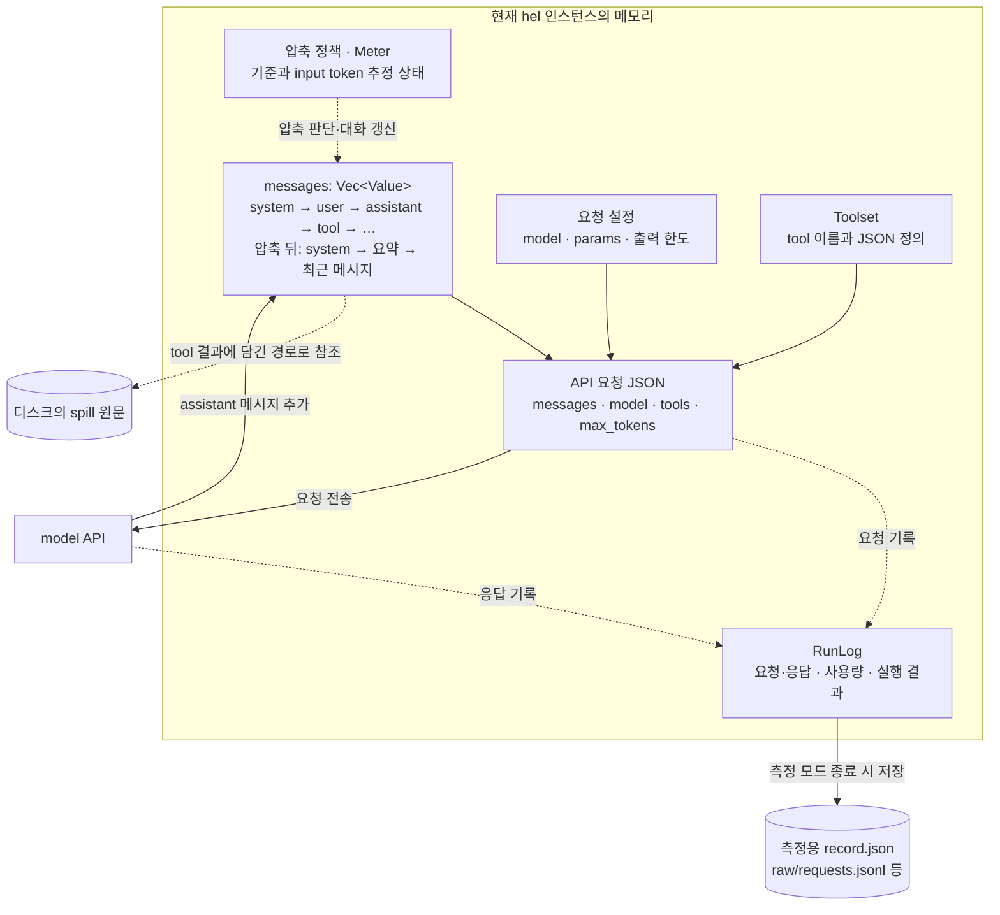
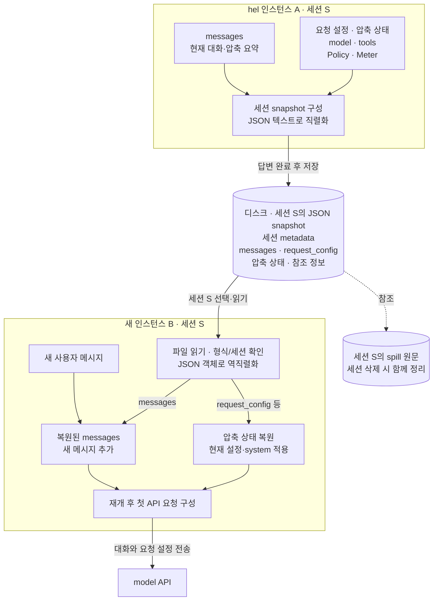

# H9 — Sessions & Checkpoints

> [!NOTE]
> - 시작 상태: [`h09`](https://github.com/jammer-droid/HEL/tree/h09) · 완료 상태: [`h10`](https://github.com/jammer-droid/HEL/tree/h10)
> - 논문: [§6.2 Iterative Action-Observation Loop](https://arxiv.org/html/2609.00006v1#S6.SS2), [§9.5 Threshold Compaction](https://arxiv.org/html/2609.00006v1#S9.SS5), [§13.1 Architectural Pattern Catalog](https://arxiv.org/html/2609.00006v1#S13.SS1)

```bash
git checkout -b my-h09 h09
```

hel을 종료하고 다시 시작해도 이전 대화를 복원해 작업을 이어갈 수 있는가?

## 들어가며

### 논문이 본 세션과 복원

[Part IV](../../parts/part4-safety-runtime.md)에서 다루는 실행 제어에는 작업을 끝내고 다시 이어 가는 문제도 있다. H8의 hel 인스턴스는 한 번 시작된 본체와 자식 프로세스를 묶은 단위다. 세션(session)은 그보다 오래 보관할 대화와 관련 상태를 가리킨다. 하나의 세션을 저장해 두면 나중에 시작한 hel 인스턴스에서도 이어갈 수 있다.

> [!NOTE]
> model에게 전달되는 정보가 종료된 세션과 동일하면, model 입장에서는 대화가 중간에 종료됐는지 구별할 필요가 없다. model은 매 요청마다 기존 메시지를 누적해 받고, 이에 따라 답변을 할 뿐이다. 새 hel 인스턴스에서도 같은 model·요청 설정과 대화 내용을 전달하면 같은 문맥에서 다음 답변을 생성할 수 있다. 생성 결과가 매번 같은 문장으로 나오는 것까지 보장하는 것은 아니다.

논문 [§2.3](https://arxiv.org/html/2609.00006v1#S2.SS3)은 대화 기록·저장·재개·분기를 여러 subsystem이 공유하는 기반으로 설명한다. 저장할 대상에 따라 복원의 의미도 달라진다.

| 구조 | 보관하는 것과 하는 일 |
| --- | --- |
| 이벤트 기록 | 메시지와 동작 결과를 누적하고 필요한 대화 상태 재구성 |
| checkpoint(체크포인트) | 특정 시점으로 돌아갈 상태 보관. 시스템에 따라 파일 상태 포함 |
| 세션 트리 | 대화의 분기 관계를 보관하고 이어갈 가지 선택 |

논문 [표11·12](https://arxiv.org/html/2609.00006v1#S13.T11)의 관련 패턴을 요약해 재구성했다. 이 표는 참고 시스템의 구조이며 hel에 모두 구현할 항목은 아니다. [§9.5](https://arxiv.org/html/2609.00006v1#S9.SS5)의 Pi는 대화를 되감아도 파일을 복원하지 않으며, Mistral Vibe와 OpenCode는 파일 복원을 포함한 checkpoint를 제공한다.

### 이번 Lab에서 다룰 대화 복원

현재 hel은 대화 기록을 메모리에 보관한다. 같은 인스턴스에 후속 지시를 보내면 앞의 대화를 함께 전달하지만, 종료한 뒤 다시 시작하면 새 대화가 된다. 측정용 실행 기록을 파일에 남기는 기능은 있어도 그 기록을 불러와 대화를 재개하는 기능은 없다.

이번에는 정상적으로 답변을 마치고 종료한 뒤, 새 인스턴스에서 같은 세션의 대화를 이어가는 동작을 다룬다. 첫 대화에서 전달한 정보를 다음 지시에서 다시 물어보고, 종료 없이 이어간 경우와 비교한다. 저장 전후의 메시지와 재개 후 첫 model 요청도 직접 확인한다.

### 현재 hel이 보관하는 데이터

현재 대화는 `messages: Vec<serde_json::Value>`에 보관한다. JSON 메시지 객체를 순서대로 담은 배열이다. 일반 대화에서는 이 배열이 메모리에 있으며, hel을 종료하면 사라진다.

| 메시지 | 내용 | 만드는 쪽 |
| --- | --- | --- |
| `system` | OS·shell·작업 경로와 `HEL.md` 내용 | hel |
| `user` | 사용자의 지시 | 사용자 입력을 받은 hel |
| `assistant` | 답변, 반환된 `reasoning_content`, `tool_calls` | model |
| `tool` | 호출 결과 또는 오류, 대응하는 `tool_call_id` | hel |
| 압축 요약 | 요약 안내와 `<compacted-summary>` 내용 | 요약 응답을 받은 hel이 `user` 메시지로 구성 |

assistant 메시지는 API가 반환한 JSON 객체 전체를 보존한다. tool 호출이 포함된 대화는 다음 순서로 이어진다.

```text
1. system     실행 환경과 HEL.md
2. user       “설정 파일에서 포트를 확인해줘”
3. assistant  read_file 호출 요청 — 호출 ID: call_1
4. tool       파일 내용 반환 — tool_call_id: call_1
5. assistant  “포트는 8080입니다”
```

tool 호출과 결과의 연결이 빠지면 model API에 다시 보낼 대화가 불완전해진다. H6에서 압축하면 오래된 구간이 요약 메시지로 교체된다. 긴 tool 결과를 잘라내는 처리도 이 배열을 수정한다. 따라서 `messages`에는 지금 model에게 보낼 대화가 들어 있으며, 처음부터의 원본 기록이 모두 남아 있는 것은 아니다.(압축으로 인해)

메시지 배열 밖에도 hel이 관리하는 데이터가 있다.

| 데이터 | 현재 위치·용도 |
| --- | --- |
| model 이름·출력 한도·model params | API client가 요청을 만들 때 추가 |
| tool 이름·정의 | Toolset에서 관리, API 요청의 `tools`로 전달 |
| 압축 정책·Meter | 다음 요청 전에 압축할지 판단 |
| 작업 경로·접근 레벨·Runtime | tool 실행과 파일 접근 제어 |
| token 사용량·호출 횟수·권한 판정·종료 이유 | RunLog의 측정·분석용 데이터 |
| API 요청·응답 원본 | 측정 모드 종료 시 `raw/requests.jsonl`로 기록 |

- hel은 실험 결과를 분석하기 위한 파일은 만든다. `record.json`에 최종 답변, token 사용량, tool 호출, 종료 이유 등이 저장된다.
- `record.json`은 `evals`를 통한 측정 실행에만 생성되는 데이터이며, 세션 재개를 위해 만들어야 하는 세션 스냅샷과는 별개의 파일이다.

### 재개를 위해 보관할 상태

대화 재개에는 기존 데이터를 파일에 남기는 일과, 저장된 대화를 식별하고 해석할 정보가 필요하다.

| 보관할 항목 | 재개할 때의 용도 |
| --- | --- |
| 세션 ID·저장 형식 버전 | 이어갈 대화 선택, 읽을 수 있는 형식인지 확인 |
| 현재 `messages` | 압축 요약과 이후 메시지를 포함한 대화 복원 |
| cursor와 읽기 위치·파일 식별 정보 | 같은 세션에서 기존 cursor로 이어 읽기 |
| model·params·출력 한도·tool 구성 | 요청 설정 재구성, 이전 설정과의 차이 확인 |
| 작업 경로 등 metadata | 재개할 프로젝트와 실행 환경 확인 |
| 압축 정책·Meter | 현재 압축 기준 적용, 입력 조건에 따라 관측값 복원 또는 초기화 |
| 대화가 참조하는 spill 정보 | 원문의 보관 위치와 새 인스턴스의 접근 연결 |

Meter는 마지막 API 요청에 보낸 메시지 개수와 그 요청의 실제 input token 수를 기억한다. Meter가 있어야 세션을 재개하는 시점에 추가되는 메시지가 포함된 input token의 근사치를 계산할 수 있고, hel의 압축 정책에 따라 적절한 시점에 압축 요청을 진행할 수 있다.

spill에는 원문이 별도 파일로 남고 대화에는 경로가 들어간다. 새 인스턴스에서 그 경로를 사용할 때는 파일의 존재와 접근 권한을 함께 확인해야 한다.

`read_file` cursor도 경로와 읽은 위치를 기억하는 메모리 상태에 연결돼 있다. `cursor = "a8f3-..."`과 같은 데이터를 가지고 있고, 이 값이 가리키는 실제 정보는 hel의 메모리에 따로 있다.

```text
"a8f3-..." → {
  파일 경로: "/.../spill/result.txt",
  다음에 읽을 바이트 위치: 9840,
  요청한 범위에서 남은 줄 수: 40,
  파일 식별 정보: inode, 크기, 수정 시각 등
}
```

그래서 model이 cursor를 이용한 `read_file`을 호출하려면 hel의 메모리에 저장된 이 정보도 같이 저장해야 한다.

API key는 다시 얻어 사용한다. HTTP client, 열린 파일, 잠금, 자식 프로세스 같은 실행 중 자원은 새 인스턴스에서 준비한다.

### Codex와 Claude Code의 저장·재개

**Codex.** 로컬 저장 구현은 메시지·tool 호출과 결과를 typed JSONL 기록으로 남기며, 세션 metadata와 압축 기록도 함께 보관한다. 재개할 때 thread ID로 기록을 찾고, 저장된 압축 상태와 이후 메시지를 반영해 model에 보낼 대화를 구성한다. SQLite는 조회를 위해 다시 만들 수 있는 데이터이며, 대화 기록인 JSONL을 먼저 기록한다. [저장 구현](https://github.com/openai/codex/blob/823ea830c0fd418b09ff02d36cad9a1fff66465b/codex-rs/thread-store/src/local/live_writer.rs), [대화 재구성](https://github.com/openai/codex/blob/823ea830c0fd418b09ff02d36cad9a1fff66465b/codex-rs/core/src/session/rollout_reconstruction.rs)

Codex의 resume 테스트는 고정된 model 응답으로 대화를 만든 뒤 엔진을 종료하고 저장 이력을 불러온다. 이어서 보낸 요청에 이전 사용자 메시지와 답변이 포함되는지 검사한다. 이 테스트에서 참고할 점은 저장 파일의 존재에 더해 실제로 model에 보낼 요청까지 확인한다는 것이다. [테스트 소스](https://github.com/openai/codex/blob/823ea830c0fd418b09ff02d36cad9a1fff66465b/codex-rs/core/tests/suite/resume.rs#L25-L91)

**Claude Code.** 공식 문서는 메시지·tool 사용·결과를 로컬 JSONL에 보관하고, `--resume`으로 지정한 세션에 후속 대화를 추가한다고 설명한다. 세션 재개와 파일 복구는 별도의 기능이다. Agent SDK가 읽어 주는 대화도 압축이 있었다면 요약을 포함한 현재 메시지 연결이며, 저장소의 모든 원본 항목과 같지 않을 수 있다. [세션 설명](https://code.claude.com/docs/en/agent-sdk/sessions), [압축 뒤 메시지 읽기](https://code.claude.com/docs/en/agent-sdk/session-storage#getsessionmessages-returns-the-post-compaction-chain)

두 시스템 모두 과거 대화와 재개 시점의 실행 설정을 따로 다룬다. Codex는 작업 경로가 달라지면 사용할 경로를 선택하고 model·sandbox 설정을 바꿔 재개할 수 있다. Claude Code도 설정 파일을 다시 읽으며, 복원되는 model·권한 상태에는 조건이 있다. 현재 기본 설정에서는 기록된 system prompt를 압축 전까지 재사용하지만, 이를 다시 구성하는 옵션도 제공한다. hel에서도 대화 복원과 현재 작업 경로·권한 설정의 관계를 정해야 한다. [Codex resume](https://learn.chatgpt.com/docs/developer-commands?surface=cli#codex-resume), [Claude 재개 범위](https://code.claude.com/docs/en/sessions#what-a-resumed-session-restores), [system prompt](https://code.claude.com/docs/en/cli-reference#system-prompt-flags-in-resumed-conversations)

> 자료 확인은 2026-10-05 기준이다.


## 이번에 해볼 것

### 현재 데이터와 model 요청

현재 hel에서 대화와 실행 상태는 다음과 같이 나뉜다. 메모리의 `messages`는 JSON 메시지 객체의 배열이고, 요청 설정과 tool 정의를 합쳐 API 요청을 만든다.



`user` 메시지는 입력할 때, `tool` 메시지는 tool 실행 뒤에 추가한다. 그림의 실선은 데이터 구성·전달, 점선은 제어·기록·참조 관계다. 측정 파일에 API 원본이 남더라도 현재 hel이 그 파일에서 세션을 복원하지는 않는다.

### snapshot 저장과 새 인스턴스의 재개

일반 `hel` 실행은 기본으로 새 세션을 시작한다. 별도의 저장 옵션 없이 답변 완료마다 저장하며, 기존 대화를 이어갈 때는 재개할 세션을 지정한다. 저장 위치는 프로젝트 안의 `.hel/sessions/`로 정한다. 세션별로 snapshot과 spill 원문을 함께 관리하고, 이 저장소는 Git 추적과 일반 프로젝트 검색에서 제외한다.

사용자 지시 하나에 대한 최종 답변이 완료될 때마다 JSON snapshot을 저장하는 구조를 만든다. 중간의 tool 호출과 그 결과도 최종 답변까지의 대화에 포함한다. 다음은 하나의 세션을 인스턴스 A에서 저장하고, A가 종료된 뒤 인스턴스 B에서 재개하는 구성안이다. 메모리의 JSON 객체를 파일의 JSON 텍스트로 쓰는 과정이 직렬화이고, 파일을 읽어 객체로 구성하는 과정이 역직렬화다.



`schema_version`과 `session_id`는 파일을 읽는 hel이 사용한다. model에게는 복원한 대화와 요청 설정으로 구성한 API 요청이 전달된다. 인스턴스 B에서 대화를 더 진행한 뒤 저장하면 세션 S의 snapshot도 최신 상태로 갱신된다.

spill 원문은 snapshot과 별도 파일로 두되 세션에 귀속시킨다. 같은 세션을 재개한 인스턴스는 그 원문을 읽을 수 있게 한다. 세션이 남아 있는 동안 보관하고, 세션을 삭제할 때 snapshot과 함께 정리하는 구조를 만든다. 세션에 귀속된 spill에는 H8의 24시간 정리 규칙을 적용하지 않는다.

프로그램의 임시 작업 공간인 tmp는 기존처럼 인스턴스에 귀속시킨다. snapshot·spill의 수명과 tmp의 수명을 구분한다.

| 데이터 | 소유 단위 | 정리 시점 |
| --- | --- | --- |
| snapshot | 세션 | 세션 삭제 시 |
| spill 원문 | 세션 | 세션 삭제 시 |
| tmp | hel 인스턴스 | 인스턴스와 잠금을 이어받은 자식 프로세스의 사용 종료 후 |

cursor도 snapshot에 저장하고 같은 세션을 재개할 때 복원한다. cursor 값과 함께 파일 경로, 다음 바이트 위치, 남은 줄 수, 파일 식별 정보를 보관해 기존 값으로 이어 읽을 수 있게 한다. 읽을 때는 기존 경로 검사와 파일 변경 검사를 유지한다. 대상 파일이 바뀌었으면 그 cursor로 이어 읽기를 거절한다.

재개할 때 system 메시지는 현재 실행 환경과 `HEL.md`로 다시 만든다. 저장된 system 메시지를 현재 것으로 교체하고, 나머지 대화와 압축 요약은 유지한다. 세션을 종료한 사이 프로젝트 규칙을 바꿨다면 재개 후 첫 요청부터 새 규칙이 전달된다. 따라서 대화 이력은 이어지지만 system 메시지는 저장 당시와 달라질 수 있다.

model·tool 구성·요청 params·출력 한도도 재개 시점의 실행 설정을 적용한다. 저장된 설정은 이전 실행과 비교할 자료로 남긴다. 설정과 작업 환경이 그대로이고 필요한 상태가 복원되면, 종료 전과 같은 문맥과 동작 조건으로 이어갈 수 있다.

Meter는 저장된 대화·system 메시지·model·tool 정의가 같으면 복원한다. 입력 토큰 수에 영향을 주는 이 조건들이 바뀌면 기존 관측값을 초기화하고 전체 메시지로 임시 추정한다. 다음 API 응답을 받으면 실제 입력 토큰 수로 갱신한다. 출력 한도나 압축 기준만 바뀌었다면 관측값은 유지하고 새 압축 기준을 적용한다.

한 세션은 한 hel 인스턴스만 사용하도록 점유를 확인한다. 다른 인스턴스가 이미 사용 중인 세션의 재개는 거절한다. 두 인스턴스가 같은 snapshot을 서로 덮어쓰는 일을 막기 위해서다. 서로 다른 세션은 동시에 사용할 수 있다.

사용할 명령은 다음과 같이 정한다.

| 명령 | 동작 |
| --- | --- |
| `hel` | 새 세션 시작 |
| `hel --resume <id>` | 기존 세션 재개 |
| `hel sessions` | 프로젝트의 세션 목록 |
| `hel sessions delete <id>` | 해당 세션의 snapshot·spill 삭제 |

점유 중인 세션은 삭제도 거절한다. 세션 삭제가 프로젝트 작업 파일을 되돌리거나 삭제하는 것은 아니다.

### JSON 메시지와 snapshot 파일

현재 메시지 배열을 세션 metadata와 함께 하나의 JSON 문서로 저장하는 방식이 snapshot이다. 다음은 저장 파일에서 메시지와 요청 설정의 주요 필드를 발췌한 예시다. 실제 파일에는 생성·갱신 시각, tool 정의, Meter 관측값과 cursor 상태도 포함한다.

```json
{
  "schema_version": 1,
  "session_id": "9d0c8f63-fd63-47bd-a93d-a087049583c7",
  "cwd": "/path/to/project",
  "request_config": {
    "model": {
      "provider": "deepseek",
      "requested": "deepseek-flash",
      "params": {}
    },
    "max_output_tokens": 8192,
    "compaction": null
  },
  "messages": [
    {"role": "system", "content": "실행 환경과 프로젝트 규칙"},
    {"role": "user", "content": "작업 식별자는 cedar-4827이다"},
    {"role": "assistant", "content": "확인했습니다"}
  ]
}
```

snapshot을 사용하는 경우, 저장 시점의 메시지 배열과 관련 상태를 JSON으로 직렬화한다. 직렬화는 메모리의 데이터를 파일에 쓸 수 있는 형식으로 바꾸는 과정이다. 새 hel 인스턴스는 재개할 세션을 선택하고 파일을 읽은 뒤, JSON을 해석해 메모리의 메시지 배열과 설정을 구성한다.

복원된 배열의 system 메시지를 현재 환경으로 교체하고 새 사용자 지시를 추가하면 기존 loop로 대화를 이어갈 수 있다. snapshot의 세션 ID·형식 버전은 hel이 사용하고, `messages`와 요청 설정은 API 요청을 구성하는 데 사용한다.

저장 파일은 임시 파일에 완성본을 쓴 뒤 교체하는 방식으로 갱신할 수 있다. 사용자 지시에 대한 최종 답변이 끝나면 변경된 대화 상태를 snapshot에 반영하고 다음 입력을 기다린다. 저장에 실패하면 경고를 표시하고 메모리의 대화는 유지한 채 다음 지시를 받는다. 다음 답변이 완료되면 최신 대화 전체의 저장을 다시 시도한다. 실패한 쓰기로 이전 snapshot을 훼손하지 않도록 하며, 저장이 계속 실패한 채 종료하면 마지막으로 저장에 성공한 지점까지만 재개할 수 있다. 한 번도 저장하지 못했다면 재개할 snapshot이 없다.

### 대화를 이어받았는지 확인하기

첫 지시에서 임의 식별자를 알려 주고, 다음 지시에서 그 값을 묻는다. 다음 지시에는 정답을 넣지 않고 도구를 통한 파일 읽기도 막는다. 답변에 식별자가 정확히 포함되면 성공으로 취급한다. 식별자 주변의 설명이나 문장 형식은 제한하지 않는다.

| 실행 방식 | 확인할 것 | 횟수 |
| --- | --- | --- |
| 종료 없이 계속 | 같은 인스턴스에서 이전 값을 답하는가 | 3회 |
| 종료 후 새 세션 | 이전 대화가 없을 때 그 값을 답할 수 있는가 | 3회 |
| 종료 후 기존 세션 재개 | 저장된 대화를 복원해 이전 값을 답하는가 | 3회 |

같은 반복 회차에서는 세 실행에 같은 식별자를 주고, 다음 반복에서는 다른 식별자로 바꾼다. 표의 식별자는 설명용이며, 실제 측정에는 미리 생성한 더 긴 임의 문자열을 사용한다.

| 반복 | 종료 없이 계속 | 종료 후 새 세션 | 종료 후 기존 세션 재개 |
| --- | --- | --- | --- |
| 1회차 | `apple-123` | `apple-123` | `apple-123` |
| 2회차 | `river-456` | `river-456` | `river-456` |
| 3회차 | `cedar-789` | `cedar-789` | `cedar-789` |

총 9회 실행하며 정상 완료 시 API 요청은 18회 발생한다. 요청당 출력 한도는 8192 토큰, 실행 한 번의 시간 제한은 첫 지시부터 두 번째 답변까지 120초로 두고, 실패를 하더라도 추가 API 요청 없이 실패로 종료한다.

검사는 두 가지로 나눈다.

첫째, 실제 model에게 첫 지시에서 식별자를 알려 주고, 다음 지시에서 다시 물어본다. 그리고 답변에 정확한 식별자가 들어 있는지 확인하면 된다.

둘째, 저장과 복원 코드가 제대로 동작하는지 검사한다. 이전 대화와 압축 요약, tool 호출과 결과를 미리 준비해 저장하고, 새로운 hel 프로세스에서 불러온다. 그리고 질문을 보낼 때 API 요청에 전달할 내용이 올바르게 들어 있는지 확인한다.(이때는 실제 model API 호출 없이 정해진 응답을 돌려주는 mock을 사용한다.)

이어 cursor와 spill 복원도 같은 방식으로 검사한다. 토큰 소모에 영향을 주는 설정이 변경됐을 때 Meter를 어떻게 처리하는지, 사용 중인 세션의 재개, 삭제를 막는지, 저장에 실패해도 대화를 계속하고 다음에 다시 저장하는지도 확인한다.

이를 통해 model이 이전 정보를 활용해 답했는지와 hel이 필요한 정보를 제대로 저장하고 복원했는지를 분리해 확인할 수 있다.

## 결과 확인

### 저장 기능을 넣기 전

같은 hel 코드로 종료 없이 계속한 경우와, 종료 후 새 인스턴스에서 다시 시작한 경우를 각각 3회 실행했다.

| 실행 방식 | 식별자를 답한 횟수 | 실제 후속 요청 |
| --- | --- | --- |
| 종료 없이 계속 | 3/3 | 첫 지시·첫 답변·후속 질문 포함 |
| 종료 후 새 세션 | 0/3 | 후속 질문만 포함 |

6회 모두 오류 없이 끝났다. 새로 시작한 인스턴스는 세 번 모두 `UNKNOWN`을 답했다. API 요청을 확인해도 앞에서 알려 준 식별자가 없었다. 연속 실행에서는 앞 지시와 답변이 그대로 전달됐고 식별자를 모두 답했다. 총 API 요청은 12회였으며 도구 호출은 없었다.

대화가 메모리에만 있으면 종료 후 정보를 이어받지 못한다는 출발점을 확인했다. 이후 세션 저장·복원을 추가하고, 같은 식별자와 질문으로 재개 동작을 확인했다.

### 저장·복원을 연결한 코드

`crates/hel/src/sessions.rs`의 `Store`가 세션 디렉터리와 점유 잠금을 관리한다. 프로젝트 경계는 hel을 실행한 작업 디렉터리(cwd)다. 각 세션의 파일은 다음과 같이 배치한다.

```text
.hel/
├── .gitignore
├── .sessions.lock
└── sessions/
    └── <session-id>/
        ├── .active
        ├── snapshot.json
        └── spill/
```

`.active`는 해당 세션의 점유 잠금이고, `.sessions.lock`은 재개와 삭제가 동시에 같은 디렉터리를 바꾸지 못하도록 짧게 잡는 저장소 잠금이다. tmp는 H8처럼 임시 디렉터리의 hel 인스턴스별 공간에 둔다. `.hel`은 Git과 프로젝트 검색에서 제외하며, 파일 tool과 sandbox는 현재 세션의 spill 읽기만 예외로 허용한다.

재개 시 저장 파일의 형식 버전·세션 ID·작업 경로와 tool 호출/결과 연결을 확인한다. 다른 프로젝트로 파일을 옮겨 곧바로 재개하거나, 연결이 깨진 메시지를 그대로 API에 넘기지는 않는다. `Store::restore`에서 과거 system 메시지를 현재 것으로 교체한 뒤 Meter를 선택한다.

```rust
let meter = if messages == snapshot.messages
    && snapshot.request_config.input_signature() == current.input_signature()
{
    snapshot.meter
} else {
    Meter::default()
};
```

여기서 `messages`는 system 교체가 끝난 배열이다. 입력에 영향을 주는 내용이 그대로면 관측값을 이어 쓰고, 달라졌다면 다시 추정한다. 출력 한도와 압축 기준은 이 비교에서 제외한다. `Reader`에 저장한 cursor 값·읽기 위치·파일 식별 정보도 함께 복원한다.

`Store::save`는 전체 snapshot을 새 임시 파일에 쓴 다음 교체한다. 기존 파일을 먼저 비우지 않는다.

```rust
file.write_all(&bytes)?;
file.write_all(b"\n")?;
file.sync_all()?;
fs::rename(&temporary, self.root.join(SNAPSHOT))?;
runtime::open_directory(&self.root)?.sync_all()?;
```

이 저장 함수는 최종 답변이 완료된 뒤 호출한다. 저장에 실패하면 경고하고 메모리의 대화는 유지한다. API 오류나 출력 한도 때문에 답변이 끝나지 않은 경우에는 snapshot을 갱신하지 않는다.

재개와 삭제에서는 `.active` 파일의 잠금을 대기 없이 시도한다.

```rust
lease
    .try_lock()
    .map_err(|_| "session is already in use; resume/delete refused")?;
```

외부 명령에는 인스턴스 잠금과 세션 잠금을 함께 전달한다. hel 본체가 종료돼도 잠금을 이어받은 자식이 살아 있으면 세션을 재개하거나 삭제할 수 없다.

### 저장·복원 코드의 검사

전체 111개 테스트와 clippy가 통과했다. 그중 세션 검사는 실제 model 대신 로컬 mock API를 사용한다. 두 hel 프로세스를 차례로 실행하고, 두 번째 요청의 본문을 직접 확인했다.

| 상황 | 확인 결과 |
| --- | --- |
| 정상 답변 후 종료·새 프로세스에서 재개 | 첫 지시와 assistant 메시지가 후속 요청에 그대로 포함 |
| 압축 요약과 tool 호출·결과를 저장해 재개 | 메시지 순서·reasoning 내용·tool_call_id 연결 유지 |
| 재개 전에 HEL.md 변경 | 현재 system 메시지 적용, 이전 대화는 보존 |
| model·tool 정의·system 변경 | Meter 초기화. 출력 한도·압축 기준만 변경하면 관측값 유지 |
| 저장한 cursor로 새 프로세스에서 spill 읽기 | 같은 cursor로 이어 읽기. 대상 파일이 바뀌면 거절 |
| 다른 세션의 spill·snapshot 접근, 내부 파일 수정 | 파일 tool·sandbox에서 거절. 일반 검색에서도 제외 |
| 같은 세션 점유 중 재개·삭제, 자식만 살아 있는 경우 | 거절. 서로 다른 새 세션은 동시에 생성 가능 |
| snapshot 저장 실패 뒤 다음 답변 완료 | 이전 snapshot 보존, 경고 후 최신 대화 전체 저장 재시도 |
| 세션 삭제 | snapshot·spill 삭제, 프로젝트 작업 파일 유지 |

### 재개 후 답변

| 실행 방식 | 식별자를 답한 횟수 |
| --- | --- |
| 종료 없이 계속 | 3/3 |
| 종료 후 새 세션 | 0/3 |
| 종료 후 기존 세션 재개 | 3/3 |

재개한 세 번 모두 첫 지시와 첫 답변이 두 번째 API 요청에 그대로 포함됐다. 두 프로세스의 세션 ID가 같고, 마지막 snapshot에 후속 질문과 답변까지 저장된 것도 확인했다. 전체 9회가 정상 완료됐으며 API 요청은 18회, 도구 호출은 0회였다.

이 짧은 대화에서는 종료 후에도 앞에서 받은 정보를 다시 사용할 수 있었다. 압축·cursor·권한 경계는 위의 고정 응답 검사로 확인했다.

답변을 마친 뒤 정상 종료하고 재개하는 동작을 확인했다. 파일 수정 후 답변과 snapshot 저장 전에 강제 종료되면, 파일에는 수정이 남아도 저장된 대화에는 그 기록이 없을 수 있다. 이 차이를 확인하고 이어가는 복구는 별도로 다루어야 한다.

## 돌아보기

### 변경 사항

재개할 문맥과 그 문맥이 참조하는 상태의 수명을 함께 관리하는 구조를 추가했다. spill은 세션이 삭제될 때까지 남고, cursor는 파일이 같은지 다시 확인한 뒤 사용할 수 있다. 실행 설정은 현재 값을 적용하며 필요한 경우 Meter 관측값을 버린다.

### 트레이드오프

매 답변마다 전체 JSON 파일을 쓰고 세션별 잠금을 관리하는 비용이 생겼다. 재개 실행의 평균 입력 토큰은 208, 연속 실행은 209였다. 두 방식 모두 앞 대화를 전달하므로 문맥 크기도 비슷했다.

답변 완료 시점의 snapshot은 선형 대화를 재개하기 위한 출발점이다. 처리 중이던 tool의 사이드 이펙트나 프로젝트 파일을 되돌리는 일은 별도의 복구 설계가 필요하다. [FAQ](faq.md)에 이번 저장 경계와의 차이를 정리했다.

### 논문의 내용 또는 다른 harness와 비교하면

논문이 구분한 대화 복원과 파일 되돌리기 중, 이번에는 완료된 대화의 복원에 집중했다. Codex와 Claude Code의 JSONL 기록은 누적된 이력을 재구성하는 기반이 된다. hel은 현재 선형 대화에 필요한 상태를 JSON snapshot 하나로 저장한다. 저장 구조는 작지만, 처리 도중 중단된 호출이나 대화 분기를 복원하려면 더 많은 실행 기록과 정책이 필요하다.
