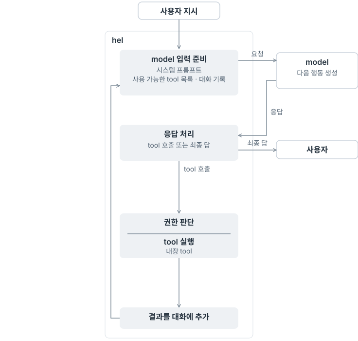
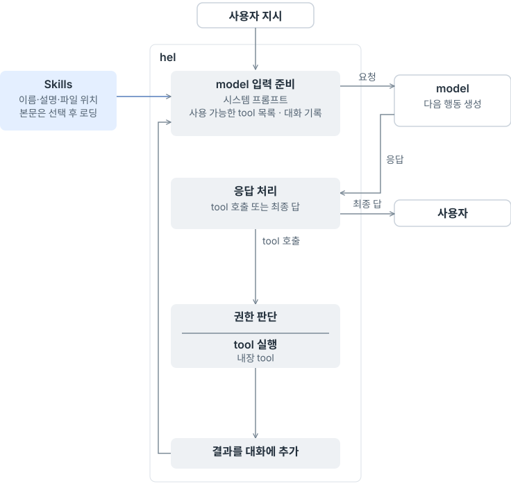
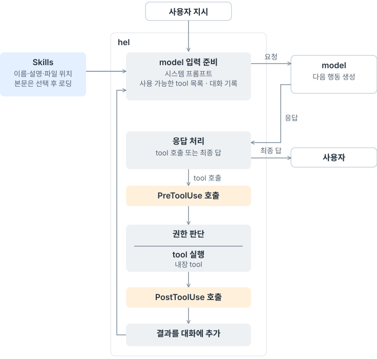
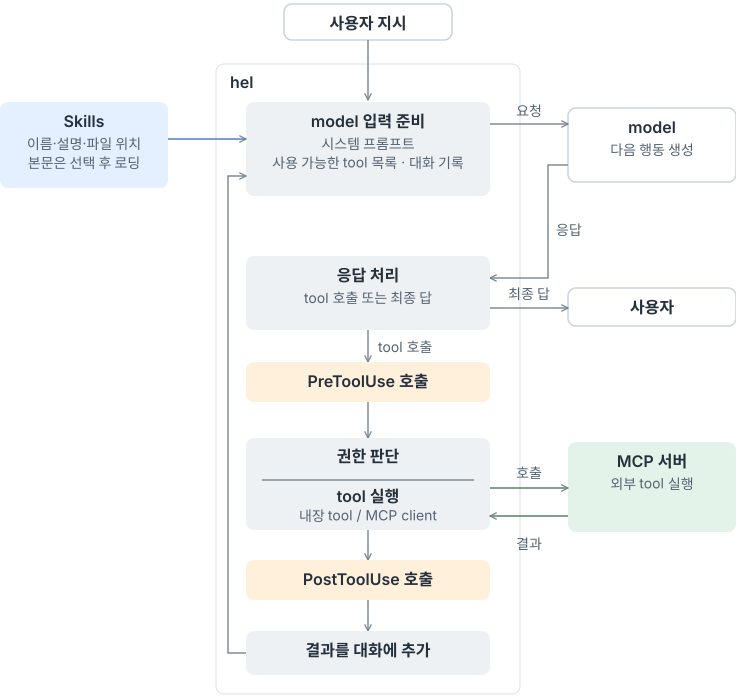

# H10 — Skills / Hooks / MCP

> [!NOTE]
> - 시작 상태: [`h10`](https://github.com/jammer-droid/HEL/tree/h10) · 완료 상태: `h11` *(예정)*
> - 논문: [§12 Extensibility Mechanisms](https://arxiv.org/html/2609.00006v1#S12), [§10.2 Lifecycle Hooks](https://arxiv.org/html/2609.00006v1#S10.SS2), [§16.8 Extensibility](https://arxiv.org/html/2609.00006v1#S16.SS8)

```bash
git checkout -b my-h10 h10
```

## 들어가며

[Part V 개요](../../parts/part5-extensibility-orchestration.md)에서 살펴본 확장 기능은 agent loop의 서로 다른 위치에 연결된다. Skills는 model에게 작업 지침을 전달하고, Hooks는 harness가 tool 실행 전후에 hook을 호출하는 구조다. MCP는 외부 서버가 제공하는 tool을 사용할 통로를 만든다.

### 현재 agent loop와 확장 지점

지금의 `hel`은 시스템 프롬프트, 사용 가능한 tool 목록, 대화 기록으로 model 입력을 준비한다. model이 tool 호출을 요청하면 권한을 판단하고 실행한다. 실행 결과는 대화에 추가해 다시 model에게 보낸다. 최종 답이 나오면 사용자에게 전달한다.

아래 그림은 같은 loop에 Skills, Hooks, MCP를 차례로 연결한 모습이다.

<style>
.h10-loop-picker { margin: 1.5em 0; }
.h10-loop-picker .h10-loop-controls { display: flex; flex-wrap: wrap; gap: .5em; margin-bottom: 1em; }
.h10-loop-picker label { display: inline-flex; align-items: center; gap: .4em; padding: .4em .7em; border: 1px solid var(--table-border-color); border-radius: .4em; cursor: pointer; }
.h10-loop-picker label:has(input:checked) { background: var(--quote-bg); font-weight: bold; }
.h10-loop-picker figure { display: none; margin: 0; }
.h10-loop-picker img { display: block; width: 100%; max-width: 736px; margin: 0 auto; }
.h10-loop-picker:has(#h10-view-current:checked) .h10-view-current,
.h10-loop-picker:has(#h10-view-skills:checked) .h10-view-skills,
.h10-loop-picker:has(#h10-view-hooks:checked) .h10-view-hooks,
.h10-loop-picker:has(#h10-view-mcp:checked) .h10-view-mcp { display: block; }
@media print { .h10-loop-picker .h10-loop-controls { display: none; } .h10-loop-picker figure { display: none !important; } .h10-loop-picker .h10-view-mcp { display: block !important; } }
</style>
<div class="h10-loop-picker">
<div class="h10-loop-controls" role="group" aria-label="agent loop의 확장 단계">
<label><input type="radio" name="h10-loop-view" id="h10-view-current" checked>현재</label>
<label><input type="radio" name="h10-loop-view" id="h10-view-skills">A · Skills</label>
<label><input type="radio" name="h10-loop-view" id="h10-view-hooks">B · Hooks</label>
<label><input type="radio" name="h10-loop-view" id="h10-view-mcp">C · MCP</label>
</div>
<figure class="h10-view-current"><picture><source media="(max-width: 640px)" srcset="images/loop-current-mobile.svg"></picture></figure>
<figure class="h10-view-skills"><picture><source media="(max-width: 640px)" srcset="images/loop-skills-mobile.svg"></picture></figure>
<figure class="h10-view-hooks"><picture><source media="(max-width: 640px)" srcset="images/loop-hooks-mobile.svg"></picture></figure>
<figure class="h10-view-mcp"><picture><source media="(max-width: 640px)" srcset="images/loop-mcp-mobile.svg"></picture></figure>
</div>

H10을 시작할 때의 흐름은 첫 번째 그림과 같다. Skills를 더하면 A 단계의 목록 전달과 본문 로딩이 연결된다. B·C는 hook 호출과 외부 tool을 연결하는 위치다.

### 논문이 본 확장 기능

논문 [§12.5](https://arxiv.org/html/2609.00006v1#S12.SS5)는 작업 지침을 파일로 묶어 발견하고 읽는 Skills를 다룬다. [§10.2](https://arxiv.org/html/2609.00006v1#S10.SS2)는 harness가 실행 흐름의 특정 시점에 hook을 호출하는 사례를, [§12.4](https://arxiv.org/html/2609.00006v1#S12.SS4)는 MCP로 외부 기능을 연결하는 사례를 설명한다.

이 세 가지를 loop의 연결 위치에 따라 나눠 보면, model에게 전달할 지침과 harness가 호출할 hook·외부 tool을 구분할 수 있다. model이 어떤 행동을 고를지에는 지침이 영향을 주고, hook 호출과 외부 서버 통신은 harness가 수행한다.

## 이번에 해볼 것

각 기능은 하위 문서에서 따로 다룬다. 앞 단계에서 만든 연결을 유지하며 다음 기능을 더한다.

| 문서 | 연결 위치 | 다룰 내용 |
| --- | --- | --- |
| [A — Skills](skills.md) | model 입력 준비 | skill 목록 전달·선택한 본문 로딩 |
| [B — Hooks](hooks.md) | tool 실행 전·후 | `PreToolUse`·`PostToolUse` hook 호출 |
| [C — MCP](mcp.md) | 사용 가능한 tool 목록·tool 실행 | 외부 tool 발견·호출·결과 전달 |

Skills는 시스템 프롬프트에 목록을 먼저 전달하고, model이 선택한 본문을 읽는다. Hooks는 tool 실행 전후에 hook을 호출한다. MCP는 외부 tool의 목록을 받고 호출 결과를 대화에 연결하는 흐름을 다룬다.

<!-- 결과 확인·돌아보기는 실제 구현과 측정 뒤 작성한다. -->
