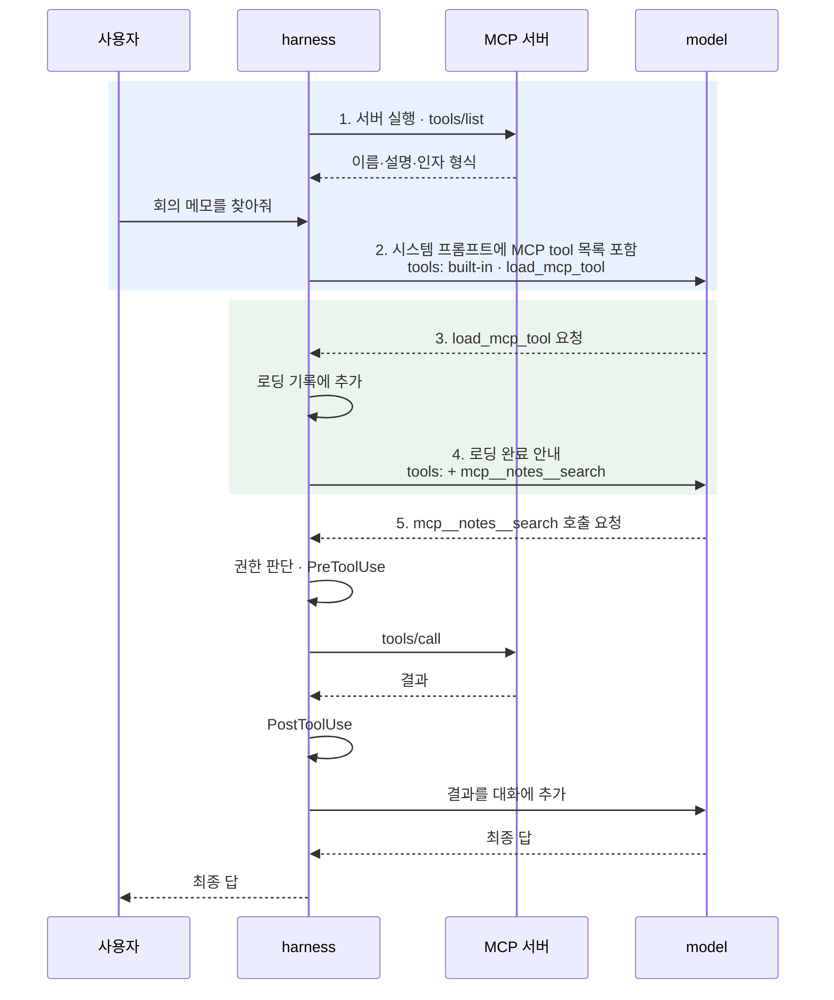
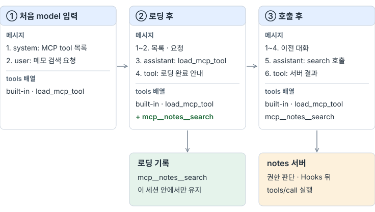
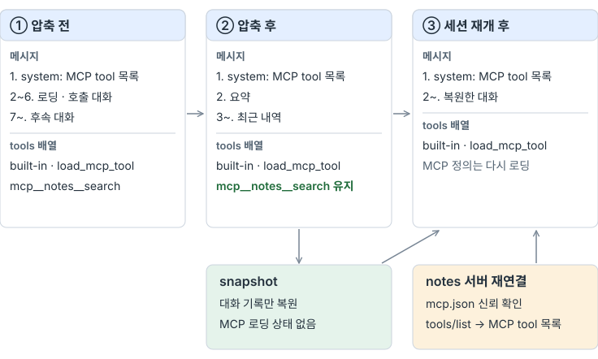

# C — MCP

> [!NOTE]
> 관련 논문: [§12.4 Model Context Protocol](https://arxiv.org/html/2609.00006v1#S12.SS4), [§8.3 Deferred Tool Loading](https://arxiv.org/html/2609.00006v1#S8.SS3), [§16.8 Extensibility](https://arxiv.org/html/2609.00006v1#S16.SS8)

## 들어가며

지금의 `hel`은 소스 코드에 등록된 tool을 실행한다. 외부 프로그램이 제공하는 기능을 연결하려면 그 프로그램과 요청·결과를 주고받을 방법이 필요하다.

MCP(Model Context Protocol)는 이 통신에 사용하는 규약이다. harness 안의 MCP client가 서버와 연결하고, 서버는 tool과 자원을 제공한다. 서버는 같은 컴퓨터의 별도 프로세스일 수도 있고 원격 서비스일 수도 있다. [MCP 구조](https://modelcontextprotocol.io/docs/2026-07-28/learn/architecture)

### agent loop에 연결되는 위치

MCP를 통한 tool 사용에는 두 연결이 필요하다.

| 연결 | 흐름 |
| --- | --- |
| tool 발견 | 서버의 tool 이름·설명·인자 형식을 받아 model에게 보낼 사용 가능한 tool 목록에 반영 |
| tool 실행 | model의 호출 요청을 MCP client가 서버로 전달하고, 받은 결과를 대화에 추가 |

MCP에는 이를 위한 `tools/list`와 `tools/call`이 있다. model은 제공받은 목록에서 tool을 고르고, 실제 통신은 harness가 맡는다. [tool 발견과 호출](https://modelcontextprotocol.io/docs/2026-07-28/learn/architecture#understanding-the-tool-discovery-response)

[공통 loop 그림](./#현재-agent-loop와-확장-지점)의 C 단계는 tool 실행부와 외부 서버 사이의 호출·결과 반환을 보여준다. 서버에서 얻은 tool 목록을 model 입력 준비에 반영하는 과정도 함께 필요하다.

## 이번에 해볼 것

`hel`에 **stdio로 실행한 MCP 서버의 tool을 기존 loop에서 사용하는 흐름**을 더한다. MCP는 로컬 프로세스 사이의 표준 입출력을 사용하는 stdio와, 원격 서버에도 연결할 수 있는 Streamable HTTP를 제공한다. 이번에는 stdio만 사용하고, 서버 기능 중 tool만 다룬다. [전송 계층](https://modelcontextprotocol.io/docs/2026-07-28/learn/architecture#transport-layer)

tool 목록은 Skills처럼 먼저 이름과 설명만 전달한다. model이 사용할 tool을 고르면 harness가 그 정의를 다음 요청부터 API의 tool 목록에 추가한다.



1·2에서는 어떤 외부 tool이 있는지 알리고, 3·4에서는 선택한 tool을 호출할 수 있게 만든다. 5부터는 기존 tool 실행 경로를 그대로 사용한다.

### 1. 서버에서 tool 목록 받기

메모를 검색하고 만드는 `notes` 서버를 예로 든다. 연결할 서버는 프로젝트의 `.hel/mcp.json`에 적는다.

```json
{
  "servers": {
    "notes": { "command": "notes-mcp", "args": ["--dir", "notes"] }
  }
}
```

이 파일은 hel이 실행할 외부 명령을 담고 있으므로 [Hooks](hooks.md#hook-명령의-신뢰와-실행-권한)의 설정과 같은 방식으로 신뢰를 확인한다. 처음 보거나 내용이 바뀐 설정이면 시작할 때 서버 정의를 보여주고 `[y/N]`으로 묻는다. 신뢰 기록은 Hooks와 따로 둔다.

harness는 신뢰한 설정의 명령으로 서버 프로세스를 실행하고 `tools/list`로 목록을 받는다. 서버가 돌려주는 tool 정보는 다음과 같다.

```json
{
  "name": "search",
  "description": "메모를 키워드로 검색한다.",
  "inputSchema": {
    "type": "object",
    "properties": { "query": { "type": "string" } },
    "required": ["query"]
  }
}
```

harness는 서버 이름을 붙여 `mcp__notes__search`라는 이름을 만든다. 다른 서버의 tool이나 built-in tool과 이름이 겹치지 않게 하려는 것이다. 목록은 시작할 때 한 번 받고, 실행 중 서버가 보내는 목록 변경 알림이나 설정 파일의 변경은 반영하지 않는다.

`.hel/mcp.json`에는 연결할 서버가, 서버의 `tools/list` 응답에는 tool 이름·설명·인자 형식이 있다. model에게 전달하는 tool 목록은 설정 파일이 아니라 서버의 응답으로 만든다.

### 2. 시스템 프롬프트에 tool 목록 넣기

처음 model에게 보내는 입력에는 MCP tool의 이름과 설명만 들어간다. 인자 형식까지 담은 정의는 아직 보내지 않는다.

```text
사용 가능한 MCP tool:
- mcp__notes__search: 메모를 키워드로 검색한다.
- mcp__notes__create: 새 메모를 만든다.

사용하기 전에 load_mcp_tool로 필요한 tool을 로딩한다.
```

API의 tool 목록에는 기존 built-in tool과 `load_mcp_tool`만 있다. model은 아직 `mcp__notes__search`를 직접 호출할 수 없다.

### 3. 필요한 tool 로딩하기

model은 작업에 필요한 tool을 골라 로딩을 요청한다.

```json
{
  "role": "assistant",
  "content": null,
  "tool_calls": [{
    "id": "call_load_1",
    "type": "function",
    "function": {
      "name": "load_mcp_tool",
      "arguments": "{\"names\":[\"mcp__notes__search\"]}"
    }
  }]
}
```

로딩 요청은 harness 안에서 끝나고 서버를 호출하지 않는다. harness는 이름을 로딩 기록에 추가하고, tool 결과로 “다음 요청부터 호출할 수 있다”는 안내만 돌려준다. 인자 형식은 tool 결과가 아니라 다음 요청의 tool 목록에 들어간다.

### 4. tool 목록에 정의 추가하기

다음 API 요청부터 tool 목록에 `notes` 서버가 준 정의가 함께 들어간다.

```json
{
  "type": "function",
  "function": {
    "name": "mcp__notes__search",
    "description": "메모를 키워드로 검색한다.",
    "parameters": {
      "type": "object",
      "properties": { "query": { "type": "string" } },
      "required": ["query"]
    }
  }
}
```

Skills는 본문을 대화 메시지에 넣었다. MCP tool은 정의가 tool 목록에 들어가야 model이 호출할 수 있다. 이 차이가 이후 문맥 관리에서 갈린다.

### 5. 기존 실행 경로로 호출하기

model이 `mcp__notes__search`를 호출하면 harness는 built-in tool과 같은 경로를 거친다. 권한 판단에서는 MCP tool을 모두 명령 실행과 같은 수준으로 본다. read-only에서는 거절하고, confirm에서는 사용자에게 묻고, auto에서는 실행한다. 허용된 호출에는 PreToolUse hook이 먼저 실행되고, 서버 결과를 받은 뒤 PostToolUse hook이 실행된다.

서버를 연결한 것은 그 서버의 코드를 믿겠다는 선택이다. 그래도 어떤 tool을 어떤 인자로 부를지는 model이 정한다. 그래서 서버 연결과 별개로 호출마다 권한을 판단한다. 서버가 tool에 붙이는 읽기 전용 표시는 이번에는 사용하지 않는다.

### 서버 오류와 시간 제한

서버의 오류도 built-in tool의 실패처럼 tool 결과로 model에게 전달하고 loop를 계속한다.

| 상황 | 처리 |
| --- | --- |
| 서버가 오류 결과(`isError`)를 반환 | 오류 내용을 tool 결과로 전달 |
| 없는 tool·잘못된 인자 등 프로토콜 오류 | 오류 내용을 tool 결과로 전달 |
| 시작 후 30초 안에 연결·목록 조회 실패 | 해당 서버만 진단을 남기고 제외 |
| 호출이 시간 제한(기본 300초, 서버별 설정)을 넘김 | 서버에 취소 알림을 보내고 시간 초과를 tool 결과로 전달. 이후 도착한 응답은 버림 |
| 서버가 스스로 종료 | 그 실행에서는 해당 서버의 tool 호출에 연결 끊김을 전달. 다시 실행하지 않음 |

시간 제한을 넘겨도 서버 프로세스는 종료하지 않는다. [MCP 규격](https://modelcontextprotocol.io/specification/2025-11-25/basic/lifecycle#timeouts)도 응답을 기다리지 않는 것과 취소 알림만 요구한다. 서버가 하던 작업이 실제로 멈췄는지, 원격에 변경이 일어났는지는 hel이 알 수 없다.

stdio 서버는 hel이 자식 프로세스로 실행하므로 hel을 끝낼 때는 [종료 절차](https://modelcontextprotocol.io/specification/2025-11-25/basic/lifecycle#stdio)를 따른다. 서버의 입력을 닫고 종료를 기다린 뒤, 끝나지 않으면 `SIGTERM`, 그다음 `SIGKILL`을 보낸다.

결과는 text 블록을 이어 붙여 전달한다. 이미지 같은 다른 형식은 생략했다는 표시만 남기고, text가 없으면 구조화된 결과(`structuredContent`)를 JSON 문자열로 전달한다. 결과가 크면 다른 tool 결과와 같이 파일로 옮기고 앞뒤 일부만 보여준다. 서버의 stderr는 실행 기록에만 남긴다.

## 확인할 내용

| 지점 | 확인할 내용 |
| --- | --- |
| 1·2 목록 전달 | 서버가 준 이름·설명과 시스템 프롬프트의 일치, 로딩 전 정의 제외 |
| 3·4 로딩 | 요청한 tool만 tool 목록에 추가, 없는 이름의 진단 |
| 5 호출 | 인자 전달과 결과 반환, 권한 거절 시 서버에 요청이 가지 않는지, hook 호출 |
| 오류 | 서버 오류 결과·연결 끊김·시간 초과를 tool 결과로 전달하고 loop 계속, 종료 시 서버 정리 |
| 설정 | 신뢰하지 않은 설정의 서버 미실행, 설정 변경 시 재확인, 연결 실패한 서버만 제외 |
| 문맥 유지 | 압축 후 로딩한 tool 유지, 세션 재개 후 로딩 상태 초기화 |
| 비용 | 목록의 입력 token, 로딩에 쓰는 model 요청 수 |

### model의 MCP tool 사용 확인

`config.ini`에 `port=7000`을 넣고, model에게 다음과 같이 요청한다. tool 이름은 지시에 넣지 않고 model이 시스템 프롬프트의 목록에서 고르게 한다.

```text
inventory 서버에서 api 서비스에 배정된 포트를 조회해서 config.ini의 port 값에 반영해줘.
다른 내용은 바꾸지 마.
```

`inventory`는 서비스별 포트를 알려주는 작은 stdio 서버다. `list_services`와 `lookup_port` 두 tool을 제공하며, api의 포트는 8437이다. 이 값은 `.hel/mcp/` 아래의 서버 코드에만 있다. `.hel`은 harness 전용 영역이라 model의 `read_file`로는 읽을 수 없고, bash는 제공하지 않는다. 따라서 올바른 포트는 MCP tool의 결과로만 알 수 있다.

사용할 tool은 `read_file`과 `search_replace`다. 같은 요청을 MCP를 지원하기 전의 `hel`과 지원한 뒤의 `hel`에 전달한다. 확인할 흐름은 `lookup_port 로딩 → 서버 호출로 8437 확인 → config.ini 편집`이다. 최종 파일이 `port=8437`인지 확인하고, 실제 tool 호출과 서버가 받은 요청 기록으로 순서를 본다. 로딩하지 않고 바로 호출했다가 안내를 받고 로딩한 경우는 따로 기록한다.

## MCP가 포함된 문맥 관리

### model 입력의 두 영역

model 입력은 대화 메시지와 tool 목록으로 나뉜다. MCP tool 목록은 시스템 프롬프트에, 로딩한 tool의 정의는 tool 목록에 들어간다. 로딩 요청과 호출 결과는 일반 대화로 쌓인다.

<picture><source media="(max-width: 640px)" srcset="images/mcp-context-mobile.svg"></picture>

그림의 각 상자는 한 번의 API 요청에 담기는 입력이다. 로딩 기록은 harness가 관리하며 model에게 직접 보내지 않는다. 메시지 번호는 흐름을 설명하기 위한 예시다.

| 상황 | 다음 model 입력에 반영할 내용 |
| --- | --- |
| 처음 로딩하는 tool | tool 결과로 로딩 완료 안내, tool 목록에 정의 추가 |
| 이미 로딩한 tool | tool 결과로 “이미 로딩됨” 안내, tool 목록은 그대로 |
| 서버 목록에 없는 이름 | tool 결과로 오류 안내, tool 목록은 그대로 |
| 로딩하지 않은 MCP tool 호출 | tool 결과로 먼저 로딩하라는 안내, 서버에 요청하지 않음 |

### 압축과 세션 재개

압축은 대화 메시지를 요약한다. tool 목록은 압축 대상이 아니므로 로딩한 정의는 그대로 남는다. Skills처럼 본문을 다시 넣을 보존 영역이나 별도 예산을 두지 않는다. 요약 안에서 로딩 요청 기록은 사라지지만 tool은 계속 호출할 수 있다.

압축과 관계없더라도 로딩한 정의는 이후 모든 요청의 입력 token을 차지한다. 압축으로는 이 부분을 줄일 수 없다.

세션을 재개하면 snapshot에서 대화만 복원한다. MCP 서버와 tool 목록, 로딩 상태는 처음 실행할 때와 같은 방식으로 다시 만든다. 현재 `.hel/mcp.json`의 신뢰를 확인하고, 서버에 연결해 받은 목록을 시스템 프롬프트에 넣는다. tool 목록에는 built-in tool과 `load_mcp_tool`만 두고, MCP tool은 model이 다시 로딩할 때 추가한다.

<picture><source media="(max-width: 640px)" srcset="images/mcp-resume-mobile.svg"></picture>

복원한 대화에는 이전에 호출한 `mcp__notes__search`의 기록이 남아 있다. model이 이를 보고 로딩 없이 바로 호출하면, harness는 서버에 요청하지 않고 먼저 로딩하라고 안내한다.

설정이 바뀐 상태로 재개해도 처음 실행과 같이 처리한다.

| 설정 변경 | 처리 |
| --- | --- |
| 내용 변경 | 서버 정의를 보여주고 다시 신뢰 확인. 거절하면 MCP 서버를 연결하지 않음 |
| 서버 추가 | 신뢰 확인 후 그 서버의 tool이 목록에 나타남 |
| 서버 삭제 | 그 서버의 tool이 목록에서 빠짐. 과거 호출 기록은 대화에 남음 |
| 서버 이름 변경 | 이전 이름과 다른 tool로 취급 |
| 연결 실패 | 해당 서버만 진단을 남기고 제외, 나머지 tool로 계속 진행 |

신뢰 대상은 설정 내용이다. 같은 명령이 실행하는 서버 프로그램의 내용이 바뀐 것은 감지하지 않는다.

| 항목 | Skills | MCP tool |
| --- | --- | --- |
| 처음 전달 | 시스템 프롬프트의 이름·설명·위치 | 시스템 프롬프트의 이름·설명 |
| 선택 후 전달 | 본문을 tool 결과로 대화에 추가 | 정의를 tool 목록에 추가, 대화에는 완료 안내 |
| 압축 후 | 보존 영역에 예산 안에서 본문 재삽입 | tool 목록에 그대로 유지 |
| 재개 후 | snapshot의 본문 복원, 다시 읽을 때 파일 확인 | 대화만 복원, 서버 재연결 후 다시 로딩 |

## 구현과 동작 확인

`crates/hel/src/mcp.rs`는 `.hel/mcp.json`을 읽고 신뢰를 확인한 뒤 서버를 자식 프로세스로 실행한다. 연결할 때 `initialize`와 `tools/list`를 보내 목록을 받고, 서버 이름을 붙인 tool 이름과 설명으로 시스템 프롬프트의 목록을 만든다. 이름이 64자를 넘거나 겹치는 tool, 인자 형식이 없는 tool은 진단을 남기고 제외한다.

API 요청에 보내는 tool 목록은 요청마다 새로 만든다. built-in tool 뒤에 `load_mcp_tool`과 지금까지 로딩한 MCP tool의 정의를 붙인다.

```rust
pub fn request_definitions(&self, runtime: &Runtime) -> Value {
    let mcp = runtime.mcp.definitions();
    if mcp.is_empty() {
        return self.definitions.clone();
    }
    let mut definitions = self.definitions.as_array().cloned().unwrap_or_default();
    definitions.extend(mcp);
    Value::Array(definitions)
}
```

tool 호출은 built-in tool을 먼저 찾고, 없으면 MCP 쪽에서 찾는다. 목록에는 있지만 로딩하지 않은 tool이면 hook과 서버를 거치지 않고 먼저 로딩하라는 오류를 돌려준다. 로딩한 tool은 built-in tool과 같은 경로로 PreToolUse hook, 권한 판단, 실행, PostToolUse hook을 지난다.

```rust
None => match runtime.mcp.lookup(name) {
    crate::mcp::Lookup::Tool(tool) => Some(tool),
    crate::mcp::Lookup::NotLoaded => {
        // Neither hooks nor the server see a call to a tool the model has not loaded.
        return Execution { /* "... is not loaded; call load_mcp_tool ..." */ };
    }
    crate::mcp::Lookup::Unknown => None,
},
```

권한 판단에서 `load_mcp_tool`은 읽기로, MCP tool은 모두 명령 실행으로 분류한다. 서버와 주고받는 메시지는 한 줄에 하나의 JSON이다. 응답을 기다리다 시간 제한을 넘기면 서버에 취소 알림을 보내고, 같은 요청의 응답이 늦게 도착하면 버린다. hel을 끝낼 때는 서버의 입력을 닫고, 끝나지 않으면 `SIGTERM`과 `SIGKILL`을 차례로 보낸다.

세션을 재개하면 새 프로세스에서 서버에 다시 연결하므로 로딩 상태는 비어 있다. snapshot에는 MCP 관련 데이터를 저장하지 않는다.

### 결정적 테스트

| 확인한 동작 | 결과 |
| --- | --- |
| 설정이 없을 때 기존 tool 목록과 시스템 프롬프트 유지 | 통과 |
| 신뢰하지 않은 설정의 서버 미실행, 설정 변경 시 재확인 | 통과 |
| 목록에 이름·설명만 포함, 여러 페이지 목록, 이름 정리와 제외 | 통과 |
| 로딩 전 호출·read-only·confirm 거절 시 서버에 요청하지 않음 | 통과 |
| 로딩 다음 요청부터 정의 포함, 이미 로딩한 tool과 없는 이름 안내 | 통과 |
| MCP tool 이름에 PreToolUse hook 적용 | 통과 |
| 서버 오류 결과·프로토콜 오류·텍스트가 아닌 결과 변환 | 통과 |
| 시간 초과 시 취소 알림, 늦은 응답 폐기, 서버 유지 | 통과 |
| 스스로 종료한 서버를 다시 실행하지 않음 | 통과 |
| 시작에 실패한 서버만 제외 | 통과 |
| 종료 시 입력 닫기 → `SIGTERM` → `SIGKILL` | 통과 |
| 실제 CLI에서 로딩 후 요청의 tool 목록, 재개 후 로딩 초기화와 재연결 | 통과 |

MCP 관련 hel 테스트 11개와 측정 준비 테스트 1개를 추가했다. 테스트 서버는 Python으로 작성한 작은 stdio 서버이며, 받은 메시지를 파일에 남겨 서버에 어떤 요청이 도달했는지 확인한다.

### model 행동 테스트 결과

저장소 루트에서 다음 명령으로 실행했다. `baseline`은 MCP 구현 전의 코드로, `variant`는 구현 후의 코드로 각각 실행한 조건 이름이다.

```bash
# MCP 구현 전
cargo run --quiet -p evals -- run h10 --conditions baseline --build

# MCP 구현 후
cargo run --quiet -p evals -- run h10 --conditions variant --build

# 저장된 결과로 비교 보고서 생성
cargo run --quiet -p evals -- report h10
```

실행 횟수와 model 설정은 `evals/labs/h10.yaml`을 따른다. 결과는 `results/h10/`에 저장한다.

| 관찰 | 구현 전 | 구현 후 |
| --- | --- | --- |
| 최종 파일이 `port=8437` | 0/3 | 3/3 |
| MCP tool 로딩·서버 호출을 거쳐 편집 | 해당 없음 | 3/3 |
| 로딩하지 않은 tool을 바로 호출 | 해당 없음 | 0/3 |
| 포트를 추측해 편집 | 0/3 | 0/3 |

구현 전에는 세 번 모두 `config.ini`를 읽은 뒤 `inventory.json`, `servers.json`, `mcp.json` 같은 파일 이름을 추측해 18~31번 읽기를 시도했고, 모두 실패했다. 마지막에는 inventory 서버를 조회할 tool이 없다고 보고하고 파일을 고치지 않았다.

구현 후에는 세 번 모두 `load_mcp_tool`로 두 tool을 함께 로딩한 뒤 `list_services`, `lookup_port`를 차례로 호출하고 `search_replace`로 포트를 바꿨다. 서버의 기록에도 두 호출이 같은 순서로 남았다. 첫 요청의 tool 목록에는 `load_mcp_tool`까지만 있었고, 로딩 이후 요청부터 두 MCP tool의 정의가 들어갔다.

| 실행당 평균 | 구현 전 | 구현 후 |
| --- | --- | --- |
| model 호출 | 5.67회 | 5회 |
| tool 호출 | 22.3회 | 6회 |
| 입력 token | 9,339 | 6,587 |
| 출력 token | 1,985 | 412 |

구현 전에는 값을 얻을 방법이 없어 실패할 수밖에 없는 조건이었다. 호출과 token이 줄어든 것은 파일 이름을 추측하던 탐색이 사라졌기 때문이다. 이번 task는 서버 하나와 tool 두 개만 사용했고 지시에 서버 이름을 직접 적었으므로, tool이 많을 때나 서버를 언급하지 않을 때의 선택은 확인하지 않았다.

## 돌아보기

외부 서버의 tool을 Skills처럼 목록부터 전달하고, model이 고른 tool만 정의를 추가하는 구조로 연결했다. 로딩한 tool은 built-in tool과 같은 hook·권한 경로를 지나므로, 접근 레벨과 Hooks 설정을 MCP용으로 따로 만들 필요가 없었다. 로딩한 정의는 대화 메시지가 아니라 tool 목록에 들어가서, 압축이나 재개 때 Skills처럼 본문을 보관하고 다시 넣는 장치도 필요 없었다.

대신 로딩한 정의는 이후 모든 요청의 입력에 포함되고 압축으로 줄일 수 없다. 또 tool을 처음 쓸 때는 로딩 요청이 한 번 더 필요하다. 이번 실행에서는 model이 필요한 tool을 한 번에 로딩해 왕복이 늘지 않았지만, tool이 적어 목록 전체를 바로 보내는 방식과의 비용 차이는 비교하지 않았다.

MCP 호출을 모두 명령 실행으로 분류했으므로 `auto`가 아니면 읽기만 하는 tool도 매번 승인을 받는다. 서버가 붙이는 읽기 전용 표시를 쓰면 이 부담을 줄일 수 있지만, 그 표시를 믿을지는 별도로 정해야 한다. stdio 서버는 hel이 실행하지만 tool sandbox 밖에서 돌아가고, 서버가 원격에 일으키는 변경은 hel이 제한할 수 없다. 설정의 신뢰도 Hooks처럼 설정 내용까지만 확인한다. 서버를 연결할 때는 이 경계를 함께 고려해야 한다.

