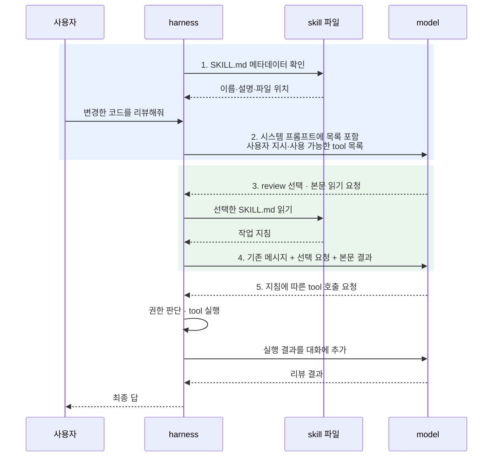
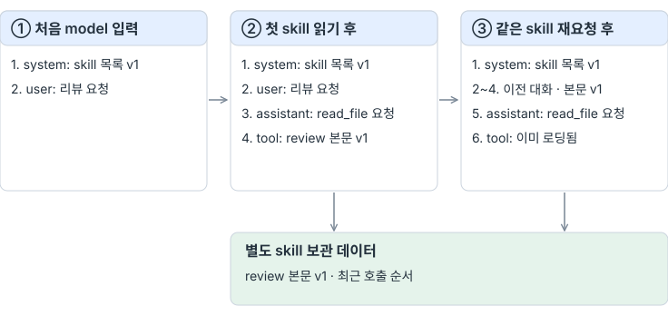
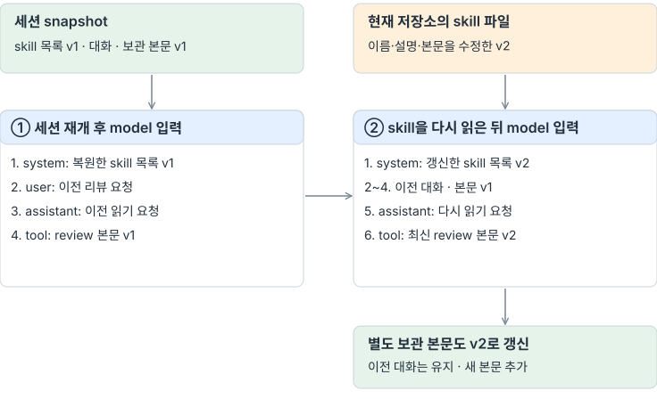
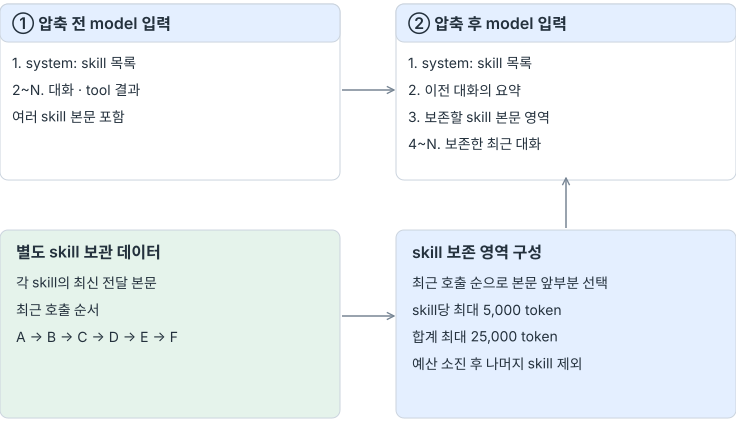
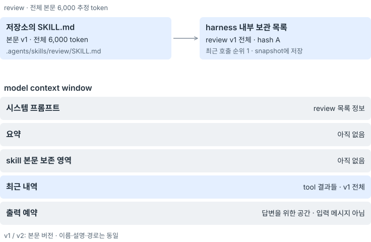
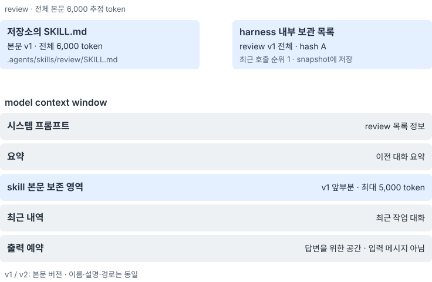
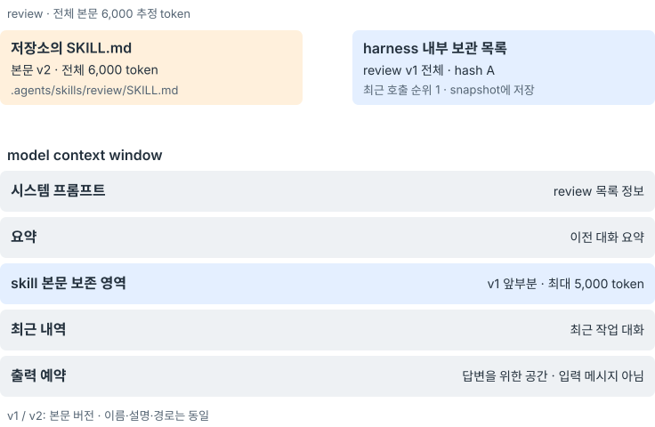
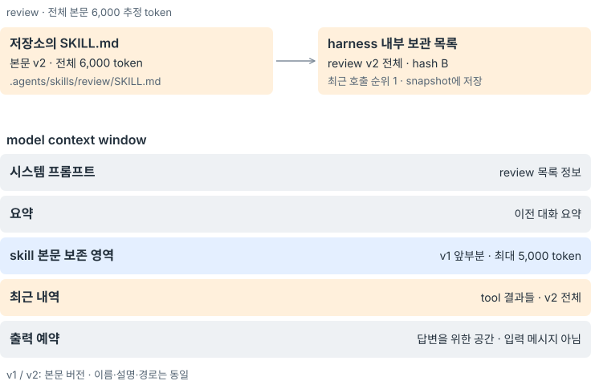
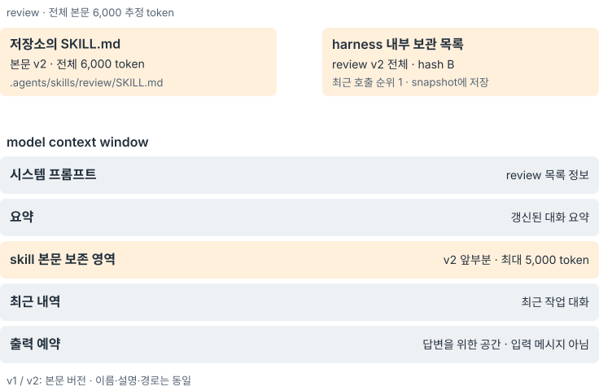

# A — Skills

## 들어가며

skill은 특정 작업을 수행하는 지침과 관련 자료를 묶은 디렉터리다. 그 중심에는 이름과 설명, 본문을 담은 `SKILL.md`가 있다. 필요한 스크립트나 참고 문서도 함께 둘 수 있다. [Agent Skills 형식](https://agentskills.io/specification)

예를 들어 코드 리뷰 절차는 다음과 같이 적을 수 있다.

```markdown
---
name: review
description: 변경한 코드를 저장소 규칙에 맞춰 검토한다.
---

# 코드 리뷰

1. references/rules.md에서 저장소의 코딩 규칙을 읽는다.
2. 변경한 코드와 관련 테스트를 확인한다.
3. 발견한 문제를 파일 위치와 함께 정리한다.
```

model은 이 지침을 읽고 파일 읽기나 명령 실행 같은 tool을 사용한다. skill 파일을 추가하는 것만으로 새로운 실행 함수나 tool은 생기지 않는다. 스크립트가 함께 있어도 실제 실행은 해당 명령을 수행하는 tool을 거친다.

### agent loop에 연결되는 위치

[공통 loop 그림](./#현재-agent-loop와-확장-지점)의 A 단계에서 Skills는 model 입력 준비에 연결된다. harness는 시스템 프롬프트에 사용할 수 있는 skill 목록을 넣는다. model이 작업에 맞는 skill을 선택하면 harness가 해당 본문을 읽어 다음 입력에 포함한다.

Agent Skills의 [구현 가이드](https://agentskills.io/client-implementation/adding-skills-support)도 이름·설명으로 skill을 발견하고, 선택한 skill의 지침과 관련 자료를 단계적으로 읽는 방식을 설명한다.

## 이번에 해볼 것

`hel`에 **목록을 먼저 전달하고, 선택한 본문을 읽는 흐름**을 더한다. 저장소의 `.agents/skills/`에 있는 skill만 대상으로 이름·설명·파일 위치를 모으고, 실제 model 입력에서 목록과 본문이 각각 언제 등장하는지 살펴본다.



1·2에서는 어떤 skill이 있는지 알리는 연결을, 3·4에서는 선택한 지침을 문맥에 넣는 연결을 만든다. 5부터는 기존 tool loop를 사용한다. 목록을 잘 전달했는지와 model이 적절한 skill을 골라 지침을 따르는지는 따로 확인한다.

### 1. 저장소에서 사용할 수 있는 skill 찾기

리뷰와 릴리스 노트 작성을 지원하는 저장소를 예로 들면, 파일을 다음과 같이 배치할 수 있다.

```text
.agents/skills/
├── review/
│   ├── SKILL.md
│   └── references/
│       └── rules.md
└── release-notes/
    └── SKILL.md
```

harness가 발견한 목록은 다음과 같다. 이 예시의 두 skill은 메시지 흐름을 설명하기 위한 구성이다.

| 이름 | 설명 | 파일 위치 |
| --- | --- | --- |
| `review` | 변경한 코드를 저장소 규칙에 맞춰 검토 | `.agents/skills/review/SKILL.md` |
| `release-notes` | 변경 내역을 사용자용 릴리스 노트로 정리 | `.agents/skills/release-notes/SKILL.md` |

`name`과 `description`은 `SKILL.md` 앞부분의 메타데이터에서 읽는다. 경로는 harness가 파일을 발견하면서 함께 기록한다. 파일을 검사하는 과정에서 본문까지 읽더라도, 처음 model에게 보내는 것은 목록이다.

### 2. 시스템 프롬프트에 skill 목록 넣기

시스템 프롬프트의 skill 목록에는 이름·설명·위치를 넣는다. 본문을 읽을 시점과 방법도 함께 알려 준다. 아래는 위 저장소에 대한 입력 예시이며, 기존 시스템 프롬프트 중 Skills와 관계된 부분만 펼쳤다.

```text
1. system: 기존 시스템 프롬프트 + 아래 skill 목록과 사용 방법
2. user: 변경한 코드를 저장소 규칙에 맞춰 리뷰해줘.
```

`system`은 harness가 준비하는 메시지이고, `user`는 사용자의 지시다. 시스템 프롬프트에 덧붙이는 부분은 다음과 같다.

```text
사용 가능한 skills:
- review: 변경한 코드를 저장소 규칙에 맞춰 검토한다.
  위치: .agents/skills/review/SKILL.md
- release-notes: 변경 내역을 사용자용 릴리스 노트로 정리한다.
  위치: .agents/skills/release-notes/SKILL.md

작업에 맞는 skill을 선택하면 해당 SKILL.md를 읽고 지침을 따른다.
skill 안의 상대 경로는 그 SKILL.md가 있는 디렉터리를 기준으로 해석한다.
```

사용 가능한 tool 목록은 메시지와 함께 API 요청에 보낸다. skill 본문 읽기에는 기존 `read_file`을 사용한다. skill 목록에 있는 `review`가 API의 tool 목록에 새 함수로 등록되는 것은 아니다.

### 3. model이 skill을 선택하고 본문 요청하기

model은 입력을 받아 시스템 프롬프트에서 작업 수행에 필요한 skill을 확인하고, skill 본문을 `read_file`로 요청할 수 있다.

model은 `review`의 설명과 사용자 지시를 바탕으로 해당 파일을 읽는 tool 호출을 생성한다. 이 응답이 대화에 `assistant` 메시지로 추가된다.

```json
{
  "role": "assistant",
  "content": null,
  "tool_calls": [{
    "id": "call_skill_1",
    "type": "function",
    "function": {
      "name": "read_file",
      "arguments": "{\"path\":\".agents/skills/review/SKILL.md\"}"
    }
  }]
}
```

harness는 호출을 받아 파일 접근 권한을 확인하고 내용을 읽는다. 본문의 상대 경로 `references/rules.md`는 `.agents/skills/review/references/rules.md`를 가리킨다. 목록에 파일 위치를 남기는 것은 본문을 찾는 데도, 부가 자료의 위치를 해석하는 데도 필요하다.

### 4. 본문을 포함해 model 입력 준비하기

harness는 읽은 결과를 `tool` 메시지로 추가한다. `tool_call_id`를 `call_skill_1`로 지정해 앞의 요청과 짝을 맞춘다. 다음 API 요청에서 model이 보는 메시지 순서는 다음과 같다. 4번의 내용은 읽기 결과 중 지침 부분을 표시했다.

```text
1. system: 기존 시스템 프롬프트 + review·release-notes 목록과 사용 방법
2. user: 변경한 코드를 저장소 규칙에 맞춰 리뷰해줘.
3. assistant: call_skill_1 — read_file로 review/SKILL.md 읽기 요청
4. tool: call_skill_1의 결과 — 코딩 규칙 읽기, 변경 코드·테스트 확인, 문제와 위치 정리
```

skill 목록은 시스템 프롬프트에 남고, 선택한 본문은 대화 기록에 들어간다. 이 시점에는 `release-notes`의 본문이나 `review`의 참고 문서 내용은 포함되지 않는다.

### 5. 지침에 따라 기존 tool 사용하기

model은 전달받은 지침에 따라 `references/rules.md`를 읽고 변경 코드와 테스트를 확인한다. 각 요청은 `assistant`의 tool 호출과 harness가 만든 `tool` 결과로 대화에 쌓인다. 작업을 마치면 model의 최종 답을 사용자에게 전달한다.

이 흐름에는 처음 전달하는 skill 목록의 token과 skill 본문을 요청하는 tool 사용, 그리고 skill 본문만큼의 token 비용이 추가된다. 읽은 본문도 이후 입력 문맥을 차지한다. 사용하지 않은 본문을 처음부터 보내지 않는 만큼 입력을 줄일 수 있지만, 전체 비용과 선택 정확도는 작업별로 확인해야 한다.

## 확인할 내용

| 지점 | 확인할 내용 |
| --- | --- |
| 1·2 목록 전달 | 발견한 이름·설명·경로와 실제 시스템 프롬프트의 일치, 선택 전 본문 제외 |
| 3 skill 선택 | 작업과 관련된 skill 선택 여부, 잘못된 경로·메타데이터 오류의 진단 |
| 4 본문 전달 | 선택한 파일 내용과 tool 결과의 일치, 요청·결과의 연결 |
| 5 작업 수행 | 지침에 있는 절차의 실제 사용 여부, 읽은 참고 자료와 실행한 tool |
| 문맥 유지 | 중복 로딩, 압축 후 지침 유지, 세션 재개 시 목록과 이미 읽은 본문의 관계 |
| 비용 | 목록·선택한 본문의 입력 token, 추가 model 요청 수와 작업 완료 비용 |

## skill이 포함된 문맥 관리

### skill을 다시 읽을 때 변경 반영하기

skill 목록과 skill 본문은 model 입력의 서로 다른 메시지에 들어간다. 시스템 프롬프트에는 skill 목록을, 대화에는 읽은 skill 본문을 둔다. harness는 압축 후에도 사용할 skill 본문을 별도로 보관한다.

<picture><source media="(max-width: 640px)" srcset="images/skills-context-mobile.svg"></picture>

그림의 각 상자는 model에게 보내는 메시지 목록이다. 별도 보관 데이터는 harness가 관리하며, 본문을 실제 요청에 포함할 때 입력 token을 차지한다. 메시지 번호는 흐름을 설명하기 위한 예시다.

세션을 재개하면 snapshot의 skill 목록과 읽어 둔 skill 본문을 복원한다. 이 시점에는 skill 파일의 변경을 확인하지 않는다. model이 기존 `read_file`로 해당 skill을 다시 요청할 때 현재 파일을 읽고 비교한다.

<picture><source media="(max-width: 640px)" srcset="images/skills-resume-mobile.svg"></picture>

이 그림은 skill의 이름·설명과 본문을 함께 수정한 경우다. 재개 직후에는 v1을 사용하고, 다시 읽은 뒤의 입력에는 갱신한 skill 목록과 v2 본문이 들어간다. 기존 대화는 유지한다. 시스템 프롬프트 중 OS·HEL.md 등은 H9처럼 현재 환경으로 구성하고, 여기서는 skill 목록 부분의 복원을 나타냈다.

| 읽기 결과 | 다음 model 입력에 반영할 내용 |
| --- | --- |
| 처음 읽는 skill | 시스템 프롬프트의 해당 skill 정보와 전체 skill 본문 |
| 같은 skill 본문이 현재 문맥에 존재 | tool 결과로 “이미 로딩됨” 안내 |
| skill 본문 변경 | 시스템 프롬프트의 해당 skill 정보 갱신, tool 결과로 최신 skill 본문 전달 |
| 같은 skill 본문이 현재 문맥에 없음 | tool 결과로 skill 본문 재전달 |

skill 이름·설명 등 목록 정보의 변경은 본문과 따로 비교하며, 달라진 경우에만 시스템 프롬프트를 갱신한다.

“이미 로딩됨”은 앞의 대화 메시지나 압축 후 skill 보존 영역에 해당 본문이 있어야 한다. 변경된 skill 본문을 전달하면 별도로 보관하는 본문도 갱신한다.

### 압축 후 skill 본문 보존하기

압축할 때는 보관한 skill 본문을 요약과 구분해 다시 포함한다.

<picture><source media="(max-width: 640px)" srcset="images/skills-compaction-mobile.svg"></picture>

압축 후 model에게 전달할 입력은 다음 순서다. 출력 예약은 메시지가 아니라 model의 답변을 위해 비워 두는 공간이다.

```text
시스템 프롬프트 | 요약 | skill 본문 보존 영역 | 최근 내역 | 출력 예약
(skill 목록 포함)      (최대 25,000 token)
```

skill 본문 보존 영역은 최근 내역에 포함하지 않는다. `keep_recent`는 최근 대화의 보존량을 정하고, skill 본문은 별도 한도를 적용한다. 다만 두 영역 모두 같은 context window를 사용한다.

시스템 프롬프트·요약·최근 내역을 구성한 뒤, 압축 기준까지 남은 입력 예산과 25,000 token 중 작은 값으로 skill 보존 영역을 제한한다. 따라서 작은 context 설정에서는 skill 본문이 25,000 token보다 적게 들어갈 수 있다. token 수는 H6와 같은 문자열 길이 기반 추정값을 사용하며, 영역의 제목·경로 등 전달 형식도 전체 예산에 포함한다.

| 항목 | 보존 규칙 |
| --- | --- |
| 순서 | 최근 호출한 skill부터 우선 |
| skill별 한도 | 가장 최근에 전달한 본문의 앞부분 최대 5,000 token |
| 전체 한도 | skill 본문 합계 최대 25,000 token |
| 한도 초과 | 남은 예산까지만 포함하고 이후 skill은 제외 |

skill이 다섯 개로 제한되는 것은 아니다. 각 본문이 짧으면 더 많은 skill을 포함할 수 있다. 본문의 일부만 남았거나 제외된 skill을 다시 읽으면, “이미 로딩됨”으로 생략하지 않고 본문을 전달한다.

파일의 최신 내용은 압축 시점이 아닌, 해당 skill을 다시 읽는 시점에 확인한다. 따라서 model이 skill을 다시 요청하기 전까지는 기존 지침이 유지된다.

### `hel` 내부 skill 보관 목록과 문맥 관리

`hel` harness 내부에는 문맥 관리를 위한 별도의 skill 보관 목록을 가진다. 보관 목록은 저장소의 모든 skill을 저장하는게 아니라 호출한 skill마다 다음과 같은 정보를 보관하게 된다.

- 경로: skill 식별용
- 최신 전체 본문: 압축 후 다시 넣을 skill 본문 원문
- 본문의 SHA-256 hash: skill 재호출시 변경 여부 비교용
- 최근 호출 순서: 압축 후 보존 우선순위

`hel`의 내부 보관 목록을 이용한 문맥 관리는 다음과 같은 절차로 진행된다.

본문이 6,000 추정 token인 `review` skill을 예로 들면 다음과 같다. 단계를 선택해 저장소 파일, 내부 보관 목록, model 입력의 변화를 비교할 수 있다.

<style>
.h10-skills-lifecycle { margin: 1.5em 0; }
.h10-skills-lifecycle .lifecycle-controls { display:flex; flex-wrap:wrap; gap:.5em; margin-bottom:1em; }
.h10-skills-lifecycle label { display:inline-flex; align-items:center; gap:.4em; padding:.4em .7em; border:1px solid var(--table-border-color); border-radius:.4em; cursor:pointer; }
.h10-skills-lifecycle label:has(input:checked) { background:var(--quote-bg); font-weight:bold; }
.h10-skills-lifecycle figure { display:none; margin:0; }
.h10-skills-lifecycle img { display:block; width:100%; max-width:736px; margin:0 auto; }
.h10-skills-lifecycle figcaption { margin-top:.75em; }
.h10-skills-lifecycle:has(#skill-life-read:checked) .skill-life-read { display:block; }
.h10-skills-lifecycle:has(#skill-life-compact:checked) .skill-life-compact { display:block; }
.h10-skills-lifecycle:has(#skill-life-changed:checked) .skill-life-changed { display:block; }
.h10-skills-lifecycle:has(#skill-life-reread:checked) .skill-life-reread { display:block; }
.h10-skills-lifecycle:has(#skill-life-recompact:checked) .skill-life-recompact { display:block; }
@media print { .h10-skills-lifecycle .lifecycle-controls { display:none; } .h10-skills-lifecycle figure { display:block !important; margin-bottom:1.5em; break-inside:avoid; } }
</style>
<div class="h10-skills-lifecycle">
<div class="lifecycle-controls" role="group" aria-label="skill 문맥 관리 단계">
<label><input type="radio" name="skill-lifecycle" id="skill-life-read">1. 첫 읽기</label>
<label><input type="radio" name="skill-lifecycle" id="skill-life-compact">2. 첫 압축</label>
<label><input type="radio" name="skill-lifecycle" id="skill-life-changed">3. 파일 수정</label>
<label><input type="radio" name="skill-lifecycle" id="skill-life-reread" checked>4. 재읽기</label>
<label><input type="radio" name="skill-lifecycle" id="skill-life-recompact">5. 다시 압축</label>
</div>
<figure class="skill-life-read"><picture><source media="(max-width:640px)" srcset="images/skills-lifecycle-read-mobile.svg"></picture><figcaption>첫 읽기는 cursor 이어 읽기까지 끝난 상태다. 본문 전체가 tool 결과들에 들어가고 내부 보관 목록에도 저장된다.</figcaption></figure>
<figure class="skill-life-compact"><picture><source media="(max-width:640px)" srcset="images/skills-lifecycle-compact-mobile.svg"></picture><figcaption>첫 skill 읽기가 요약 대상이 된 경우다. 내부 보관 원문은 전체를 유지하고, 문맥의 skill 보존 영역에는 앞부분만 들어간다.</figcaption></figure>
<figure class="skill-life-changed"><picture><source media="(max-width:640px)" srcset="images/skills-lifecycle-changed-mobile.svg"></picture><figcaption>저장소에서 본문만 v2로 수정했다. 아직 다시 읽지 않았으므로 내부 보관 목록과 model 입력은 v1을 유지한다.</figcaption></figure>
<figure class="skill-life-reread"><picture><source media="(max-width:640px)" srcset="images/skills-lifecycle-reread-mobile.svg"></picture><figcaption>재읽기를 마치면 내부 보관 목록과 새 tool 결과는 v2가 된다. 기존 skill 보존 영역의 v1은 그대로 남는다.</figcaption></figure>
<figure class="skill-life-recompact"><picture><source media="(max-width:640px)" srcset="images/skills-lifecycle-recompact-mobile.svg"></picture><figcaption>후속 대화가 쌓여 v2 읽기도 요약 대상이 됐다. 기존 skill 보존 영역을 제거하고 내부 보관 목록의 v2로 다시 구성한다.</figcaption></figure>
</div>

내부 보관 목록과 압축시 skill을 포함한 문맥 관리를 정리하면 다음과 같다.

- 압축 후 skill 본문 보존 영역에서 skill을 읽을 때, 잘린 부분이 필요하면 model이 `read_file`로 남은 부분을 요청한다. 결과는 최근 대화에 추가된다. 남은 부분은 model의 판단에 따라 범위로 읽거나, 처음부터 읽고 cursor로 이어갈 수 있다.
- skill이 변경된 경우에는, 변경된 skill을 읽는 시점에 내부 보관 목록을 갱신하고 최근 대화에 갱신된 skill 본문을 추가한다. skill 보존 영역은 이후 압축에서 갱신된다.
- skill 본문이 문맥에 존재하는지는 harness가 남긴 전달 기록과 실제 메시지를 대조하여 판단한다. 이때 본문 내용과 함께 요청한 skill의 버전까지 모두 동일해야 한다. 본문은 일반 대화 영역 혹은 skill 보존 영역에 독립적으로 완전하게 존재해야 한다.
    - 일반 대화의 tool 결과에 요청한 skill 본문 정보가 모두 존재하면 있다고 판단한다.
    - 압축 후 skill 보존 영역에 요청한 skill 본문 정보가 모두 존재하면 있다고 판단한다.
    - 그 외에는 새로 로드한다.
- skill의 메타데이터(이름, 설명)가 변경되면 시스템 프롬프트의 skill 목록을 갱신한다.

## 구현과 동작 확인

skill을 사용하는 실행에서는 기존 tool 목록에 `read_file`을 포함한다.

```bash
hel --tools bash,read_file
```

저장소의 `.agents/skills/<디렉터리>/SKILL.md`에서 이름과 설명을 읽어 목록을 만든다. 상위 저장소나 사용자 홈의 skill은 합치지 않는다. 잘못된 메타데이터·심볼릭 링크·1 MiB를 넘는 파일은 목록에서 제외하며 진단을 출력한다.

harness는 경로별로 최신 본문과 SHA-256 hash, 마지막 호출 순서를 저장한다. model에게 전달한 tool 결과의 호출 ID·내용·본문 범위도 기록한다. 이 기록을 실제 대화와 대조하므로, 오래된 결과가 잘리거나 압축으로 제거됐을 때도 전체 본문이 남았는지 구분할 수 있다.

`read_file`의 10,000 byte 한도와 cursor 이어 읽기는 유지한다. 긴 skill의 전체 원문은 harness에 보관하고, model에게는 기존 한도에 맞춰 전달한다. 범위 읽기는 요청한 범위를 반환하며, 전체 읽기 요청에서만 중복 본문 전달을 생략한다.

재읽기 시에는 같은 본문의 전달 기록과 보존 영역을 확인한다.

```rust
pub fn same_visible(&self, path: &str, doc: &Document) -> bool {
    self.visible.contains(path)
        && self.loaded.get(path).is_some_and(|old|
            old.hash == hash(&doc.body) && old.body == doc.body)
}
```

같은 경로의 메타데이터와 본문은 따로 비교한다. 이름·설명만 바뀌면 목록을 갱신하고, 같은 전체 본문이 현재 문맥에 있으면 “이미 로딩됨”을 반환한다. 경로가 사라졌다면 읽기 실패를 알리고 목록을 다시 탐색한다. 이동한 디렉터리를 이전 skill과 같은 것으로 추정하지 않는다.

압축 후 문맥은 시스템 프롬프트와 요약, 최근 내역을 먼저 구성한 다음 그 사이에 skill 보존 영역을 넣는다.

```rust
let available = policy.at.saturating_sub(estimate(&candidate));
let preserved = skills.preservation(available);
if let Some(region) = &preserved {
    candidate.insert(first + 1, region.message.clone());
}
```

세션 snapshot에는 skill 목록과 보관 본문, 호출 순서, 전달 기록을 함께 저장한다. 재개할 때는 이 상태를 복원하고, skill 파일은 다시 읽기 요청이 올 때 확인한다. Skills 데이터가 없는 이전 snapshot도 읽을 수 있다.

| 검사한 상황 | 확인한 동작 |
| --- | --- |
| 최초 호출·동일 본문 재호출 | 최초 본문 전달, 재호출은 이미 로딩됨 안내 |
| 이름만 변경·본문 변경 | 목록 정보 갱신과 본문 재전달을 구분 |
| skill 디렉터리 이동 | 이전 경로 오류와 목록 재탐색, 새 경로 읽기 |
| 긴 UTF-8 본문 이어 읽기 | byte 한도 유지, 전체 전달 전 중복 생략 없음 |
| 압축 후 일부 보존·제외 | 재읽기 시 본문 전달 |
| 반복 압축 | 보존 영역 중복 없이 갱신, 별도 보관 원문 유지 |
| 프로세스 종료 후 재개 | 과거 skill 정보 복원, 재읽기 후 변경 반영 |
| 이전 형식의 snapshot | Skills 필드 없이도 복원 |

harness 내부의 문맥 관리 로직은 위 결정적 테스트와 로컬 응답 서버를 이용한 CLI 테스트로 검증했다. 검사한 범위는 본문의 전달·변경 판정, 문맥에 남은 전체 본문 확인, 압축 후 보존과 세션 복원이다. model의 선택 없이 정해진 입력과 기대 결과를 대조해 확인했다.

## model의 skill 사용 확인

model에게 설정 파일 리뷰를 요청하고, 사용할 skill을 고르는 과정부터 결과를 작성하는 행동까지 살펴본다. 저장소에는 설정 리뷰용 `config-review`와 릴리스 노트 작성용 `release-notes`를 함께 둔다. `config-review`의 본문에는 참고 규칙을 읽는 절차와 결과 형식을 적는다.

```text
.agents/skills/
├── config-review/
│   ├── SKILL.md
│   └── references/rules.md
└── release-notes/
    └── SKILL.md
server.json
```

사용자 지시는 다음과 같이 전달한다. skill 이름이나 파일 위치는 지시에 넣지 않고, model이 시스템 프롬프트의 목록에서 고르게 한다.

```text
server.json을 저장소 규칙에 맞춰 리뷰하고 결과를 정리해줘.
```

파일 구성은 다음과 같다. 포트의 허용 범위는 이 저장소의 규칙으로 정한 임의의 값이다.

| 파일 | 내용 |
| --- | --- |
| `config-review/SKILL.md` | 참고 규칙으로 설정을 검토하고, 문제를 `항목 / 현재 값 / 위반 이유` 형식으로 보고 |
| `config-review/references/rules.md` | 포트는 8000~9000만 허용 |
| `server.json` | `"port": 7000` |

model은 skill을 읽어 검토 절차를 파악한 뒤, 참고 규칙과 실제 설정값을 대조해야 한다. 이 예시에서 기대하는 보고는 다음과 같다.

```text
port / 7000 / 허용 범위 8000~9000을 벗어남
```

“config-review skill을 사용하겠습니다”라고만 답하고 끝내면 리뷰를 수행하지 못한 것이다. skill을 찾아 읽었는지와 그 지침을 적용해 오류를 보고했는지를 함께 확인한다.

| model의 행동 | 확인할 내용 |
| --- | --- |
| skill 선택 | 작업과 관련된 `config-review/SKILL.md` 읽기, 무관한 skill 호출 여부 |
| 지침 사용 | 본문에 지정된 `references/rules.md`와 `server.json` 읽기 |
| 리뷰 수행 | 실제 포트 값과 허용 범위를 대조한 오류 지적 |
| 결과 작성 | skill에 지정된 보고 형식 준수 |

최종 답과 tool 호출 기록을 함께 확인한다. 파일을 읽은 사실과 규칙을 올바르게 적용한 결과는 각각 기록하고, model 요청 수와 입력 token도 살펴본다. 앞에서 검증한 snapshot 복원·본문 보존 이후의 model 행동은 이번 실험에서는 다루지 않는다.


### 실행 결과

`deepseek-flash`로 Skills 구현 전 코드와 구현 후 코드를 각각 3회 실행했다. 같은 설정 파일과 지시를 사용하고, 실행당 model 호출은 최대 8회, 출력 한도는 8,192 token, 제한 시간은 120초로 두었다. 압축은 끄고 `bash`와 `read_file`을 제공했다. 구현 전 코드는 과거 버전을 별도로 빌드해 실행했다.

| 확인한 행동 | 구현 전 | 구현 후 |
| --- | --- | --- |
| 첫 tool 호출로 `config-review/SKILL.md` 읽기 | 0/3 | 3/3 |
| 리뷰 skill·참고 규칙·설정 파일 읽기 | 3/3 | 3/3 |
| 포트 7000의 범위 위반 지적 | 3/3 | 3/3 |
| 무관한 `release-notes` 본문 읽기 | 3/3 | 0/3 |
| 기대 보고 문자열과 완전 일치 | 1/3 | 2/3 |
| 설정 파일 변경 없이 리뷰 완료 | 3/3 | 3/3 |

구현 전에도 model은 디렉터리를 탐색해 skill과 참고 규칙을 찾았다. 구현 후에는 목록에서 리뷰 skill을 골라 첫 tool 호출로 읽었다. 무관한 skill의 본문은 읽지 않았지만, 추가 파일 탐색은 여전히 수행했다.

보고 문자열이 일치하지 않은 세 실행도 포트 오류와 위반 이유는 올바르게 답했다. 구현 전 두 실행은 답 전체를 백틱으로 감쌌고, 구현 후 한 실행은 다음처럼 항목과 값을 백틱으로 감쌌다.

```text
`port` / `7000` / 허용 범위 8000~9000을 벗어남
```

완전 일치 검사는 이 차이를 실패로 판정했다. skill은 보고 형식과 code fence 금지를 지정했지만 inline code 사용을 명시적으로 금지하지는 않았다. 이 결과는 문자열 일치 여부로 기록하며, 규칙을 적용하지 못한 경우와 구분한다.

| 실행당 평균 | 구현 전 | 구현 후 |
| --- | --- | --- |
| model 호출 | 3.67회 | 3.67회 |
| tool 호출 | 6회 | 4.33회 |
| 입력 token | 4,983.7 | 4,743.7 |
| 출력 token | 614 | 336.3 |

이번 세 번씩의 실행에서는 관련 skill로 바로 접근하고 무관한 본문 읽기를 줄이는 행동이 관찰됐다. 오류 발견 횟수는 같았고, 입력 token 차이는 약 4.8%였다. 다만 이 규모로 선택 정확도나 비용의 일반적인 개선을 단정하기는 어렵다.

- 실험 중 model은 `server.json`을 찾으려고 `find`로 디렉터리 전체를 확인했다. 이 과정에서 접근이 금지된 세션 저장 폴더 `.hel`에 접근했고, sandbox가 이를 막아 종료 코드 1을 반환했다.
- 이는 Skills 구현과 무관하게 model이 사용하는 bash 명령의 호출 형태에 따라 기록에 영향을 준 것이다.

측정은 다음과 같은 명령어로 확인할 수 있다.

```bash
evals run h10 --conditions baseline --build
```

```bash
evals run h10 --conditions variant --build
```


## 돌아보기

### 변경 사항

model이 시스템 프롬프트의 목록에서 작업에 맞는 skill을 고르고, 본문과 참고 파일을 읽어 설정을 리뷰하는 흐름을 확인했다. 이번 실행에서는 관련 skill에 바로 접근하고 무관한 skill의 본문을 읽지 않았다. 구현 전에도 포트 오류는 모두 찾아냈으므로, 확인한 변화는 지침을 찾는 과정에 있었다.

작업별 지침은 `.agents/skills/`에 추가하고 기존 `read_file`로 읽는다. 새 지침을 연결할 때 tool을 추가하거나 loop를 바꿀 필요가 없다. harness에는 읽은 본문을 보관하고, 재읽기·압축·세션 재개 때 문맥에 어떤 버전을 남길지 관리하는 구조가 더해졌다.

### 트레이드오프

본문을 필요할 때 읽는 만큼 최초 로딩에 tool 호출이 필요하고, skill 목록은 시스템 프롬프트의 공간을 사용한다. 이번에는 전체 tool 호출이 줄었지만 model 호출 횟수는 같았다. 목록 제공이 모든 탐색을 없애거나 왕복 횟수를 줄여 주는 것은 아니다.

본문 보관에는 메모리와 snapshot 공간이 들고, 압축 뒤 다시 넣은 지침도 입력 token을 차지한다. 별도로 원문을 보관해도 model에게 전달할 수 있는 양에는 한도가 있다. 긴 skill의 뒷부분이나 오래된 skill이 빠졌다면 다시 읽어야 한다. 이는 결정적 테스트로 검사했다.

skill을 읽은 뒤에도 지침의 해석과 실행은 model에 달려 있다. 이번 보고의 백틱 차이처럼, 지침이 허용하는 표현과 판정 규칙이 기대하는 문자열이 어긋날 수 있다. 정확한 서식이 필요한 작업에서는 허용할 표현을 지침에 명확히 적고, 의미상 맞는 답과 서식 준수를 나누어 확인해야 한다. tool 실행 시 반드시 지켜야 할 규칙은 다음 [Hooks](hooks.md)에서 실행 경계의 검사로 다룬다.

### 논문의 내용 또는 다른 harness와 비교하면

[Agent Skills의 통합 안내](https://agentskills.io/client-implementation/adding-skills-support)는 목록, 선택한 본문, 필요한 부가 자료를 단계적으로 읽는 구조를 설명한다. hel도 이 흐름을 따르며 기존 파일 읽기 tool을 사용한다. 탐색 범위는 현재 프로젝트 하나로 제한해 사용자 홈이나 여러 저장소의 지침을 합칠 때 생기는 우선순위 문제는 다루지 않았다.

[Claude Code의 skill 수명 관리](https://code.claude.com/docs/en/skills#skill-content-lifecycle)는 같은 내용의 중복 전달을 생략하고, 압축 뒤에는 최근 호출한 skill부터 한도 안에서 본문을 다시 붙인다. hel에도 이 보존 방식을 적용했다. 다만 hel은 파일에서 읽은 본문을 비교하고 문자열 길이로 token을 추정한다. 인자나 명령 실행 결과를 반영한 본문 생성은 지원하지 않으므로, 같은 보존 정책을 사용해도 전체 동작이나 문맥 사용량이 같다는 뜻은 아니다.
