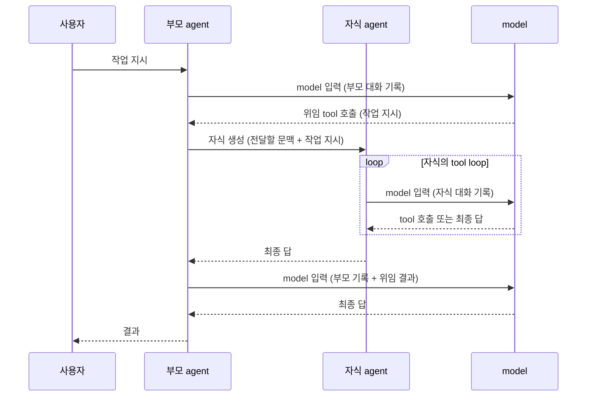
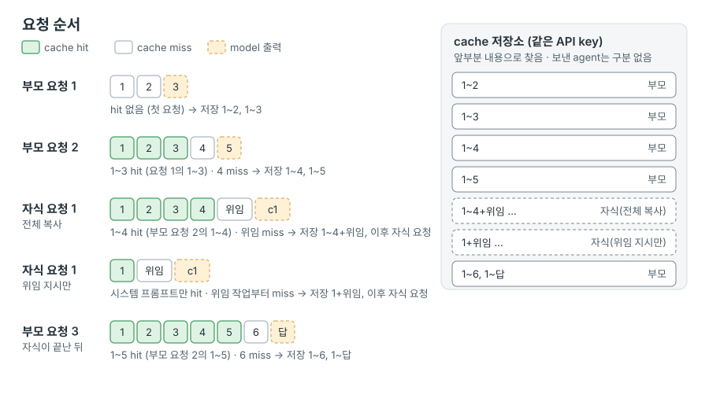
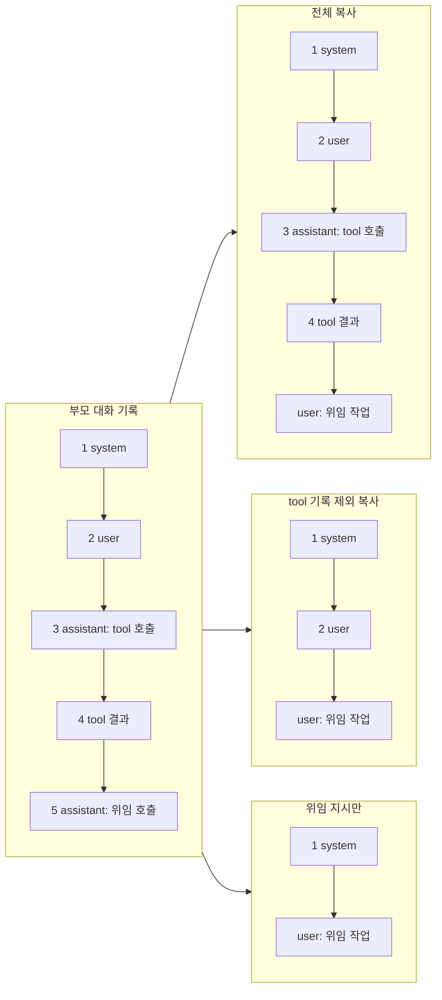

# H11 — Subagents

> [!NOTE]
> - 시작 상태: [`h11`](https://github.com/jammer-droid/HEL/tree/h11) · 완료 상태: [`h12`](https://github.com/jammer-droid/HEL/tree/h12)
> - 논문: [§11 Multi-Agent Orchestration](https://arxiv.org/html/2609.00006v1#S11), [§16.7 Multi-Agent Orchestration](https://arxiv.org/html/2609.00006v1#S16.SS7)

```bash
git checkout -b my-h11 h11
```

## 들어가며

[Part V 개요](../../parts/part5-extensibility-orchestration.md)에서 작업 위임은 부모 agent가 작업 일부를 자식 agent에게 맡기고 결과를 돌려받는 구조로 소개했다. 지금의 `hel`은 agent 하나가 model 입력 준비, tool 실행, 결과 추가를 반복한다. 읽은 파일과 tool 결과는 모두 같은 대화 기록에 쌓이고, 대화 기록이 문맥 한도에 가까워지면 H6의 압축으로 오래된 구간을 요약한다.

### 논문이 본 subagent

논문 [§11.1](https://arxiv.org/html/2609.00006v1#S11.SS1)은 분석한 11개 시스템 중 9개가 여러 agent를 실행할 수 있다고 정리한다. 구조는 자식 하나를 만들고 끝날 때까지 기다리는 순차 위임부터, 자식이 다시 자식을 만드는 재귀 구조, 여러 자식을 동시에 실행하는 구조까지 넓게 갈린다. 그래도 부모가 작업자를 만들고 결과를 모으는 형태는 대부분의 시스템에서 공통으로 나타난다([§11.10](https://arxiv.org/html/2609.00006v1#S11.SS10) 관찰 7).

시스템마다 달라지는 지점은 부모와 자식 사이에 무엇을 주고받는지다. 논문 [표 9](https://arxiv.org/html/2609.00006v1#S11.T9)에서 Codex와 Claude Code 행을 필요한 열만 추리면 다음과 같다.

| 시스템 | 자식 생성 | 문맥 분리와 상속 | 결과 전달 | 깊이와 동시 실행 |
| --- | --- | --- | --- | --- |
| Claude Code | AgentTool, 문맥 분기 | 부모 문맥을 6개 차원에서 분기, 렌더링한 시스템 프롬프트 공유 | 반환값과 XML 알림 | 재귀, 동시 실행 |
| Codex | `spawn_agent` | 스레드 트리, 부모 기록 상속 방식 선택 | 입력 큐와 메시지 기록 | 깊이 추적, 동시 실행 |

[§16.7](https://arxiv.org/html/2609.00006v1#S16.SS7) 권고 12는 여러 문맥으로 나눠 탐색하는 쪽이 순차 탐색보다 분명히 나은 단계를 지목할 수 있을 때까지 agent 하나를 유지하라고 권한다. 근거로 든 연구에서는 여러 agent를 쓰는 구성이 일반 대화보다 token을 약 15배 사용했다. 권고 13은 harness 안의 부모와 자식은 별도 통신 규약 없이 같은 프로세스 안에서 호출하라고 권한다.

### 이번 Lab에서 다룰 작업 위임

이번 Lab은 순차 위임을 다룬다. 부모 agent는 tool 호출로 자식 agent를 만들고, 자식이 끝날 때까지 기다린 뒤 자식의 최종 답을 tool 결과로 받아 작업을 이어 간다. 사용자는 부모와만 대화하고, 자식에게 직접 지시를 보내지 않는다.



자식은 별도의 대화 기록을 가진다. 자식이 읽은 파일과 tool 결과는 자식의 기록에만 쌓이고, 부모에게는 최종 답만 돌아온다. 부모와 자식이 쓰는 token을 합하면 agent 하나로 처리할 때보다 늘어난다. 대신 작업을 나눠 각자 자기 문맥 한도 안에서 처리하므로, 전체 작업이 쓸 수 있는 문맥은 넓어진다. 이번 Lab에서는 subagent의 이점을 token 절약보다 이렇게 넓어지는 문맥으로 본다.

자식을 만들 때 무엇을 넘길지가 이번에 살펴볼 지점이다. 부모 대화 기록을 그대로 복사하면 자식은 부모가 이미 읽은 내용을 다시 탐색하지 않아도 된다. 하지만 자식의 문맥도 부모 기록만큼 차지한 상태로 시작한다. 작업 지시만 넘기면 자식은 작은 문맥으로 시작하지만, 부모가 지시에 담지 않은 정보는 다시 찾아야 할 수 있다. 부모 기록 전체를 복사하는 방식, tool 기록만 빼고 복사하는 방식, 작업 지시만 넘기는 방식을 비교해 자식의 자원 사용과 작업 결과를 확인한다. 여러 자식을 동시에 실행해 작업 시간을 줄이는 구조는 H12 Parallelism에서 다룬다.

### 참고 자료

[Claude Code](https://code.claude.com/docs/en/sub-agents)의 일반 subagent는 새 문맥에서 시작한다. 자기 시스템 프롬프트, 부모 model이 작성한 위임 메시지, `CLAUDE.md`와 git 상태를 받고, 작업이 끝나면 최종 요약만 돌려준다. fork는 부모의 대화 기록·시스템 프롬프트·tool·model을 그대로 받는다. 첫 요청이 부모와 같은 prompt cache를 사용하므로 새 subagent를 만드는 것보다 비용이 적다. fork는 대화형 세션에서 기본으로 켜지고, `-p` 실행과 Agent SDK에서는 기본으로 꺼진다(2026-10 기준).

[Codex](https://github.com/openai/codex/blob/ac9b5b8380517ded445b09dd3196d8d9e2ba3c59/codex-rs/core/src/tools/handlers/multi_agents_spec.rs)의 `spawn_agent`는 `fork_context` 인자로 부모 기록을 넘길지 고른다. 넘기지 않으면 자식은 초기 작업 지시만 받는다. 넘길 때도 시스템·사용자 메시지와 assistant 최종 답만 남기고, tool 호출과 결과, 추론 과정은 [제외한다](https://github.com/openai/codex/blob/ac9b5b8380517ded445b09dd3196d8d9e2ba3c59/codex-rs/core/src/agent/control/spawn.rs). 자식은 부모의 model, 승인 정책, sandbox, 작업 폴더를 그대로 쓰고, 기본 설정에서는 자식이 다시 자식을 만들 수 없다. tool 설명은 위임할 작업을 구체적이고 그 자체로 완결되게 쓰고, 필요한 출력으로 좁혀 지시하라고 안내한다.

### DeepSeek의 cache 작동 방식

> [!NOTE]
> subagent를 사용해도 cache는 model에게 전달하는 문맥의 구성에 따라 유지될 수도, 그렇지 않을 수도 있다. DeepSeek를 기준으로 model의 cache 저장소가 어떻게 작동하는지 확인한다.

`hel`이 사용하는 DeepSeek API는 요청의 앞부분이 이전 요청과 같으면 그 부분을 다시 계산하지 않고 저장해 둔 결과를 쓴다([Context Caching](https://api-docs.deepseek.com/guides/kv_cache), 2026-10 기준). 응답의 usage에는 저장된 결과를 쓴 `prompt_cache_hit_tokens`와 새로 계산한 `prompt_cache_miss_tokens`가 따로 나온다.

DeepSeek 문서는 cache가 다음과 같이 작동한다고 설명한다.

- 요청 하나를 처리하면 입력이 끝나는 위치와 model 출력이 끝나는 위치를 기준으로 저장 단위를 만들어 model의 cache 저장소에 cache를 저장한다.(그래서 요청 1개, 요청+출력 1개가 생긴다.) 여기서 입력은 model을 호출하는 API 요청에 담아 보낸 메시지 전체를 의미하며, model 출력은 API 요청에 대한 model의 응답을 의미한다.
- 다음 요청부터는 cache 저장소에 저장된 cache와 요청의 앞부분을 비교한다. cache 저장 단위를 기준으로 처음부터 끝까지 같을 때만 그 길이만큼 cache hit에 성공한다.
- 저장은 best-effort로 처리하며 cache hit를 보장하지 않는다. 쓰지 않는 단위는 보통 몇 시간에서 며칠 안에 지워진다.

cache 저장소는 저장 단위를 harness에서 정한 agent 단위가 아닌 내용을 기반으로 찾는다. 그래서 subagent 기록을 따로 만들어도, 그 기록의 앞부분이 부모가 보낸 요청과 같으면 자식의 첫 요청에서도 cache hit을 얻을 수 있다. 또한 자식이 요청을 보내 새로운 저장 단위를 만들어도 부모가 남긴 기존 저장 단위는 그대로 남기 때문에, 자식의 작업이 끝난 뒤 부모의 다음 요청도 이전 앞부분을 다시 사용할 수 있다.

<figure><picture><source media="(max-width: 640px)" srcset="images/cache-store-mobile.svg"></picture></figure>

그림은 subagent를 호출했을 때의 cache 저장소의 작동 방식을 순서대로 표현한 것이다. 점선은 model 출력을 의미하며, 요청을 보낸 뒤에 요청에 대한 응답으로 추가된 것임을 의미한다. cache 저장소는 요청과 요청+응답을 순차적으로 쌓는 것을 확인할 수 있다.

- 부모 요청 2는 요청 1이 남긴 1~3 단위로 cache hit에 성공한다. 새로 추가한 4번(tool 결과)만 다시 계산한다.
- 부모 기록을 전체 복사한 자식의 첫 요청은 1~4가 부모 요청 2의 입력과 같다. 마지막에 붙인 위임 작업만 다시 계산한다.
- 위임 지시만 받은 자식의 첫 요청은 1번 시스템 프롬프트만 부모와 같다. 시스템 프롬프트 부분만 cache hit에 성공하고, 그 뒤 위임 작업부터는 다시 계산한다.
- 자식이 끝난 뒤 부모 요청 3은 부모 요청 2가 남긴 1~5 단위로 cache hit에 성공한다. 자식의 단위는 다른 앞부분으로 저장되어 부모의 단위에 영향을 주지 않는다.

문서는 사용 가능한 tool 목록이 이 앞부분에 포함되는지, 저장 공간이 찼을 때 어떤 단위부터 지우는지는 설명하지 않는다. 그래서 자식에게 부모와 같은 시스템 프롬프트와 사용 가능한 tool 목록을 주고, 그림의 cache hit 범위는 결과 확인에서 요청별 `prompt_cache_hit_tokens`로 맞춰 본다.

> [!NOTE]
> 실제로 측정한 cache hit token은 모두 64의 배수였다. 그림은 hit 범위를 메시지 단위로 그렸다. 실제 hit 범위는 64 token 묶음 경계에서 끊긴다(아래 "cache hit 확인").


## 이번에 해볼 것

부모가 위임 tool을 호출하는 시점의 부모 대화 기록이 아래와 같다고 하자. system 메시지는 `hel`이 만드는 시스템 프롬프트이고, user 메시지는 사용자의 지시다. assistant 메시지는 model의 응답이고, tool 메시지는 `hel`이 tool을 실행한 결과다.

```text
1. [system]    시스템 프롬프트
2. [user]      작업 지시
3. [assistant] read_file 호출
4. [tool]      파일 내용
5. [assistant] 위임 tool 호출 (자식에게 맡길 작업 지시)
```

자식의 대화 기록은 이 기록에서 무엇을 가져오는지에 따라 세 가지로 나뉜다. 세 방식 모두 자식의 마지막 메시지는 5번 호출에 담긴 작업 지시를 user 메시지로 옮긴 것이다.



- 전체 복사: 1~4번을 그대로 복사한다. 자식은 부모가 읽은 파일 내용을 이미 가진 상태로 시작한다. Claude Code의 fork와 같은 구조다.
- tool 기록 제외 복사: system·user 메시지와 assistant의 최종 답만 복사하고, tool 호출과 결과는 뺀다. 위 기록에는 아직 최종 답이 없으므로 1·2번만 남는다. 앞선 대화가 있었다면 그 대화의 최종 답도 함께 남는다. Codex의 `fork_context`와 같은 구조다.
- 위임 지시만: 시스템 프롬프트와 작업 지시만 받는다. 부모가 알아낸 내용 중 자식에게 필요한 것은 부모 model이 작업 지시에 직접 써야 한다. Claude Code의 일반 subagent, Codex의 `fork_context=false`와 같은 구조다.

자식이 끝나면 최종 답이 5번 호출의 tool 결과로 부모 기록에 추가되고, 부모는 그 결과를 보고 작업을 이어 간다. 자식의 3·4번 같은 중간 기록은 부모 기록에 들어가지 않는다.

## 결과 확인

### 위임 tool이 없는 상태

`hel`이 위임 tool을 갖기 전의 코드로 같은 작업을 3번 실행했다. `evals`의 조건 이름 `baseline`은 이렇게 기능을 더하기 전의 상태를 가리킨다.

```bash
evals run h11 --conditions baseline --build
```

사용자 지시는 다음과 같다. 사용 가능한 tool은 `read_file`, `search_replace`이다.

```text
services.ini를 읽어 api 서비스의 port를 확인해. 그다음 deploy/api.yaml의 port를 그 값으로 바꾸는 작업을
delegate_task로 subagent에게 맡겨. subagent의 결과를 받은 뒤 deploy/api.yaml을 직접 읽어 바뀐 줄을 확인하고,
최종 답에는 바뀐 port 값만 숫자로 써.
```

`services.ini`에는 서비스 60개의 port가 있고, `[api]`의 port는 8143이다. 판정은 `deploy/api.yaml`이 `port: 8143`으로 바뀌었는지, 최종 답이 `8143` 한 줄인지 본다.

| run | 위임 | `deploy/api.yaml` | 최종 답 | model 요청 |
| --- | --- | --- | --- | --- |
| 1 | 불가 | 부모가 직접 수정 | `8143` 뒤에 위임하지 못한 이유를 덧붙임 | 4 |
| 2 | 불가 | 수정하지 않음 | 위임 tool이 없어 중단한다는 설명 | 2 |
| 3 | 불가 | 부모가 직접 수정 | 직접 수정했다는 설명 | 4 |

- 세 run 모두 `delegate_task`가 사용 가능한 tool 목록에 없다는 것을 알아차렸다. 두 run은 지시를 바꿔 직접 수정했고, 한 run은 수정하지 않고 멈췄다.
- 파일을 직접 고친 두 run도 작업을 맡기고 결과를 돌려받는 흐름은 없다. 위임 tool을 더한 뒤에는 부모가 tool을 호출하고, 자식이 파일을 고치고, 부모가 결과를 받아 다시 확인하는지를 본다.
- 최종 답 판정은 세 run 모두 실패했다. 1번 run은 값 8143은 맞았지만 설명 줄을 덧붙여 형식이 맞지 않았다.

요청별 입력 token과 cache hit token은 다음과 같다(1번 run).

| 요청 | 직전에 추가된 메시지 | 입력 token | cache hit token |
| --- | --- | --- | --- |
| 1 | 사용자 지시 | 837 | 0 |
| 2 | `services.ini` 읽기 결과 | 2,285 | 1,024 |
| 3 | `deploy/api.yaml` 읽기 결과 | 2,497 | 2,304 |
| 4 | 수정 결과 | 2,606 | 2,432 |

- `services.ini`를 읽은 결과가 대화 기록에 들어가면서 입력이 약 1,450 token 늘었다. 위임할 때 이 부분을 자식에게 복사하는지가 세 전달 방식의 차이다.
- 2번 요청의 cache hit(1,024)는 1번 요청의 입력(837)보다 크다. 1번 요청에 대한 model 출력까지 저장 단위에 들어가, 2번 요청의 앞부분과 함께 cache hit에 성공했다.
- 세 run의 cache hit token은 모두 64의 배수였다. 저장 단위가 메시지 경계에서 정확히 끝나지 않고 일정한 token 묶음으로 저장되는 것으로 보인다. 이 묶음 단위는 아래 "cache hit 확인"에서 자식의 요청과 함께 다시 본다.

### 위임 tool 추가

`--delegate full | no-tools | task-only`로 실행하면 사용 가능한 tool 목록 끝에 `delegate_task`가 추가된다. 같은 옵션이 tool 설명의 마지막 문장과 자식에게 넘기는 메시지를 함께 정한다. 부모와 자식은 같은 시스템 프롬프트와 사용 가능한 tool 목록을 쓴다.

자식의 대화 기록은 부모 기록에서 위임 호출이 담긴 assistant 메시지 바로 앞까지를 기준으로 만든다.

```rust
pub fn child_messages(parent: &[Value], mode: Mode, task: &str) -> Vec<Value> {
    let before = parent
        .iter()
        .rposition(|m| m["role"] == "assistant")
        .unwrap_or(parent.len());
    let prefix = &parent[..before];
    let mut messages: Vec<Value> = match mode {
        Mode::Full => prefix.to_vec(),
        Mode::NoTools => prefix
            .iter()
            .filter(|m| match m["role"].as_str() {
                Some("system" | "user") => true,
                Some("assistant") => !has_tool_calls(m),
                _ => false,
            })
            .cloned()
            .collect(),
        Mode::TaskOnly => prefix
            .iter()
            .take_while(|m| m["role"] == "system")
            .cloned()
            .collect(),
    };
    messages.push(json!({ "role": "user", "content": task }));
    messages
}
```

`run_loop`는 `delegate_task` 호출을 받으면 이 메시지로 같은 loop를 한 번 더 돌린다. 자식은 부모와 같은 model, 작업 폴더, 접근 레벨을 쓰고, 자식이 다시 `delegate_task`를 호출하면 `hel`이 실행하지 않고 오류를 결과로 돌려준다. 부모 기록에는 자식의 최종 답만 tool 결과로 추가된다. 자식의 요청은 `raw/requests.jsonl`에 `"agent": "child"`를 붙여 남기고, 위임마다 작업 지시 원문과 자식의 tool 호출을 `raw/delegations.jsonl`에 남긴다.

### 위임 tool 구현 후 다시 측정한 결과

```bash
evals run h11 --conditions variant-full,variant-no-tools,variant-task-only --build
```

`evals`의 조건 이름 `variant-full`, `variant-no-tools`, `variant-task-only`는 각각 전체 복사, tool 기록 제외 복사, 위임 지시만 전달하는 방식이다. 방식마다 3번 실행했다.

| | 위임 tool 없음 | 전체 복사 | tool 기록 제외 | 위임 지시만 |
| --- | --- | --- | --- | --- |
| 부모 호출 → 자식 수정 → 부모 확인 | 0/3 | 3/3 | 3/3 | 3/3 |
| `deploy/api.yaml` 판정 | 2/3 | 3/3 | 3/3 | 3/3 |
| 최종 답 판정 | 0/3 | 2/3 | 2/3 | 1/3 |
| 부모가 쓴 작업 지시에 8143 포함 | — | 3/3 | 3/3 | 3/3 |
| 자식의 `services.ini` 다시 읽기 | — | 0/3 | 3/3 | 0/3 |
| 자식의 `delegate_task` 호출 | — | 3/3 | 3/3 | 0/3 |
| 자식 첫 요청 입력 / cache hit | — | 2,392 / 2,176 | 1,082 / 896 | 1,105 / 640 |
| 자식 요청 수 | — | 4.7 | 5.0 | 4.0 |
| 자식 입력 합 / cache hit | — | 13,109 / 12,203 | 13,320 / 11,307 | 5,354 / 4,309 |
| run 전체 입력 / cache hit | 6,668 / 4,309 | 21,616 / 18,133 | 22,092 / 17,451 | 14,508 / 10,667 |
| model 요청 수 | 3 | 8.7 | 9 | 8 |

(token 값은 3번 실행한 평균이다.)

- 세 방식 모두 9번 중 9번, 부모가 `delegate_task`를 한 번 호출하고 자식이 파일을 고친 뒤 부모가 결과를 받아 파일을 다시 읽고 답했다. 최종 답 판정 실패 4건은 모두 8143을 포함한 설명형 답이었다.
- 부모는 세 방식 모두 작업 지시에 8143을 직접 적었다. 위임 지시만 받는 방식에서는 작업 폴더의 절대 경로까지 적었다. 이번 작업은 넘길 값이 하나라 부모가 지시에 담기 쉬웠다.
- 전체 복사한 자식은 `services.ini`를 다시 읽지 않았다. 첫 요청 입력은 부모와 비슷하게 컸지만 91%가 cache hit에 성공했다.
- tool 기록을 뺀 자식은 작업 지시에 8143이 있었는데도 3번 모두 `services.ini`를 다시 읽었다. 위임 지시만 받은 자식은 다시 읽지 않았고, 자식의 입력 합은 다른 두 방식의 절반 이하였다.

#### 자식이 다시 위임하려 한 이유

전체 복사와 tool 기록 제외 방식의 자식은 6번 모두 첫 행동으로 `delegate_task`를 호출했다. 아래는 전체 복사 1번 run의 자식 기록이다.

```text
1. [system]    시스템 프롬프트
2. [user]      services.ini를 읽어 … delegate_task로 subagent에게 맡겨. …
3. [assistant] read_file 호출 (services.ini)
4. [tool]      services.ini 내용
5. [user]      In the working directory, edit the file deploy/api.yaml. Change the port value … to 8143 …
6. [assistant] delegate_task 호출
7. [tool]      error: Delegation depth limit reached: a subagent cannot delegate. Do the task yourself.
8. [assistant] read_file 호출 (deploy/api.yaml)
   (중략: 수정과 확인)
```

- 자식은 2번 메시지에 남은 사용자의 원래 지시를 자기 지시로 읽었다. 자식에게 이 대화가 부모의 기록이고 자신은 위임받은 작업만 한다는 정보가 없다.
- tool 기록 제외 방식의 `services.ini` 다시 읽기도 같은 2번 메시지의 "services.ini를 읽어"를 따른 것으로 보인다. 위임 지시만 받는 자식은 2번 메시지가 없어 두 행동이 모두 나오지 않았다.
- 자식 몇 개는 "위임이 불가해 직접 수행했다"는 문장을 최종 답에 섞어 부모에게 돌려줬다.

Codex는 fork한 자식의 기록 끝에 자신이 여러 agent 중 하나라는 안내 메시지를 붙이고([spawn.rs](https://github.com/openai/codex/blob/ac9b5b8380517ded445b09dd3196d8d9e2ba3c59/codex-rs/core/src/agent/control/spawn.rs)), 작업 지시는 agent 사이의 메시지 형식으로 전달한다([multi_agents_v2/spawn.rs](https://github.com/openai/codex/blob/ac9b5b8380517ded445b09dd3196d8d9e2ba3c59/codex-rs/core/src/tools/handlers/multi_agents_v2/spawn.rs)). 부모 기록을 복사하는 방식에서는 자식에게 역할을 따로 알려 줘야 부모의 사용자 지시와 위임받은 작업을 구분할 수 있다.

#### 자식에게 역할 알리기

자식의 마지막 user 메시지 앞에 역할 안내를 붙이고 세 방식을 다시 3번씩 실행했다. 부모 기록을 복사한 앞부분은 그대로 두고, 앞의 `child_messages`에서 끝에 붙는 메시지만 바뀐다.

```rust
messages.push(json!({ "role": "user", "content": child_task(task) }));

pub fn child_task(task: &str) -> String {
    format!("{ROLE_NOTE}\n\nTask:\n{task}")
}
```

`ROLE_NOTE`의 내용은 다음과 같다.

```text
You are a subagent. The parent agent delegated the task below to you. Any messages above this one
are the parent's conversation, given for context only; do not carry out the instructions in them.
Do only this task, then answer with what it asks you to report. You cannot delegate further.

Task:
<부모가 쓴 작업 지시>
```

| | 전체 복사 | tool 기록 제외 | 위임 지시만 |
| --- | --- | --- | --- |
| 자식의 `delegate_task` 호출 | 3/3 → 0/3 | 3/3 → 0/3 | 0/3 → 0/3 |
| 자식의 `services.ini` 다시 읽기 | 0/3 → 0/3 | 3/3 → 2/3 | 0/3 → 0/3 |
| 자식 요청 수 | 4.7 → 3.0 | 5.0 → 4.0 | 4.0 → 4.0 |
| 자식 입력 합 | 13,109 → 7,603 | 13,320 → 7,786 | 5,354 → 5,232 |

(화살표 왼쪽은 역할 안내를 붙이기 전, 오른쪽은 붙인 뒤의 3번 평균이다.)

- 부모 기록을 복사한 두 방식에서 자식이 다시 위임하려는 시도가 사라졌다. 거절된 호출에 쓰던 요청이 빠져 자식의 요청 수와 입력이 줄었다.
- tool 기록 제외 방식의 자식은 3번 중 2번 `deploy/api.yaml`을 읽은 뒤 `services.ini`도 읽었다. 작업 지시에 8143이 있었으므로, 복사된 사용자 지시에 남은 파일 이름을 보고 값을 확인한 것으로 보인다.
- 위임 흐름(부모 호출 → 자식 수정 → 부모 확인)은 9번 모두 성공했다. 자식 첫 요청의 cache hit(전체 복사 90%)와 위임 직후 부모 요청의 cache hit는 역할 안내를 붙이기 전과 같은 범위였다.

#### cache hit 확인

| 요청 | 전체 복사 | tool 기록 제외 | 위임 지시만 |
| --- | --- | --- | --- |
| 위임 직전 부모 요청 (입력 / hit) | 2,204 / 1,024 | 2,222 / 1,024 | 2,315 / 1,024 |
| 자식 첫 요청 | 2,308 / 2,048 | 1,121 / 896 | 1,050 / 640 |
| 위임 직후 부모 요청 | 2,503 / 2,304 | 2,581 / 2,432 | 2,885 / 2,560 |

(각 방식의 1번 run 값이다.)

- 전체 복사한 자식의 첫 요청은 부모의 직전 요청과 같은 앞부분에서 cache hit에 성공했다. tool 기록 제외 방식은 시스템 프롬프트와 사용자 지시까지 hit됐다.
- 위임 지시만 받은 자식은 예상대로 부모가 쌓은 문맥을 재사용하지 못했다. 다만 부모와 같은 시스템 프롬프트 부분 640 token은 hit됐다. 지금까지 기록된 cache hit token이 모두 64의 배수인 것으로 보아, 서버는 앞에서부터 64 token 묶음 단위로 같은 부분을 찾아 hit시키는 것으로 보인다. 메시지가 끝나는 위치와 상관없이, 처음으로 내용이 달라지는 묶음 앞까지 hit된다.
- 위임 직후 부모 요청은 9번 모두 위임 직전 요청의 입력과 그 응답(`delegate_task` 호출) 대부분까지 hit됐다. 전체 복사 1번 run에서는 직전 요청 입력 2,204 token보다 큰 2,304 token이 hit됐다. 그 사이에 자식이 요청을 5번 보냈지만 부모가 남긴 저장 단위는 그대로 남았다. 그림과 다른 점은 hit 범위가 64 token 묶음 경계에서 끊긴다는 것뿐이다.

## 돌아보기

### 변경 사항

부모 agent가 작업 일부를 자식 agent에게 맡기고, 자식의 최종 답을 받아 작업을 이어 갈 수 있게 됐다. 세 전달 방식 모두 3번씩 두 차례 실행한 18번에서 부모가 위임하고, 자식이 파일을 고치고, 부모가 결과를 받아 다시 확인하는 흐름이 끝까지 이어졌다. 위임 tool이 없던 상태에서는 부모가 직접 고치거나 작업을 멈췄다.

전달 방식에 따라 자식이 시작하는 문맥이 달라졌다. 전체 복사한 자식은 부모가 읽은 파일을 다시 읽지 않았고, 첫 요청의 90%가 cache hit에 성공했다. 위임 지시만 받은 자식은 가장 작은 문맥으로 시작했다. 이번 작업은 부모가 넘길 값이 하나라, 부모가 작업 지시에 값을 직접 적어 세 방식 모두 정답을 냈다.

자식 agent를 호출할 때는 자식의 역할을 지시에 포함해 전달해야 한다. 그렇지 않으면 사용자 입력에서 지시한 delegate를 직접 실행하려는 성향을 보여주었고, 지시를 추가한 뒤에는 이러한 현상이 발생하지 않았다.

`hel`에서는 `--delegate full`, `--delegate no-tools`, `--delegate task-only`로 전달 방식을 고른다. 옵션을 주면 사용 가능한 tool 목록에 `delegate_task`가 추가되고, tool 설명이 자식이 받는 내용을 알려 준다. 자식의 요청은 `raw/requests.jsonl`에 `"agent": "child"`로, 위임마다 작업 지시와 자식의 tool 호출은 `raw/delegations.jsonl`에 남는다.

### 트레이드오프

| | 위임 tool 없음 | 전체 복사 | tool 기록 제외 | 위임 지시만 |
| --- | --- | --- | --- | --- |
| run 전체 입력 token | 6,668 | 16,103 | 16,485 | 14,145 |
| 그중 cache miss | 2,359 | 3,346 | 4,282 | 3,777 |
| model 요청 수 | 3 | 7 | 8 | 8 |
| 실행 시간 | 5.9초 | 6.7초 | 8.2초 | 8.9초 |

(역할 안내를 붙인 뒤 3번 실행한 평균이다. 위임 tool 없음은 그 전 측정값이다.)

- 입력 token은 2.1~2.5배로 늘었다. 늘어난 입력의 대부분이 cache hit에 성공해, 새로 계산한 입력은 1.4~1.8배였다. 이번 작업은 agent 하나로 충분히 처리할 수 있는 크기라, 문맥을 나눈 이점보다 비용이 먼저 드러난다. 부모 문맥이 한도에 가까워지는 작업에서 나누는 이점은 H13 Harness Evaluation에서 다른 구성과 함께 비교한다.
- 자식이 끝날 때까지 부모가 기다리므로 실행 시간은 자식의 요청만큼 길어진다. 서로 기다리지 않아도 되는 작업을 동시에 실행하는 구조는 H12 Parallelism에서 다룬다.
- 부모와 자식은 같은 작업 폴더, 권한 판정, hook을 쓰고, skill 상태는 자식을 실행하는 동안만 복제본을 쓴다. 자식이 하나씩 실행되므로 지금은 이 상태를 나눠 가져도 충돌이 없다. 여러 자식이 동시에 실행되면 같은 파일과 상태를 함께 고치게 되므로, H12에서 자식마다 작업 공간과 상태를 나누는 방법을 살펴본다.
- 자식의 최종 답은 형식 없이 그대로 부모 기록에 들어간다. 이번 실행에서도 자식이 수정 전후 내용이나 파일 전체를 길게 돌려준 경우가 있었다. 부모가 받을 결과의 형식을 정하는 문제는 여러 결과를 합치는 H12에서 이어진다.

### 논문의 내용 또는 다른 harness와 비교하면

논문 [§16.7](https://arxiv.org/html/2609.00006v1#S16.SS7) 권고 12는 문맥을 나눠 탐색하는 쪽이 분명히 나은 단계를 찾기 전까지 agent 하나를 유지하라고 권한다. 이번 작업에서도 위임은 비용을 늘렸고 결과는 agent 하나로 처리할 때와 같았다. 위임을 쓰는 이유는 비용 절감보다 작업을 나눠 각자 자기 문맥 한도 안에서 처리하는 데 있고, 그 이점은 부모 문맥이 커지는 작업에서 확인해야 한다.

Claude Code의 fork는 부모와 같은 시스템 프롬프트와 tool을 써서 prompt cache를 공유한다. `hel`의 전체 복사도 같은 방식으로 DeepSeek에서 자식 첫 요청의 대부분이 cache hit에 성공했다. Claude Code의 일반 subagent는 자기 시스템 프롬프트로 시작하므로 부모 cache를 쓰지 못한다. `hel`의 위임 지시만 받는 방식은 부모와 같은 시스템 프롬프트를 써서 그 부분만큼은 cache hit에 성공했다.

Codex는 부모 기록을 넘길 때 tool 호출과 결과를 빼고, fork한 자식에게 자신이 여러 agent 중 하나라는 안내를 붙인다. `hel`의 tool 기록 제외 방식은 앞의 구조를 따랐고, 역할 안내가 없을 때 자식이 부모의 사용자 지시를 따라 다시 위임하려는 문제를 겪은 뒤 같은 안내를 더했다. tool 결과를 빼도 사용자 지시가 남아 있으면, 자식이 그 지시에 나온 파일을 다시 확인하는 경우가 있었다.
