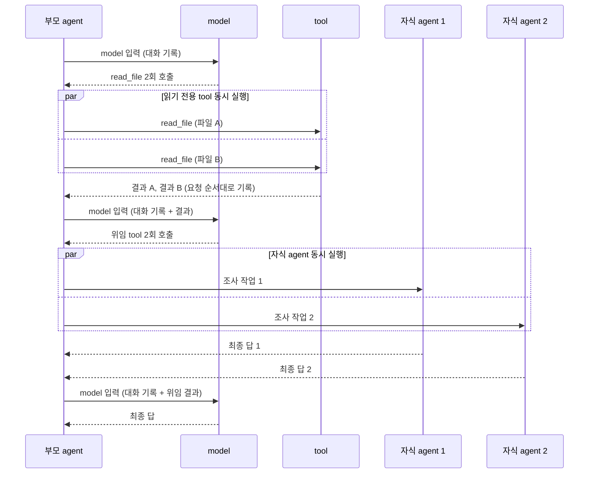

# H12 — Parallelism

> [!NOTE]
> - 시작 상태: [`h12`](https://github.com/jammer-droid/HEL/tree/h12) · 완료 상태: [`h13`](https://github.com/jammer-droid/HEL/tree/h13)
> - 논문: [§6.2 Iterative Action-Observation Loop](https://arxiv.org/html/2609.00006v1#S6.SS2), [§11 Multi-Agent Orchestration](https://arxiv.org/html/2609.00006v1#S11), [§16.7 Multi-Agent Orchestration](https://arxiv.org/html/2609.00006v1#S16.SS7)

```bash
git checkout -b my-h12 h12
```

## 들어가며

H12에서는 여러 작업을 동시에 실행하는 구조를 다뤄본다. 현재 `hel`은 model이 한 응답에서 tool을 여러 개 요청해도 요청 순서대로 하나씩 실행한다. H11에서 만든 위임 tool도 자식 agent 하나를 실행하고, 자식이 끝날 때까지 부모가 기다리는 방식으로 작동한다.

### 논문이 본 병렬 실행(tool의 병렬 실행과 agent의 병렬 실행)

논문은 병렬 실행을 두 곳에서 다룬다. [§6.2](https://arxiv.org/html/2609.00006v1#S6.SS2)는 agent loop 안에서 한 응답의 tool 호출을 어떻게 실행하는지 비교하고, [§11](https://arxiv.org/html/2609.00006v1#S11)은 여러 자식 agent를 동시에 실행하는 구조를 비교한다.

tool 호출을 동시에 실행하는 방식은 시스템마다 다르다. Mini-SWE-Agent와 Aider는 순서대로 실행한다. 동시에 실행하는 시스템도 대부분 아무 tool이나 함께 실행하지 않고, 함께 실행해도 되는 tool을 따로 표시한다. 논문 [표 5](https://arxiv.org/html/2609.00006v1#S6.T5)의 Concurrency 열과 부록 표 18의 tool 실행 행에서 Claude Code와 Codex를 추리면 다음과 같다.

| 시스템 | tool 호출 실행 방식 | 동시 실행 허용 기준 |
| --- | --- | --- |
| Claude Code | 연속된 안전 tool을 묶어 동시 실행, 최대 10개 | tool마다 `isConcurrencySafe`(기본 false). 읽기 전용 tool 허용, 편집·bash 단독 |
| Codex | 동시 실행 후 요청 순서대로 결과 수집(`FuturesOrdered`) | tool마다 `supports_parallel`(기본 false). 허용하지 않는 tool은 lock으로 단독 실행 |

자식 agent를 동시에 실행하는 구조는 [§11.1](https://arxiv.org/html/2609.00006v1#S11.SS1)의 분류에서 병렬 자식 세션, 계층 스레드 트리, 재귀 합성에 해당한다. 자식은 각자 대화 기록을 가지고 동시에 실행되고, 부모는 자식들의 결과를 모아 다음 단계를 진행한다. 실제 시스템은 동시에 실행할 자식 수에 상한을 둔다.

논문은 병렬 실행의 비용도 함께 다룬다. 논문이 인용한 연구에서는 여러 agent를 쓰는 구성이 일반 대화보다 token을 약 15배 사용했다. 또한 코딩 작업에는 연구 작업보다 실제로 나눠 실행할 수 있는 작업이 적다고 본다. 논문은 실제 시스템에서도 자식을 동시에 실행하는 구조가 주로 코드베이스를 넓게 조사하는 단계에 쓰인다고 관찰한다. [§16.7](https://arxiv.org/html/2609.00006v1#S16.SS7) 권고 12는 병렬로 문맥을 나누는 쪽이 순차 탐색보다 분명히 나은 조사 단계를 지목할 수 있을 때까지 agent 하나를 유지하라고 권한다.

### 이번 Lab에서 다룰 병렬 실행

이번 Lab은 두 가지 병렬 실행을 다룬다. 하나는 model이 한 응답에서 요청한 읽기 전용 tool 호출을 harness가 동시에 실행하는 것이다. 다른 하나는 model이 위임 tool을 여러 번 호출하면 자식 agent들을 동시에 실행하는 것이다. 두 경우 모두 결과는 model이 요청한 순서대로 대화 기록에 넣는다.



tool을 동시에 실행하면 tool 실행을 기다리는 시간이 줄어든다. 다만 한 번의 작업에서 model 응답을 기다리는 시간이 tool 실행 시간보다 훨씬 길면 전체 시간이 줄어드는 폭은 작다.

자식 agent를 동시에 실행하면 자식들이 순서대로 실행될 때 기다리던 시간이 줄어든다. 대신 자식마다 별도의 model 요청과 token을 쓰고, 부모는 여러 자식이 돌려준 결과를 읽고 합쳐야 한다. 자식이 돌려주는 결과의 길이와 형식이 제각각이면 합치는 작업이 어려워질 수 있다. 실행 시간과 함께 요청 수, token, 결과를 합친 뒤의 정답 여부를 확인한다.

동시에 실행하는 작업은 읽기 전용으로 제한한다. 읽기 전용 작업은 여러 개를 함께 실행해도 서로의 결과를 바꾸지 않는다. 여러 작업이 같은 파일을 동시에 고치면 충돌이 생긴다. 편집 작업을 동시에 실행하려면 작업마다 독립된 작업 공간을 두거나, 적어도 작업마다 고치는 파일이 겹치지 않게 나눠야 한다. 참고 자료에서 Claude Code와 Codex가 이 문제를 다루는 방식을 소개한다.

### 참고 자료

[Claude Code](https://code.claude.com/docs/en/env-vars)는 읽기 전용 tool과 subagent를 동시에 최대 10개까지 model의 응답을 바탕으로 실행한다(`CLAUDE_CODE_MAX_TOOL_USE_CONCURRENCY`, 2026-10 기준). [subagent](https://code.claude.com/docs/en/sub-agents)는 부모가 결과를 기다리는 foreground 방식과, 부모가 작업을 이어 가고 완료 알림으로 결과를 받는 background 방식으로 실행된다.

하나의 세션에서 동시에 실행할 수 있는 subagent는 기본 20개다. 문서는 서로 의존하지 않는 모듈을 subagent 여러 개로 나눠 조사하고 결과를 합치는 예를 들고, 자세한 결과를 돌려주는 subagent가 많으면 부모 문맥을 많이 차지하고 subagent마다 token을 쓴다고 안내한다. 쓰기 작업은 `isolation: worktree`로 subagent를 임시 git worktree에서 실행해 부모 작업 폴더와 분리할 수 있다. 바뀐 내용이 없으면 worktree는 자동으로 정리된다. 별도 세션을 [`claude --worktree`](https://code.claude.com/docs/en/common-workflows)로 실행해 같은 저장소에서 여러 작업을 동시에 진행할 수도 있다.

[Codex](https://github.com/openai/codex/blob/ac9b5b8380517ded445b09dd3196d8d9e2ba3c59/codex-rs/core/src/tools/parallel.rs)는 tool 호출마다 비동기 작업을 만들고, 공유 lock 하나로 동시 실행을 조정한다. 동시 실행을 허용한 tool은 읽기 lock을, 그렇지 않은 tool은 쓰기 lock을 잡아 혼자 실행된다. 편집 tool인 `apply_patch`는 혼자 실행되고, shell 명령은 동시 실행을 허용한다. shell 명령의 위험은 OS sandbox와 승인 정책으로 막는다. 자식 agent는 `spawn_agent`로 시작하면 id만 바로 돌려주고, 결과는 `wait_agent`나 완료 알림으로 받는다. 동시에 실행하는 자식은 기본 6개로 제한한다. 자식은 부모와 같은 작업 폴더를 쓰며, [`spawn_agent` 설명](https://github.com/openai/codex/blob/ac9b5b8380517ded445b09dd3196d8d9e2ba3c59/codex-rs/core/src/tools/handlers/multi_agents_spec.rs)은 독립적인 조사는 동시에 맡기고, 구현을 나눌 때는 자식마다 고치는 파일이 겹치지 않게 나누라고 안내한다.

## 이번에 해볼 것

`hel`은 model이 한 응답에서 tool을 여러 개 요청하면 요청 순서대로 하나씩 실행한다. 위임 tool(`delegate_task`) 호출이 여러 개 와도 자식을 하나 실행해 끝낸 뒤 다음 자식을 실행한다.

여기에 `--parallel` 옵션을 더한다. 옵션을 켜면 한 응답 안의 읽기 전용 tool(`read_file`, `glob`, `grep`) 호출을 동시에 실행하고, 위임 tool 호출이 여러 개면 자식들을 동시에 실행한다. 결과는 두 경우 모두 model이 요청한 순서대로 대화 기록에 넣는다.

`evals`로 같은 작업을 옵션 없이(`baseline`) 5번, 옵션을 켜고(`variant-parallel`) 5번 실행해 비교한다. 두 실행 모두 부모에게 읽기 전용 tool 세 개와 위임 tool을 주고, 자식은 작업 지시만 받는 방식(`task-only`)으로 만든다. 작업은 두 가지다.

| 작업 | 지시 | 정답 판정 |
| --- | --- | --- |
| 병렬 읽기 (`parallel-read-01`) | 이름을 알려 준 서비스 설정 파일 4개를 위임 없이 직접 읽고 port 값의 합을 출력 | 출력이 `30909`와 일치 |
| 병렬 탐색 위임 (`parallel-explore-01`) | auth, billing, search 세 모듈의 구현 코드에서 기본 `TIMEOUT_MS`를 찾되, 모듈마다 subagent를 하나씩 맡기고 세 위임을 한 번에 요청 | 출력이 `auth=2750`, `billing=4200`, `search=1850` 세 줄과 일치 |

### 병렬 읽기

사용자 지시는 다음과 같다.

```text
Read services/auth.ini, services/billing.ini, services/search.ini and services/notify.ini
yourself, without delegating, and add up their port values.
The files do not depend on each other, so you can read them in any order.
Print only the sum as an integer.
```

작업 폴더의 파일은 다음과 같다.

| 파일 | 내용 | 역할 |
| --- | --- | --- |
| `services/auth.ini` | `port = 7311` | 합계에 필요 |
| `services/billing.ini` | `port = 8420` | 합계에 필요 |
| `services/search.ini` | `port = 9133` | 합계에 필요 |
| `services/notify.ini` | `port = 6045` | 합계에 필요 |
| `services/legacy.ini` | `port = 5000` | 지시에 없는 서비스 |
| `docs/ports.md` | 7300, 8400, 9100, 6000 | 오래된 port 표 |

정답은 7311 + 8420 + 9133 + 6045 = `30909`이다. 지시에 없는 파일은 틀린 답이 나왔을 때 원인을 구분하는 데 쓴다. `legacy.ini`까지 더하면 35909, 오래된 표의 값을 쓰면 31700이 된다. 동시에 실행한 결과가 다른 호출의 결과로 기록되는 문제가 생겨도 합계가 달라진다.

model은 첫 응답에서 `read_file` 4개를 요청하고, 결과를 받은 다음 응답에서 합계를 출력할 수 있다. 4개를 한 응답에 요청하면 옵션이 없을 때는 하나씩, 옵션을 켜면 동시에 실행된다. 파일을 하나씩 나눠 요청하면 두 실행의 동작은 같다. `read_file`은 로컬 파일을 읽어 금방 끝나므로, 실행 시간의 대부분은 model 응답을 기다리는 시간이다. 이 작업은 tool 실행 시간이 짧을 때 동시 실행으로 줄어드는 시간이 얼마인지 확인한다.

### 병렬 탐색 위임

사용자 지시는 다음과 같다.

```text
modules/ 아래 auth, billing, search 세 모듈 각각의 구현 코드(src/)에서 기본 TIMEOUT_MS 값을 찾아.
문서와 테스트에는 다른 값이 있을 수 있다.
모듈마다 delegate_task로 subagent를 하나씩 맡기고, 세 위임은 서로 독립적이니 한 번에 함께 요청해.
최종 답은 auth=<값>, billing=<값>, search=<값> 세 줄만 이 순서로 써.
```

각 모듈에는 `src/`, `docs/`, `tests/`가 있고, 구현 코드 밖에도 `TIMEOUT_MS`가 나온다.

| 모듈 | 구현 코드의 값 | 다른 곳에 있는 값 |
| --- | --- | --- |
| auth | `src/settings/defaults.py`: `TIMEOUT_MS = 2750` | `docs/`: 이전 값 3000, `tests/`: 주석의 `TIMEOUT_MS = 1200` |
| billing | `src/settings/defaults.py`: `TIMEOUT_MS = 4200` | `src/client.py`: 사용하지 않는 `LEGACY_TIMEOUT_MS = 9000`, `docs/`: staging 예시 5000, `tests/`: `TIMEOUT_MS = 100` |
| search | `src/settings/defaults.py`: `TIMEOUT_MS = BASE_TIMEOUT_MS + 350`, `src/settings/base.py`: `BASE_TIMEOUT_MS = 1500` → 1850 | `docs/`: 2000, `tests/`: test에서 6000으로 바꿈 |

모듈마다 `grep`으로 `TIMEOUT_MS`를 찾으면 값이 여러 개 나온다. 자식은 그중 구현 코드의 기본값을 골라야 한다. billing의 `LEGACY_TIMEOUT_MS`는 `src/` 안에 있지만 쓰이지 않는 값이다. search는 import를 따라 두 파일을 읽어야 값을 계산할 수 있어서, 세 자식의 탐색 길이가 서로 다르다.

model은 첫 응답에서 모듈별 지시를 담은 `delegate_task` 3개를 요청하고, 자식 셋은 각자 `grep`과 `read_file`로 값을 찾아 최종 답을 돌려줄 수 있다. 부모는 세 결과를 받아 지정한 형식의 세 줄로 합친다. 옵션이 없으면 자식 하나가 끝나야 다음 자식이 시작하므로, 위임에 걸리는 시간은 세 자식의 실행 시간을 더한 값에 가깝다. 옵션을 켜면 세 자식이 함께 시작하므로 가장 오래 걸린 자식의 시간에 가까워진다. 자식마다 model 요청을 따로 보내는 것은 같아서, 요청 수와 token은 크게 다르지 않을 수 있다. 부모가 위임 호출을 한 응답에 모으지 않고 하나씩 내면 옵션을 켜도 자식은 차례로 실행된다.

### 확인할 것

두 작업 모두 옵션이 없어도 정답을 낼 수 있다. 판정은 최종 출력이 정답과 완전히 같은지만 본다. 정답 여부와 함께 실행 시간, model 요청 수, token, 부모의 최대 문맥 크기를 비교한다. 응답 하나에 tool 호출과 위임 호출이 몇 개씩 들어 있었는지 세고, 자식들이 실제로 겹쳐 실행됐는지는 자식의 시작·종료 시각으로 확인한다. 자식이 돌려준 결과의 길이와 형식도 함께 살펴본다.

## 결과 확인

### 동시 실행 옵션이 없는 상태

`--parallel` 옵션을 더하기 전의 코드로 두 작업을 5번씩 실행했다. `evals`의 조건 이름 `baseline`은 이렇게 기능을 더하기 전의 상태를 가리킨다.

```bash
evals run h12 --conditions baseline --build
```

#### 병렬 읽기

| run | 첫 응답의 tool 호출 | model 요청 | 입력 / 출력 token | 실행 시간 | 최종 답 |
| --- | --- | --- | --- | --- | --- |
| 1 | `read_file` 4개 | 2 | 2,621 / 191 | 1.8초 | `30909` |
| 2 | `read_file` 4개 | 2 | 2,623 / 226 | 2.0초 | `30909` |
| 3 | `read_file` 4개 | 2 | 2,621 / 175 | 1.8초 | `30909` |
| 4 | `read_file` 4개 | 2 | 2,623 / 175 | 1.9초 | `30909` |
| 5 | `read_file` 4개 | 2 | 2,623 / 175 | 2.2초 | `30909` |

- 5 run 모두 첫 응답에서 지시한 파일 4개의 `read_file`을 한 번에 요청하고, 두 번째 응답에서 합계를 출력했다. 지시에 없는 `legacy.ini`와 오래된 port 표는 읽지 않았다.
- `hel`은 한 응답에 들어온 `read_file` 4개를 차례로 실행했다. 옵션을 켜면 이 4개가 모든 run에서 동시에 실행된다.
- 실행 시간은 1.8–2.2초다. model 요청 두 번과 로컬 파일 읽기 4번을 합한 시간이다. 옵션을 켰을 때 줄어들 수 있는 것은 이 중 파일 읽기에 걸린 부분이다.

#### 병렬 탐색 위임

| run | 위임 전 부모의 탐색 | 위임 후 부모가 다시 읽은 파일 | model 요청 (부모 / 자식) | 입력 token (부모 / 자식) | 실행 시간 | 최종 답 |
| --- | --- | --- | --- | --- | --- | --- |
| 1 | `glob` 3회 (응답 2개) | 4개 | 5 / 9 | 10,353 / 14,655 | 18.3초 | 세 줄, 성공 |
| 2 | 없음 | 3개 (search) | 4 / 11 | 8,553 / 18,795 | 17.9초 | 한 줄, 실패 |
| 3 | `glob`, `grep` (응답 1개) | 없음 | 3 / 11 | 7,669 / 18,936 | 23.2초 | 한 줄, 실패 |
| 4 | `glob` (응답 1개) | 없음 | 3 / 11 | 5,561 / 18,875 | 19.3초 | 한 줄, 실패 |
| 5 | 없음 | 4개 | 3 / 9 | 6,210 / 14,522 | 14.7초 | 세 줄, 성공 |

- 5 run 모두 `delegate_task` 3개를 한 응답에 모아 요청했다. 두 run은 첫 응답에서 바로 위임했고, 세 run은 `glob`이나 `grep`으로 폴더 구조를 먼저 본 뒤 위임했다. 옵션을 켜면 모든 run에서 세 자식이 동시에 실행된다.
- 자식 15개가 모두 구현 코드의 값을 찾았다. `docs/`와 `tests/`의 값이나 billing의 `LEGACY_TIMEOUT_MS`를 답으로 고른 자식은 없었다. search를 맡은 자식은 모두 `base.py`까지 읽어 1850을 계산했다. 자식 하나는 model 요청 3–5회로 끝났다.
- 실패한 세 run은 값은 모두 맞았지만 `auth=2750, billing=4200, search=1850`처럼 한 줄로 이어 썼다. 지시한 출력 형식을 따르지 않은 실패이고, 위임이나 실행 순서와는 관계가 없다. 옵션을 켠 실행도 같은 기준으로 판정하고, 값이 맞았는지를 따로 함께 적는다.
- 세 run에서 부모는 자식의 결과를 받은 뒤 같은 파일을 직접 다시 읽었다. 자식 결과에 파일 경로와 줄 번호가 들어 있어 부모는 다시 탐색하지 않고 해당 파일만 읽었다. 결과를 확인하는 데 model 요청이 1–2회 더 들었다.
- 부모는 5 run 모두 위임 지시 끝에 돌려받을 내용을 적었다. 값과 정의된 파일·줄은 공통이었고, 짧게 쓰라는 요청이나 import를 따라간 과정의 설명은 run마다 달랐다. 자식이 돌려준 결과는 208–1,784자였다. 같은 요청을 받은 자식끼리도 값과 경로만 적은 결과부터 소제목과 코드 블록을 붙인 보고서까지 형식이 달랐다. 따라간 과정을 설명하라고 한 3번 run의 결과가 958–1,784자로 가장 길었다.
- run 전체 입력 token의 59–77%를 자식이 썼다. 자식은 같은 시스템 프롬프트로 시작하고 요청마다 앞부분이 같아서, 자식 입력의 대부분이 cache hit에 성공했다.
- 실행 시간은 14.7–23.2초다. 세 자식이 차례로 실행되므로 이 시간의 상당 부분은 자식들의 실행 시간을 더한 값이다. 자식 하나하나의 시작과 종료 시각은 이 코드의 기록에 없어서, 옵션을 더할 때 위임 기록에 함께 남겨 비교한다.

### 동시 실행 옵션 추가

`--parallel`로 실행하면 model 응답의 tool 호출을 앞에서부터 묶는다. 읽기 전용 tool 호출이 이어지면 한 묶음, `delegate_task` 호출이 이어지면 한 묶음이고, 그 밖의 호출은 하나씩 실행한다. 묶음 크기는 다음 함수가 정한다.

```rust
fn concurrent_run(session: &Session, calls: &[Call]) -> usize {
    if !session.parallel
        || !session.runtime.hooks.is_empty()
        || !session.runtime.skills.borrow().idle()
    {
        return 0;
    }
    let delegate = |c: &Call| {
        c.name == delegate::DELEGATE_TASK
            && session.tools.delegate().is_some()
            && session.depth == 0
    };
    let read = |c: &Call| session.tools.offers_read_only(&c.name);
    let same: &dyn Fn(&Call) -> bool = match calls.first() {
        Some(c) if delegate(c) => &delegate,
        Some(c) if read(c) => &read,
        _ => return 0,
    };
    calls.iter().take_while(|c| same(c)).count()
}
```

- hook이 설정되어 있거나 skill이 등록되어 있으면 묶지 않는다. hook과 skill은 tool 호출마다 상태를 기록하고 바꿀 수 있으므로, 호출 순서가 섞이면 그 기록이 맞지 않게 된다.
- 위임 묶음은 사용자와 대화하는 agent(`depth == 0`)에서만 만든다. 자식은 위임 tool을 쓸 수 없고, 자기 응답의 읽기 묶음만 동시에 실행한다.

묶음 안의 호출은 `std::thread::scope`로 동시에 실행한다. 자식 agent 묶음은 다음과 같다.

```rust
let shared = std::sync::Mutex::new(&mut *session.approval);
std::thread::scope(|scope| {
    for child in &mut children {
        let (run, shared) = (&run, &shared);
        scope.spawn(move || run(child, &mut OneAtATime(shared)));
    }
});
```

- `run`은 자식 하나의 tool loop를 실행하고, 시작과 종료 시각을 위임 기록에 남긴다.
- 자식이 파일 수정처럼 사용자 확인이 필요한 tool을 호출하면 `OneAtATime`이 확인 요청을 하나씩 처리한다. 읽기 전용 tool은 확인 없이 실행되므로, 읽기 묶음은 확인 입력을 공유하지 않는다.
- 모든 thread가 끝나면 결과를 model이 요청한 순서대로 대화 기록에 넣는다. 기록과 tool 실행 기록의 순서는 옵션이 없을 때와 같다.

여러 thread가 같은 실행 상태를 쓰게 되면서, skill 상태와 `read_file`의 이어 읽기 위치처럼 `RefCell`로 두었던 값을 mutex로 감싼 타입으로 바꿨다.

같은 두 작업을 옵션을 켜고 5번씩 실행했다. `evals`의 조건 이름 `variant-parallel`은 `--parallel`을 켠 실행을 가리킨다.

```bash
evals run h12 --conditions variant-parallel --build
```

#### 병렬 읽기

| | 옵션 없음 | 옵션 켬 |
| --- | --- | --- |
| 정답 | 5/5 | 5/5 |
| 첫 응답의 `read_file` 호출 | 4개 (5/5 run) | 4개 (5/5 run) |
| model 요청 | 2 | 2 |
| 실행 시간 중앙값 (범위) | 1.88초 (1.81–2.16) | 2.00초 (1.76–2.17) |

- 옵션을 켠 5 run 모두 파일 4개를 동시에 읽었지만 실행 시간은 줄지 않았다. 두 실행의 범위가 겹치고, 0.1초 차이는 model 응답 시간의 편차 안에 있다.
- `read_file`은 로컬 파일을 읽어 금방 끝나므로, 실행 시간은 거의 전부 model 응답 두 번을 기다리는 시간이다.

#### 병렬 탐색 위임

| run | 위임 구간 | 자식 실행 시간 (auth / billing / search) | model 요청 (부모 / 자식) | 실행 시간 | 최종 답 |
| --- | --- | --- | --- | --- | --- |
| 1 | 4.1초 | 3.8 / 3.8 / 4.1초 | 3 / 9 | 10.2초 | 한 줄, 실패 |
| 2 | 5.7초 | 4.2 / 5.7 / 4.3초 | 2 / 10 | 10.9초 | 한 줄, 실패 |
| 3 | 4.0초 | 3.6 / 3.4 / 4.0초 | 3 / 9 | 10.0초 | 세 줄, 성공 |
| 4 | 7.5초 | 7.5 / 6.5 / 5.3초 | 5 / 12 | 17.0초 | 세 줄, 성공 |
| 5 | 3.5초 | 2.2 / 3.2 / 3.5초 | 3 / 8 | 10.9초 | 세 줄, 성공 |

위임 구간은 첫 자식이 시작한 때부터 마지막 자식이 끝날 때까지다.

| | 옵션 없음 | 옵션 켬 |
| --- | --- | --- |
| 값 정답 / 형식까지 정답 | 5/5 / 2/5 | 5/5 / 3/5 |
| 위임 3개를 한 응답에 요청 | 5/5 | 5/5 |
| 실행 시간 중앙값 (범위) | 18.3초 (14.7–23.2) | 10.9초 (10.0–17.0) |
| model 요청 중앙값 (부모 / 자식) | 3 / 11 | 3 / 9 |
| 입력 token 평균 (부모 / 자식) | 7,669 / 17,157 | 7,914 / 17,002 |
| 출력 token 평균 | 2,630 | 2,986 |

- 5 run 모두 세 자식이 같은 시각(차이 1ms 이하)에 시작해 겹쳐 실행됐다. 위임 구간은 가장 오래 걸린 자식의 실행 시간과 같았다.
- 자식 실행 시간의 합은 run마다 9.0–19.4초다. 옵션이 없으면 이만큼을 차례로 기다리고, 옵션을 켜면 3.5–7.5초만 기다린다. 실행 시간 중앙값은 18.3초에서 10.9초로 7.4초 줄었다.
- 값은 두 실행 모두 5/5 맞았다. 형식 실패는 옵션 없이 3번, 옵션을 켜고 2번으로, 두 실행 모두 값을 한 줄로 이어 쓴 경우다.
- 요청 수와 입력 token은 거의 같다. 자식은 같은 작업을 하고 실행 순서만 바뀌므로 token은 줄지 않는다. 출력 token 평균은 14% 많았지만, 자식 결과의 길이 편차(218–1,332자)를 고려하면 5번 실행으로는 옵션의 영향으로 보기 어렵다.
- 부모가 자식 결과를 받은 뒤 파일을 직접 다시 읽은 run은 옵션 없이 3번, 옵션을 켜고 3번(1·3·4번 run)이었다. 4번 run은 부모가 위임 전에 폴더 구조를 보고, 결과를 받은 뒤 7개 파일을 다시 읽었다. 위임 구간도 7.5초로 가장 길어 17.0초가 걸렸다. 동시 실행으로 줄어드는 것은 위임 구간이고, 부모가 직접 하는 탐색과 확인은 그대로 남는다.

## 돌아보기

### 변경 사항

부모 agent가 한 응답에서 맡긴 자식 agent 셋이 동시에 실행되면서, 세 모듈을 나눠 조사하는 작업의 실행 시간 중앙값이 18.3초에서 10.9초로 줄었다. 5번 모두 세 자식이 함께 시작했고, 위임에 걸린 시간은 가장 오래 걸린 자식 하나의 시간과 같았다. 세 모듈의 값은 두 실행 모두 5번 다 맞혔다. 파일 4개를 한 번에 읽는 작업은 읽기를 동시에 실행해도 실행 시간이 달라지지 않았다.

`hel`에서는 `--parallel`로 동시 실행을 켠다. 한 응답에서 이어지는 `read_file`, `glob`, `grep` 호출과 이어지는 `delegate_task` 호출을 묶어 동시에 실행하고, 결과는 model이 요청한 순서대로 대화 기록에 넣는다. hook이 설정되어 있거나 skill이 등록되어 있으면 이전처럼 하나씩 실행한다. 위임 기록(`raw/delegations.jsonl`)에는 함께 실행된 자식 수와 자식마다 시작·종료 시각이 남는다.

### 트레이드오프

| 병렬 탐색 위임 | 옵션 없음 | 옵션 켬 |
| --- | --- | --- |
| 실행 시간 중앙값 | 18.3초 | 10.9초 |
| model 요청 중앙값 | 14 | 12 |
| 입력 token 평균 | 24,826 | 24,915 |
| 출력 token 평균 | 2,630 | 2,986 |

- token은 줄지 않는다. 자식이 하는 일은 같고 실행 순서만 바뀌기 때문이다. 대신 같은 요청이 짧은 시간에 몰린다. `hel`은 한 응답에 들어온 위임 호출 수만큼 자식을 한꺼번에 실행하고 동시 실행 수에 상한을 두지 않았다. 상한이 필요한 이유는 FAQ에 정리했다.
- 줄어드는 것은 tool과 자식이 실행되는 시간뿐이다. `read_file`처럼 금방 끝나는 tool은 동시에 실행해도 줄일 시간이 거의 없다. 부모가 위임 전에 직접 탐색하거나 결과를 받은 뒤 파일을 다시 읽는 시간도 그대로 남는다.
- 여러 thread가 같은 실행 상태를 쓰도록 skill 상태, `read_file`의 이어 읽기 위치, hook과 MCP 기록을 mutex로 감쌌다. 같은 thread에서 잠금을 두 번 잡으면 이전에는 바로 오류가 났지만 이제는 멈춘 채로 기다리게 되므로, 잠금을 겹쳐 잡던 코드 한 곳을 고쳤다. hook과 skill은 호출마다 상태를 바꾸므로, 둘이 설정된 상태에서는 동시 실행을 포기했다.

### 논문의 내용 또는 다른 harness와 비교하면

논문 [§16.7](https://arxiv.org/html/2609.00006v1#S16.SS7) 권고 12는 여러 문맥으로 나눠 탐색하는 쪽이 분명히 나은 단계를 지목할 수 있을 때 다중 agent 구조를 쓰라고 권한다. 서로 의존하지 않는 모듈 셋을 조사하는 작업은 그런 단계에 해당했고, 같은 token으로 실행 시간이 줄었다. 논문이 경고한 token 증가는 agent 하나로 처리할 때와 비교한 비용이다. 이 비용은 H11에서 위임을 더할 때 이미 생겼고, 동시 실행은 그 위에 비용을 더하지 않았다.

Claude Code는 읽기 전용 tool과 subagent를 최대 10개까지 동시에 실행한다. `hel`도 같은 기준으로 읽기 전용 tool만 묶는다. Claude Code의 background subagent는 부모가 다른 작업을 하는 동안 실행되고 완료 알림으로 결과를 돌려주지만, `hel`의 부모는 묶음의 자식이 모두 끝날 때까지 기다린다. 이번 작업은 부모가 세 결과를 모두 받아야 답할 수 있어서 기다리는 구조로 충분했다.

Codex는 tool마다 동시 실행 여부를 표시하고 shell 명령도 동시에 실행한다. shell 명령의 위험은 OS sandbox와 승인 정책으로 막는다. `hel`의 `bash`는 파일을 고칠 수 있어 동시 실행 대상에서 뺐다. 결과를 요청 순서대로 모으는 방식은 Codex의 `FuturesOrdered`와 같다. Codex의 `spawn_agent`는 자식을 시작하고 바로 돌아오므로, 부모가 자식을 기다리지 않고 다른 작업을 할 수 있다.
