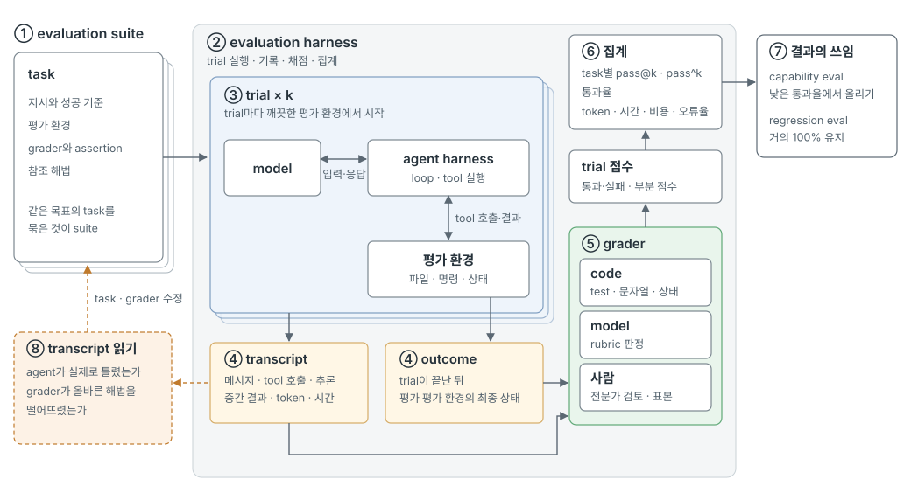

# H13 — Harness Evaluation

> [!NOTE]
> - 시작 상태: [`h13`](https://github.com/jammer-droid/HEL/tree/h13) · 완료 상태: [`h14`](https://github.com/jammer-droid/HEL/tree/h14)
> - 논문: [§13.4 Trade-off Framework](https://arxiv.org/html/2609.00006v1#S13.SS4), [§15.5 The Scaffold–Capability Frontier](https://arxiv.org/html/2609.00006v1#S15.SS5), [§17.2 Future Work](https://arxiv.org/html/2609.00006v1#S17.SS2)
> - 기준 자료: Anthropic, [Demystifying evals for AI agents](https://www.anthropic.com/engineering/demystifying-evals-for-ai-agents) (2026-01-09)

```bash
git checkout -b my-h13 h13
```

harness를 어떤 기준으로 평가하고 개선할 수 있는가?

## 들어가며

H1부터 H12까지는 기능을 하나 더할 때마다 그 기능을 확인하는 작은 task를 만들고, 기능을 켜기 전과 후의 `hel`에 같은 작업을 맡겨 결과를 비교했다. 

H13에서는 기능 하나가 아니라 harness 자체를 평가하는 방식을 다룬다. 무엇을 기준으로 harness를 평가하는지, 그 평가를 어떻게 실행하고 기록하는지를 살펴보고, `evals`를 그 흐름에 맞게 고친다.

### 논문이 본 harness 평가

논문은 harness를 실행해서 평가하지 않고 source code를 읽어 비교한다. 그래서 이번 Lab은 Anthropic이 agent 평가를 정리한 글 [Demystifying evals for AI agents](https://www.anthropic.com/engineering/demystifying-evals-for-ai-agents)를 기준으로 삼는다.

### Anthropic이 정리한 agent 평가

이 글에서 eval(평가)은 AI에게 입력을 주고, 그 출력을 채점 규칙으로 판정하는 test다. 실제 사용자 없이 개발 중에 돌리는 자동 평가를 다룬다. agent는 여러 turn에 걸쳐 tool을 호출하고 환경을 바꾸기 때문에, 중간의 실수가 뒤로 이어지고 평가를 만든 사람이 예상하지 못한 해법이 나오기도 한다. 그래서 글은 평가를 여러 구성 요소로 나누고, 각 요소가 어떤 순서로 이어지는지 정의한다.

<figure><picture><source media="(max-width: 640px)" srcset="images/eval-flow-mobile.svg"></picture></figure>

(글의 정의와 구성 요소 그림을 바탕으로 실행 순서에 맞게 다시 그렸다.)

1. **evaluation suite**: 같은 목표를 가진 task의 묶음이다. task 하나는 입력과 성공 기준이 정해진 test다. 지시와 평가 환경, 채점할 grader가 함께 정해지고, task가 실제로 풀린다는 것을 보여 주는 참조 해법을 둘 수 있다.
2. **evaluation harness**: 평가를 처음부터 끝까지 실행하는 기반이다. task에 지시와 tool을 주고, 여러 task를 동시에 실행하고, 모든 단계를 기록하고, 채점하고, 결과를 집계한다.
3. **trial**: task에 대한 시도 한 번이다. model의 출력은 실행마다 달라지므로 task마다 trial을 여러 번(k번) 실행한다. trial마다 깨끗한 평가 환경에서 시작해야 한다. 이전 trial이 남긴 파일이나 cache를 다음 trial이 보면 실패가 서로 묶이거나 점수가 부풀려진다. trial 안에서 agent harness와 model 실행된다. 글은 agent를 평가한다는 것이 harness와 model을 함께 평가하는 것이라고 정의한다.
4. **transcript와 outcome**: trial이 남기는 두 가지 결과다. transcript는 메시지, tool 호출, 추론, 중간 결과를 담은 전체 기록이다. outcome은 trial이 끝난 뒤 평가 환경의 최종 상태다. 항공권 예약 agent가 "예약했습니다"라고 답해도, DB에 예약이 실제로 있는지로 평가해야 한다.
5. **grader**: transcript나 outcome을 채점하는 규칙이다. task 하나에 grader가 여러 개 있을 수 있고, grader마다 assertion(check)이 여러 개 있다. 모두 통과해야 하는 방식, 가중치를 더해 기준을 넘는 방식, 둘을 섞는 방식으로 trial 점수를 낸다.
6. **집계**: trial 점수를 task와 suite 단위로 모은다. 통과율과 함께 token, 실행 시간, task당 비용, 오류율을 같은 task 묶음에서 계속 추적한다.
7. **결과의 쓰임**: 집계한 결과는 무엇을 확인하느냐에 따라 두 가지로 쓴다(아래 capability eval과 regression eval).
8. **transcript 읽기**: 점수만으로는 grader가 맞게 채점하는지 알 수 없다. 실패한 trial의 기록을 읽으면 agent가 실제로 틀렸는지, grader가 올바른 해법[^valid]을 떨어뜨렸는지 구분할 수 있다. 읽은 결과로 task와 grader를 고친다.

[^valid]: 원문의 valid solution을 옮긴 말이다. 지시가 요구한 것을 실제로 해냈지만, 판정 규칙이 예상한 형태나 경로와 달라 실패로 처리된 해법을 가리킨다. 이때 고칠 대상은 agent가 아니라 판정 규칙이다. 예를 들어 CORE-Bench에서는 96.12라는 답이 기대값 96.124991…과 자릿수까지 같지 않다는 이유로 실패했다. tool 호출 순서를 채점하면 다른 순서로 같은 결과를 낸 실행도 실패가 된다. [H3](../h03-repository-context/faq.md)에서는 두 파일의 차이를 찾아 exit 1을 돌려준 `diff`가 실패로 기록됐다.

**grader의 종류.** 글은 grader를 세 가지로 나눈다.

| 종류 | 채점 방법 | 장점 | 약점 |
| --- | --- | --- | --- |
| code | 문자열 일치, 실패하던 test 통과와 기존 test 유지, 정적 분석, outcome 확인, tool 호출 확인, transcript 분석(turn 수, token) | 빠르고 저렴, 재현 가능 | 기대한 형태와 조금만 달라도 올바른 해법을 실패 처리 |
| model | rubric 점수, 자연어 assertion, 두 결과 비교, 여러 판정 model의 합의 | 열린 과제와 자유 형식 출력 처리 | 비결정적, 사람 판정과 맞춰 보는 보정 필요 |
| 사람 | 전문가 검토, 표본 점검, A/B test | 가장 정확한 판정, model grader 보정의 기준 | 느리고 비쌈 |

글은 가능하면 code grader를, 필요할 때 model grader를 쓰고, 사람은 검증에 아껴 쓰라고 권한다. coding agent는 코드가 돌고 test가 통과하는지로 판정할 수 있어 code grader가 잘 맞는다. tool 호출 순서처럼 agent가 거쳐 간 경로를 강제하면 예상하지 못한 올바른 방법이 실패로 처리되므로, agent가 만든 결과를 채점한다.

**capability eval과 regression eval.** capability eval은 agent가 무엇을 잘하는지 묻는다. 낮은 통과율에서 시작해 harness를 고치며 통과율을 올린다. regression eval은 예전에 하던 일을 여전히 하는지 묻는다. 통과율이 거의 100%여야 하고, 떨어지면 무언가 깨졌다는 신호다. 한쪽 기능을 고치는 동안 다른 쪽이 깨지지 않았는지 보려면 둘을 함께 돌려야 한다. 통과율이 충분히 오른 capability eval의 task는 regression eval로 옮긴다.

**실행마다 다른 결과.** 같은 task도 trial마다 통과하거나 실패한다. 글은 두 지표를 구분한다.

- pass@k: k번 중 한 번 이상 성공할 확률. k가 커질수록 오른다.
- pass^k: k번 모두 성공할 확률. k가 커질수록 내려간다. trial당 성공률이 75%이면 3번 모두 성공할 확률은 0.75³ ≈ 42%다.

한 번만 성공해도 쓸 수 있는 도구라면 pass@k를, 매번 같은 결과를 기대하는 agent라면 pass^k를 본다.

**평가를 만드는 순서.** 글은 평가가 없는 상태에서 믿을 수 있는 평가까지 가는 순서를 단계로 정리한다.

- task 모으기: 실제로 겪은 실패에서 고른 20~50개로 시작한다. 개발 초기에는 변경의 효과가 커서 적은 task로도 차이가 드러난다. task는 전문가 두 사람이 독립적으로 같은 판정을 내릴 만큼 분명해야 하고, grader가 확인하는 내용은 지시에 드러나 있어야 한다. 행동이 일어나야 하는 경우와 일어나지 말아야 하는 경우를 함께 넣는다.
- evaluation harness와 grader 설계: 평가 속 agent는 실제로 쓰는 agent와 같게 동작해야 하고, trial마다 깨끗한 평가 환경에서 시작한다. 여러 단계로 된 task에는 부분 점수를 준다. grader 자체의 버그도 점검한다. 글이 든 사례에서 Opus 4.5는 CORE-Bench에서 처음 42%를 받았는데, 소수점 자릿수가 다르다고 실패 처리한 판정과 모호한 지시를 고치고 제약이 덜한 scaffold로 바꾸자 95%가 됐다.
- 오래 쓰기: transcript를 정기적으로 읽는다. 통과율이 100%에 가까워진 평가는 개선 신호를 주지 못하므로 더 어려운 task를 더한다. 평가는 계속 고치는 산출물로 다룬다.

자동 평가는 agent를 이해하는 여러 방법 중 하나다. 운영 중 모니터링, 사용자 피드백, A/B test, 사람의 기록 검토를 함께 쓴다. 한 방법이 놓친 문제를 다른 방법이 잡는 구조다.

### 이번 Lab에서 다룰 평가

`hel`에서 이 흐름의 evaluation harness 역할은 `evals`가 맡는다. agent harness는 `hel`이다. 지금까지의 측정 흐름을 글의 구성 요소에 대응시키면 다음과 같다.

| 글의 구성 요소 | `evals`의 대응 | 차이 |
| --- | --- | --- |
| evaluation suite | Lab 정의 `evals/labs/hXX.yaml` | Lab마다 그 기능의 task만 묶음 |
| task | `evals/tasks/<id>/`(지시, fixture, check) | 참조 해법 없음 |
| trial | run, 조건별 3~5회 | |
| 깨끗한 평가 환경 | run마다 새 작업 폴더 | |
| transcript | `raw/`의 원본 기록, record의 `events` | |
| outcome | 최종 답, run 종료 시 복사한 `workspace/` | |
| grader | check(`output_exact_match`, `file_exact_match`, `tool_calls`, `ini_value`) | code grader만 있음. `tool_calls`는 경로를 채점 |
| 집계 | `evals report`의 조건별 통과 수, 평균 token, model 요청 수, 실행 시간 | pass^k 같은 일관성 지표 없음 |
| transcript 읽기 | Lab마다 사람이 원본 기록을 읽어 확인 | |

`evals report`는 저장된 기록을 다시 채점하므로, check를 고치면 model을 다시 실행하지 않고 지난 run의 판정을 다시 볼 수 있다. 반대로 Lab마다 그 기능의 task만 실행했기 때문에, 이전 Lab의 task를 현재 `hel`로 다시 돌리는 regression eval은 없다. 실행 기록이 tool 실패를 표시하는 방식에도 한계가 있다. bash 명령은 exit code가 0이 아니면 모두 실패로 남아, 차이를 찾아 exit 1을 돌려준 `diff`도 실패로 기록된다([H3 FAQ](../h03-repository-context/faq.md)).

이번 Lab에서는 `evals`를 위 흐름에 맞게 고치고, H1~H12에서 남긴 평가 항목 중 하나를 골라 문제 정의, 평가 방식, 계측 순서로 적용한다.

### 참고 자료

- Anthropic, [Quantifying infrastructure noise in agentic coding evals](https://www.anthropic.com/engineering/infrastructure-noise) (2026-02-05): 같은 model과 harness, task로 Terminal-Bench 2.0을 실행하면서 실행 환경의 CPU·메모리 설정만 바꿨을 때 점수가 최대 6%p 달라졌다. 실행 환경 오류를 agent의 실패와 나눠 기록하는 근거가 된다.
- Anthropic, [An update on recent Claude Code quality reports](https://www.anthropic.com/engineering/april-23-postmortem) (2026-04-23): 기본 reasoning effort 변경, 오래된 세션의 thinking 정리 버그, 시스템 프롬프트에 넣은 출력 길이 제한 한 줄이 Claude Code의 품질을 떨어뜨렸다. 마지막 변경은 처음 돌린 평가를 통과했고, 더 넓은 평가에서 한 줄씩 빼 보는 비교로 3% 하락이 드러났다. 이후 Anthropic은 시스템 프롬프트를 바꿀 때마다 model별로 넓은 평가를 돌리기로 했다.
- OpenAI, [Introducing SWE-bench Verified](https://openai.com/index/introducing-swe-bench-verified/) (2024-08-13): SWE-bench 표본을 사람이 다시 검토해, 판정 test가 올바른 해법도 떨어뜨릴 수 있거나 문제 설명이 부족한 표본을 걸러 500개를 남겼다. grader 자체를 검증한 사례다.
- [Harbor](https://docs.harborframework.com/): Terminal-Bench 2.0을 실행하는 evaluation harness다. task를 지시, 평가 환경, 판정 script, 참조 해법으로 구성하고, 판정 script만 고쳤을 때 agent를 다시 실행하지 않고 저장된 결과를 다시 채점하는 기능(`regrade`)이 있다.

## 이번에 해볼 것

### Lab을 진행하며 남긴 평가 항목

H1부터 H12까지 각 Lab의 FAQ에 남긴 항목과, 앞의 대응표에서 드러난 `evals`의 차이를 평가 흐름의 단계로 나누면 다음과 같다. 번호는 실행 흐름 그림의 번호다.

**① task와 ⑤ grader: 판정이 맞는가**

| 항목 | 나온 곳 | 문제 |
| --- | --- | --- |
| A. 명령 실패 분류 | [H3 FAQ](../h03-repository-context/faq.md) | bash 명령의 exit code가 0이 아니면 모두 실패로 기록. 차이를 찾아 exit 1을 돌려준 `diff`, `a \|\| b`에서 실패한 앞 명령도 실패로 기록 |
| B. 보고와 실행 기록 대조 | [H3 FAQ](../h03-repository-context/faq.md) | model이 최종 보고에서 실행 기록과 다른 사실을 말해도 판정하지 못함 |
| C. 경로 채점 | 대응표 | `tool_calls` check가 호출 횟수와 대상 경로를 채점. 다른 방법으로 같은 결과를 내도 실패 |
| D. 참조 해법 | 대응표 | task가 풀리는지, check가 맞게 설정됐는지 확인할 해법이 없음 |

**④ transcript와 ⑥ 집계: 기록과 숫자가 맞는가**

| 항목 | 나온 곳 | 문제 |
| --- | --- | --- |
| E. 압축 직후 token 추정 | [H10 FAQ](../h10-skills-hooks-mcp/faq.md) | `hel`의 token 추정이 사용 가능한 tool 목록을 세지 않아 실제 입력과 차이 |
| F. 비용 분리 | [H10 FAQ](../h10-skills-hooks-mcp/faq.md), [H11 FAQ](../h11-subagents/faq.md) | MCP 서버 통신과 model 요청 비용이 섞임. cache hit가 64 token 단위로 끊기는 이유를 측정값에서만 추정 |
| G. 일관성 지표 | 대응표 | 반복 실행의 평균만 집계. 매번 성공하는지(pass^k)는 보지 않음 |

**③ trial과 ⑦ 결과의 쓰임: 구성을 바꾸면 도움이 되는가**

| 항목 | 나온 곳 | 문제 |
| --- | --- | --- |
| H. 회귀 확인 | 대응표 | Lab마다 그 기능의 task만 실행. 기능을 더한 뒤 이전 기능이 깨져도 드러나지 않음 |
| I. 기능 수와 성공률 | [Part VI 개요](../../parts/part6-evaluation.md) | 과거 단계의 `hel`을 같은 task로 실행해 기능이 늘 때의 성공률과 비용을 비교한 적 없음 |
| J. MCP tool 로딩 방식 | [H10 FAQ](../h10-skills-hooks-mcp/faq.md) | 목록 전체를 처음부터 보내는 방식과 필요할 때 불러오는 방식의 입력 token·선택 정확도 |
| K. 위임할 정보의 양 | [H11 FAQ](../h11-subagents/faq.md) | 넘길 정보가 많을 때 위임 방식별 성공률과 비용 |
| L. 자식 결과 형식 | [H12 FAQ](../h12-parallelism/faq.md) | 결과 형식이 제각각이라 부모가 같은 파일을 다시 확인 |
| M. 그 밖의 구성 | [H2](../h02-editing/faq.md)·[H6](../h06-compaction/faq.md)·[H10](../h10-skills-hooks-mcp/faq.md)·[H12](../h12-parallelism/faq.md) FAQ | model별 `search_replace` 매칭 실패, 압축의 비용 손익분기, skill 수, 동시에 실행하는 자식 수 상한, hook·skill과 동시 실행의 조합 |

### 이번에 다룰 항목: 실패 분류와 일관성 지표

이번 Lab에서는 A(명령 실패 분류)와 G(일관성 지표)를 다룬다. 두 항목은 지금까지 저장한 실행 기록만으로 다시 판정하고 집계할 수 있다. ⑤ grader가 맞게 판정하는지 확인하고, ⑥ 집계에 일관성 지표를 더하고, ⑧ 기록을 읽어 판정을 고치는 흐름을 한 번에 다룬다.

**A. 실패 분류.** `hel`은 tool을 호출할 때마다 성공·실패를 하나의 값(`ok`)으로 기록한다. bash 명령은 exit code가 0이 아니면 실패이고, `read_file`은 열려는 경로가 없으면 실패다. 이 값 하나에 성격이 다른 실패가 섞인다.

| 종류 | 뜻 | 예 |
| --- | --- | --- |
| 의도한 비 0 exit | exit code가 0이 아니지만 명령이 할 일을 함. 실패 아님 | 차이를 찾은 `diff`, 일치하는 줄이 없는 `grep` |
| 명령 실패 | 없는 명령·옵션, 문법 오류, 작업 단계의 실패 | macOS에 없는 `md5sum`, `cat -A` |
| 경로 오류 | 없는 파일·폴더를 열거나 경로 형식이 틀림 | model이 파일 위치를 추측해 연 경로 |
| harness 정책 차단 | 권한, sandbox, hook이 호출을 막음. harness가 의도한 동작 | H7의 권한 거부, H10의 hook 차단 |
| 실행 환경 오류 | harness가 쓰는 프로그램이나 환경의 문제. agent의 실수가 아님 | `rg`가 없어 실패한 `glob`, `grep` |

이 구분을 다음 순서로 다룬다.

1. 문제 정의: 저장된 실행 기록에서 실패로 남은 tool 호출을 읽고, 위 종류 중 어디에 속하는지 사람이 직접 분류한다.
2. 평가 방식: 같은 호출을 자동 분류 규칙으로 나누고, 사람이 분류한 결과와 얼마나 일치하는지 본다. 규칙이 의도한 결과를 실패로 셌는지, 실제 실패를 놓쳤는지 따로 센다.
3. 계측: `hel`은 실행 기록에 exit code와 실패한 호출의 결과를 남기고, 종류는 `evals`가 그 기록을 읽어 판정한다. 판정 규칙을 고치면 `evals report`가 저장된 기록을 다시 판정해 함께 집계한다.

**G. 일관성 지표.** `evals report`는 조건과 task마다 통과한 run 수와 평균 token, 실행 시간을 보여 준다. 여기에 task별 pass@k와 pass^k를 더한다. k는 그 조건에서 반복한 횟수다. 같은 통과 수라도 매번 통과한 task와 가끔 통과한 task를 구분할 수 있게 된다. 지난 Lab의 저장된 판정에 이 지표를 적용해, 평균 통과율로 내렸던 판단과 달라지는 곳이 있는지 확인한다.

두 항목 모두 저장된 기록으로 먼저 확인한다. 그다음 예전에 실패가 나왔던 task 세 개를 고친 `hel`로 다시 실행해, 새 기록에 판정 근거가 남는지와 규칙이 처음 보는 실패도 맞게 판정하는지 확인한다.

## 결과 확인

### 1. 실행 기록에 남기는 것

지금까지 `hel`은 tool 호출마다 성공·실패를 `ok` 하나로 기록했다. 실패한 이유는 model에게 돌려준 메시지에만 있었고, 그 메시지는 다음 model 요청에 실려 원본 요청 기록(`raw/requests.jsonl`)에 남았다. 이번에는 실행 기록의 tool 호출 항목에 bash의 exit code와 실패한 호출이 돌려준 결과를 함께 남긴다.

```rust
// crates/hel/src/main.rs — tool 결과를 기록하고 대화에 넣는 곳
log.events.push(ToolEvent {
    seq: log.events.len() as u32 + 1,
    category: tools::category(&call.name),
    name: call.name.clone(),
    args: call.args.clone(),
    ok: Some(result.is_ok()),
    exit_code: (call.name == tools::BASH)
        .then(|| record::bash_exit_code(text))
        .flatten(),
    error: result
        .as_ref()
        .err()
        .map(|err| record::error_excerpt(&call.name, err)),
});
```

`hel`이 하는 일은 사실을 기록하는 것까지다. 실패의 종류는 `evals`가 기록을 읽어 판정한다. 판정 규칙을 고쳐도 model을 다시 실행하지 않고 저장된 기록을 다시 판정할 수 있다. 결과는 300자까지만 남기고, bash는 stderr가 stdout 뒤에 붙으므로 끝부분을 남긴다. 위임한 자식 agent의 호출도 같은 함수를 지나므로 자식 기록(`raw/delegations.jsonl`)에 같은 값이 남는다.

`evals`의 판정 규칙은 오류 문구와 bash 명령으로 다섯 종류를 나눈다. bash는 exit code가 1이고, 실제로 exit code를 정한 명령이 `diff`, `grep`, `cmp`, `test` 같은 비교·검색 명령이면 의도한 비 0 exit로 본다.

```rust
// crates/evals/src/failures.rs (발췌)
if error.starts_with("permission denied") || has("hook blocked")
    || has("outside the working directory") || has("Delegation depth limit") {
    return Kind::Policy;
}
if has("program not found") || has("could not start bash") {
    return Kind::Environment;
}
if name == "bash" {
    let answers = deciding_programs(command)
        .iter()
        .any(|program| ANSWERS_WITH_EXIT_1.contains(&program.as_str()));
    return if exit_code == Some(1) && answers { Kind::IntendedExit } else { Kind::Command };
}
```

`deciding_programs`는 명령의 마지막 문장에서 `&&`, `||`로 이어진 각 pipeline의 마지막 프로그램을 돌려준다. bash는 마지막으로 실행된 명령의 exit code를 돌려주므로, `diff a b && echo same`에서 diff가 차이를 찾으면 echo는 실행되지 않고 diff의 exit 1이 남는다. 마지막 문장이 `exit $status`이면 `status=$?`로 결과를 받은 앞 문장을 본다.

예전 기록에는 이 값이 없으므로 원본 요청 기록에서 같은 값을 뽑는다. 요청에 담긴 assistant 메시지에서 tool 호출을 순서대로 모으고, 이름과 인자가 같은 기록 항목에 tool 메시지의 내용을 붙인다.

### 2. 저장된 기록을 다시 판정하기

`evals failures`는 저장된 run의 실패한 tool 호출을 한 줄씩, 판정한 종류와 함께 출력한다. `--labels`로 사람이 분류한 파일(run, agent, 호출 순서, 종류를 tab으로 나눈 줄)을 주면 둘을 비교한다. 사람이 판정할 수 없는 호출은 종류를 `?`로 적어 비교에서 뺀다.

```bash
cargo run -p evals -- failures --labels labels.tsv
```

H1부터 H12까지 저장된 실패 호출은 부모 agent 502건, 위임한 자식 agent 552건이다. 사람이 분류한 것은 bash 실패 22건 전부, `read_file`이 아닌 실패 전부, `read_file` 실패 표본 34건이다. 처음 만든 규칙은 83건 중 70건(84.3%)이 사람 분류와 같았다. 다른 13건의 원인은 다음과 같았다.

| 원인 | 건수 | 예 |
| --- | --- | --- |
| 위임 실패의 원인이 자식 쪽에 있음 | 6 | 부모 기록에는 "자식이 답 없이 끝남"만 남고, 자식은 `rg`가 없어 검색하지 못함 |
| 실패 원인이 기록에 없음 | 3 | `ls; find … 2>/dev/null`이 exit 1. model이 stderr를 버려 사람도 원인을 확인할 수 없음 |
| 복합 명령의 exit code를 정한 명령을 잘못 봄 | 2 | `diff … && echo …`, `diff …; status=$?; …; exit $status` |
| 규칙이 모르는 예전 오류 문구 | 2 | H1의 `Is a directory` |

위 코드는 이 차이를 보고 고친 규칙이다. 위임 실패에는 자식의 마지막 실패 종류를 붙이고, 원인이 기록에 없는 3건은 사람 분류에서도 판정 불가로 빼고 비교했다.

```text
labeled 80 · judged by the rule 80 · agree 74 (92.5% of labeled) · excluded as unjudgeable by hand 3
intended exit counted as a failure: 0
failure counted as an intended exit: 0
  command: 11/11
  environment: 14/20
  intended-exit: 3/3
  path: 32/32
  policy: 14/14
  (중략: 사람 분류와 다른 6건의 목록. 모두 H12 위임 실패, environment → path)
```

- 의도한 비 0 exit와 실제 실패를 서로 잘못 센 경우가 없어졌다.
- 남은 6건은 위임 실패다. 자식은 먼저 `rg`가 없어 검색에 실패했고, 그 뒤 파일 위치를 추측해 없는 경로를 20번 넘게 열었다. 규칙은 마지막 실패(경로 오류)를, 사람은 첫 원인(실행 환경 오류)을 봤다. 어느 쪽을 원인으로 볼지는 규칙을 만드는 사람이 정할 문제로 남겼다.
- 92.5%는 틀린 사례를 보고 규칙을 고친 뒤 같은 기록으로 잰 값이다. 규칙이 처음 보는 사례에서도 맞는지는 새로 실행한 기록으로 확인했다.
- 예전 기록에는 판정할 수 없는 실패도 남았다. max_turns로 끝난 run은 마지막 응답의 tool 결과가 다음 요청에 실리지 않아 원본 기록에 없다(부모 74건). 자식 여럿을 동시에 실행한 기록은 자식별 요청 순서를 맞출 수 없어 판정하지 않았다(자식 99건).

### 3. 새로 실행한 기록

현재 `hel`(사용 가능한 tool 전체, 위임과 동시 실행 사용)로 예전에 실패가 나왔던 세 작업을 4번씩 실행했다.

```bash
cargo run -p evals -- run h13 --build
```

```text
condition  task                 pass  file-exact  output-exact  in/out tokens  cached · peak ctx  calls  pass@k · ^k  failed calls
variant    edit-line-01         4/4   4/4         n/a           13996 / 585    10304 · 3758       5      1 · 1 (k=4)  command 2
variant    env-checksum-01      4/4   4/4         n/a           8283 / 515     6048 · 2312        4      1 · 1 (k=4)  command 1
variant    parallel-explore-01  2/4   n/a         2/4           33596 / 3074   27072 · 3863       14     1 · 0 (k=4)  none
```

- 12번 모두 유효한 실행이었다.
- 실패한 tool 호출 3건 모두 exit code와 결과가 기록됐다. bash 호출은 모두 exit code가 남았다. 판정에 쓸 근거가 없는 실패는 없었다.
- parallel-explore-01의 실패 2번은 값은 맞았지만 형식이 달랐다. 한 번은 설명 문장을 덧붙였고, 한 번은 세 값을 한 줄에 썼다.
- env-checksum-01에서 model은 이번에는 `md5sum`을 쓰지 않았다. 예전 기록의 명령 실패는 새 실행에서 다시 나오지 않았다.

새 실행에서 나온 실패 3건은 판정 규칙이 처음 보는 사례다. 규칙이 이런 사례에서도 맞는지 보려면, 사람의 분류가 규칙의 답을 보고 따라가지 않아야 한다. 그래서 규칙이 호출마다 붙인 종류를 보기 전에, 실행 기록에 남은 명령과 결과만 읽고 사람이 먼저 종류를 정했다. 다만 `evals run`이 끝날 때 출력한 위 요약표의 `failed calls` 열은 분류 전에 봤다. 이 열은 작업별로 종류마다 몇 건인지만 보여 준다(edit-line-01은 command 2건, env-checksum-01은 command 1건). 어느 호출이 어떤 종류로 판정됐는지는 분류를 마친 뒤 다음 명령으로 확인했다.

```bash
cargo run -p evals -- failures h13
```

출력을 표로 옮기면 다음과 같다(결과는 끝부분만 줄여 적었다).

| 작업 | 호출 | exit | 규칙의 판정 | 기록된 결과 |
| --- | --- | --- | --- | --- |
| edit-line-01 4번째 실행 | `ls -la; echo "---"; find . -name settings.py … 2>/dev/null` | 1 | command | `ls`와 `find`의 정상 출력만 있음 |
| edit-line-01 4번째 실행 | `grep -n …; python3 -c "…"` | 1 | command | `…specify the Xcode that you wish to use for command line developer tools. Use xcode-select --install …` |
| env-checksum-01 3번째 실행 | `python3 -c "import hashlib …"` | 1 | command | 위와 같은 xcode-select 안내 |

- 첫 번째는 H10에서 본 `ls; find … 2>/dev/null`과 같은 형태로, 원인이 기록에 없어 판정하지 않았다.
- 나머지 2건은 `python3 -c …`가 xcode-select 오류로 실행되지 않은 경우다. 같은 Mac에서 sandbox 밖의 `python3`는 동작하고, sandbox가 없던 H3 기록에서는 `python3` 호출이 5번 모두 성공했다. `hel`의 sandbox가 Command Line Tools 경로를 읽지 못하게 막는 것으로 보인다. 사람은 실행 환경 오류로, 규칙은 처음 보는 오류 문구라 명령 실패로 판정했다. 규칙이 처음 보는 사례 2건에서 둘 다 틀렸다.
- 이 오류를 받은 model은 원인을 모른 채 다른 방법으로 작업을 끝냈다. run은 통과했지만 harness가 쓸 수 있어야 할 명령을 막고 있었다. 이 문제는 규칙이 아니라 기록을 읽어서 찾았다.

### 4. 지난 Lab의 일관성

`evals report`로 지난 Lab의 저장된 판정을 다시 집계했다. 65개 조건×task 중 7개가 한 번 이상 통과했지만 매번 통과하지는 못했다(pass@k = 1, pass^k = 0).

| Lab | 조건 | task | 통과 |
| --- | --- | --- | --- |
| H1 | 읽기 tool 추가 | find-echo-01 | 2/3 |
| H4 | 검색 tool 추가 | trace-config-01 | 2/3 |
| H8 | sandbox 적용 | sandbox-outside-01 | 1/3 |
| H11 | 위임(tool 기록 제외) | delegate-port-handoff-01 | 2/3 |
| H11 | 위임(위임 지시만) | delegate-port-handoff-01 | 1/3 |
| H12 | 순서대로 실행 | parallel-explore-01 | 2/5 |
| H12 | 동시 실행 | parallel-explore-01 | 3/5 |

각 Lab에서는 통과한 run 수를 조건끼리 비교했다. 이 7곳은 같은 작업도 실행마다 결과가 갈린 곳이다. 반복 3~5번으로는 이 차이가 harness 구조 때문인지 model의 실행 편차인지 구분하기 어렵다는 한계가 있다.

## 돌아보기

### 변경 사항

`hel`은 tool 호출마다 bash의 exit code와 실패한 호출의 결과를 실행 기록에 남긴다. `evals`는 이 기록으로 실패를 다섯 종류로 나누고, report에 task별 pass@k·pass^k와 종류별 실패 수를 보여 준다. `evals failures`로 저장된 실패를 목록으로 보고, 사람이 분류한 파일과 비교할 수 있다.

새로 실행한 기록에서는 실패한 tool 호출 모두에 판정할 근거가 남았다. 차이를 찾아 exit 1을 돌려준 `diff`는 더 이상 실패로 집계되지 않는다. 실패 종류의 자동 판정은 규칙이 처음 보는 사례에서 2건 모두 틀려, 판정 결과를 통과·실패에 쓰지 않고 기록을 읽을 대상을 고르는 참고 분류로 둔다.

### 트레이드오프

- 실패한 호출마다 최대 300자가 기록에 더해진다. model 요청과 token은 달라지지 않는다.
- 판정 규칙은 `hel`의 오류 문구에 의존한다. 오류 문구가 바뀌거나 새 원인이 생기면 규칙도 고쳐야 한다. sandbox 안 `python3` 오류처럼 처음 보는 문구는 명령 실패로 판정된다.
- 규칙을 고칠 때 쓴 기록으로 다시 재면 일치율이 올라간다. 처음 보는 사례로 확인하는 기록을 따로 두지 않으면 규칙이 얼마나 맞는지 알 수 없다.
- 과거 기록은 다시 판정할 수 있지만 전부는 아니다. 결과가 요청에 실리지 않은 호출과 동시에 실행된 자식의 호출은 판정할 수 없다.
- 사람 분류는 한 사람이 했다. 판단이 갈리는 사례(위임 실패의 원인, stderr를 버린 명령)는 분류하는 사람에 따라 달라질 수 있다.

### 논문의 내용 또는 다른 harness와 비교하면

이번 Lab에서 실행 기록으로 harness를 평가해 보니, 기록에 무엇이 남는지가 평가할 수 있는 범위를 정했다. 예전 기록에서는 실패한 호출의 절반 이상이 판정할 근거를 남기지 않았다.

Anthropic 글은 code grader가 예상한 형태에서 벗어나면 올바른 해법도 실패로 처리한다고 경고하고, transcript를 읽어 grader를 확인하라고 권한다. 이번 결과가 그 두 가지를 모두 보여 줬다. 오류 문구 규칙은 이미 본 형태에서는 맞았지만 새 원인에서 틀렸고, sandbox 문제는 기록을 읽어서 찾았다. Harbor가 판정기만 바꿔 저장된 결과를 다시 채점하는 기능을 두는 것처럼, `hel`도 사실을 기록하고 판정은 `evals`에 두었기 때문에 규칙을 바꿔 가며 같은 기록을 여러 번 다시 판정할 수 있었다.
