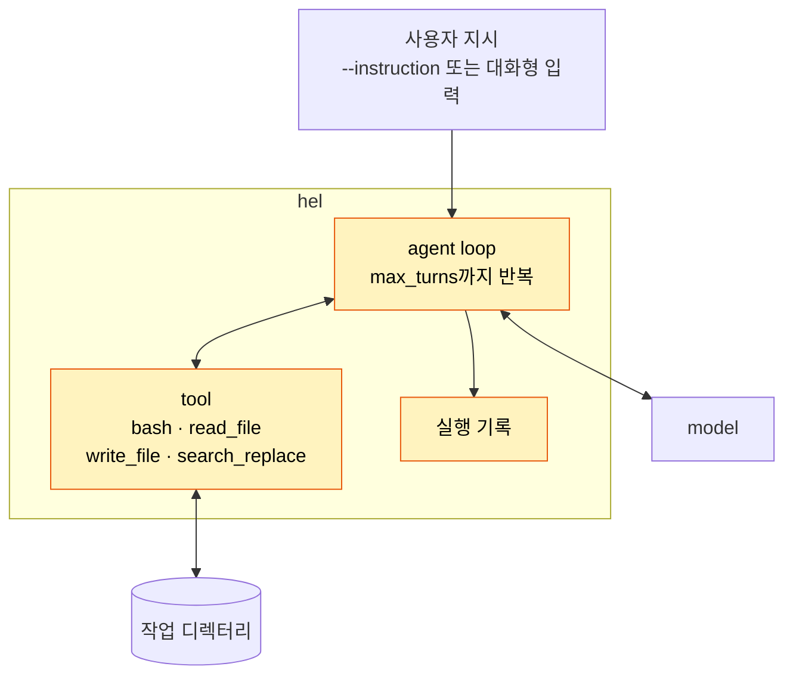

# Part I 개요

> [!NOTE]
> - 시작 상태: [`h00`](https://github.com/jammer-droid/HEL/tree/h00) · 완료 상태: [`h03`](https://github.com/jammer-droid/HEL/tree/h03)
> - 논문: [§2.4 The Minimal Harness](https://arxiv.org/html/2609.00006v1#S2.SS4), [§6 Agent Loop Design](https://arxiv.org/html/2609.00006v1#S6), [§8 Tool and Action Systems](https://arxiv.org/html/2609.00006v1#S8)

## 현재 구조

사용자와 model만 있다. 그리고 model이 할 수 있는 일은 텍스트를 입력 받아 텍스트로 답을 하는 것 뿐이다.

- model은 파일을 읽거나 명령을 실행하지 못한다. 파일 내용을 물으면 읽을 수 없다는 답이나 추측한 답을 만든다.
- 사용자가 결과를 보고 다음 지시를 직접 다시 써야 한다.

## 이 Part에서 다루는 내용

이번 Part에서는 아무것도 없는 상황에서 agent loop와 기초적인 tool을 만들어 가장 기본적인 유형의 harness를 만들 것이다. 이를 통해 model이 harness를 통해 사용자의 작업 디렉터리에서 작업할 수 있는 기초적인 능력을 얻게 될 것이다.

| Lab | 질문 | 더하는 구조 |
| --- | --- | --- |
| [H0 Hello Harness](../labs/h00-hello-harness/README.md) | LLM을 agent로 만드는 최소 구조는 무엇인가? | agent loop, `read_file` tool, 실행 기록 |
| [대화형 도구의 기본 틀](../labs/h0.5-interactive-cli/README.md) | | 사람과 주고받는 대화형 모드 |
| [H1 Tool Loop](../labs/h01-tool-loop/README.md) | bash 하나만 주면 model은 어디까지 스스로 해낼 수 있을까? | `bash` tool, `--tools`로 tool 고르기 |
| [H2 Editing](../labs/h02-editing/README.md) | bash만으로 파일을 고칠 때와 전용 편집 tool을 줄 때, 비용과 작업 범위는 어떻게 달라질까? | `write_file`, `search_replace` tool |

## 이 Part를 마치면

- `hel`이 앞으로 만들어 갈 harness의 이름이다.
- harness는 model이 요청한 tool을 실행하고, 결과를 대화에 붙여 model을 다시 부른다. model이 tool 호출 없이 답하면 loop가 끝난다.
- model이 받는 것은 사용자 지시, tool 정의, 대화 기록뿐이다. 어떤 OS에서 실행되는지, 작업 디렉터리가 어디인지, 그 저장소에 어떤 규칙이 있는지는 model이 tool을 호출해서 알아내야 한다. 이 문제는 [Part II](part2-repository-intelligence.md)에서 다룬다.
