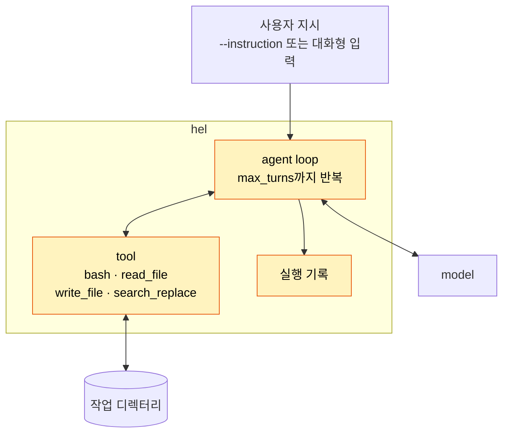
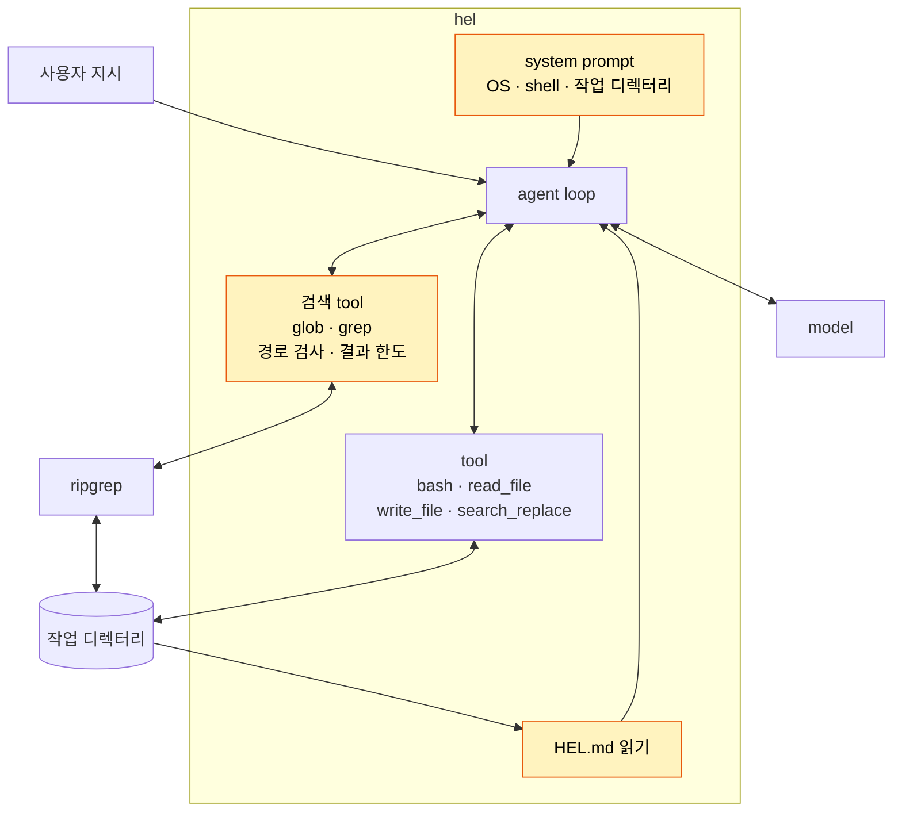

# Part II 개요

> [!NOTE]
> - 시작 상태: [`h03`](https://github.com/jammer-droid/HEL/tree/h03) · 완료 상태: [`h05`](https://github.com/jammer-droid/HEL/tree/h05)
> - 논문: [§9.7 Repository Context](https://arxiv.org/html/2609.00006v1#S9.SS7), [§13.2 The Twin Absences](https://arxiv.org/html/2609.00006v1#S13.SS2), [§16.5 Memory and Context](https://arxiv.org/html/2609.00006v1#S16.SS5)

## 현재 구조

[Part I](part1-foundations.md)을 마친 `hel`의 구조는 다음과 같다.

- harness는 매 호출에 사용자 지시, tool 정의, 대화 기록을 model에게 보낸다. system prompt는 없다.
- 실행 환경(OS, shell, 작업 디렉터리 위치)과 저장소의 규칙은 model이 tool을 호출해서 알아내거나 추측해야 한다.

## Part I에서 드러난 문제

Part I을 마치면서 model은 harness를 통해 사용자가 원하는 작업을 할 수 있게 됐다. 파일을 찾고 읽고 고친다. 하지만 그 작업이 실행되는 환경과 저장소의 규칙은 model이 알 수 없었다.

- [H2 Editing](../labs/h02-editing/README.md)에서 model은 `sed`를 18번 중 세 번 썼다. 그중 두 번은 macOS `sed`의 `-i` 차이로 실패한 뒤 python으로 다시 고쳤다. model은 자신이 작업하게 될 운영체제를 모르는 상태로 Linux 기준의 명령을 먼저 사용했다.
- 같은 Lab에서 `cat -A`처럼 macOS에서 다르게 동작하는 명령과, 실행 환경의 PATH에 없는 `md5sum`도 여러 번 실패했다([H2 FAQ](../labs/h02-editing/faq.md#macos와-linux의-명령-차이)). model은 오류를 보고 다른 명령으로 바꿨지만 그만큼 호출과 token이 늘었다.
- 실행할 때마다 model은 처음부터 다시 시작한다. 이전 실행에서 알아낸 환경과 파일 구조는 다음 실행에 남지 않는다.

이런 상황에서 작업 디렉터리가 커지고 지켜야 할 규칙이 생기면, 이 탐색과 시행착오가 작업마다 반복되며 프로젝트의 오버헤드가 될 것이다.

## 논문이 보는 Repository Intelligence

논문은 model이 저장소를 아는 방법을 두 갈래로 다룬다.

**미리 알려 주기** (§9.7, §16.5): repository context를 다루는 시스템은 모두 AGENTS.md, CLAUDE.md 같은 Markdown 파일을 자동으로 찾아 prompt에 넣는다. 찾는 범위와 합치는 방식만 다르다. system prompt에 OS, 작업 디렉터리, git 상태를 넣는 시스템도 있다(§7.2). 논문은 이 방식을 권고로 정리한다(Recommendation 6).

**필요할 때 찾기** (§13.2, §16.5): 코드 검색에 embedding 기반 검색(RAG)을 쓰는 시스템은 조사한 11개 중 하나도 없다. 모두 ripgrep, glob, 파일 시스템 탐색을 쓰고, Aider만 tree-sitter로 symbol 지도를 만든다. 논문은 코드에는 경로와 구문 구조 같은 결정적인 정보가 있고 코드가 자주 바뀌어 미리 만든 index가 금방 낡는다는 이유로 "코드에 RAG를 만들지 말라"고 권한다(Recommendation 8).

## 이 Part에서 다룰 것

| Lab | 질문 | 더하는 구조 |
| --- | --- | --- |
| [H3 Repository Context](../labs/h03-repository-context/README.md) | 실행 환경 정보를 system prompt로 주고, 작업 디렉터리의 `HEL.md`를 읽어 넣으면, model이 환경과 저장소 규칙을 알아내는 데 드는 호출과 실패는 어떻게 달라질까? | 환경 정보 system prompt, `HEL.md` 읽기 |
| [H4 Repository Search](../labs/h04-repository-search/README.md) | 파일명·본문 검색을 전용 tool로 제공하면 필요한 코드를 찾는 재시도와 context 사용량이 줄어드는가? | glob·grep, 경로 검사·결과 한도 |

## 이 Part를 마치면

- harness는 매 호출에 system prompt, 사용자 지시, tool 정의, 대화 기록을 model에게 보낸다.
- model은 첫 호출부터 실행 환경을 알고, 작업 디렉터리에 `HEL.md`가 있으면 그 규칙을 함께 받는다.
- `HEL.md`는 harness가 실행된 작업 디렉터리에서만 읽는다.
- 검색 tool을 제공하면 model은 pattern과 path로 파일명·본문 검색을 요청할 수 있다. harness는 작업 디렉터리 경계를 검사하고, 경로와 일치 내용으로 결과를 돌려준다.
