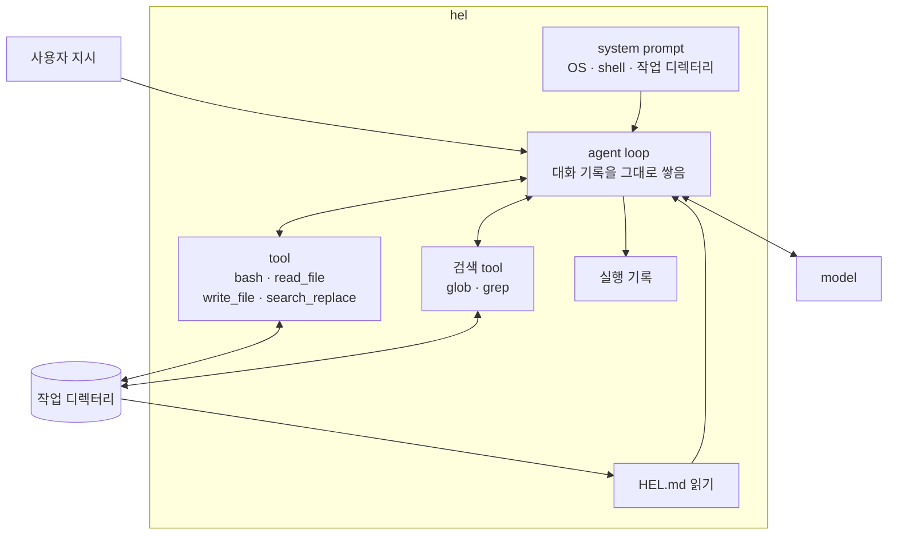
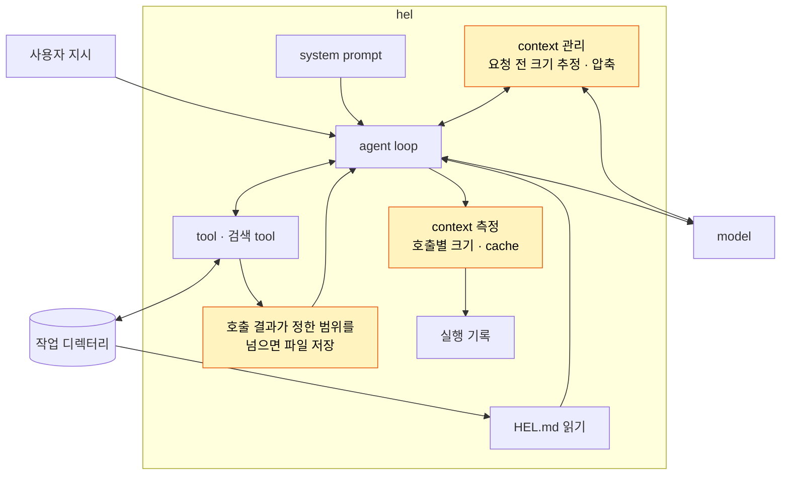

# Part III 개요

> [!NOTE]
> - 시작 상태: [`h05`](https://github.com/jammer-droid/HEL/tree/h05) · 완료 상태: [`h07`](https://github.com/jammer-droid/HEL/tree/h07)
> - 논문: [§9 Memory and Context Management](https://arxiv.org/html/2609.00006v1#S9), [§16.5 Memory and Context](https://arxiv.org/html/2609.00006v1#S16.SS5)

## 현재 구조

[Part II](part2-repository-intelligence.md)를 마친 `hel`의 구조는 다음과 같다.

- harness는 매 호출에 system prompt, tool 정의, 사용자 지시, 지금까지의 대화 기록 전체를 model에게 보낸다. 대화형 모드에서는 입력이 바뀌어도 기록을 이어서 보낸다.
- bash와 파일 읽기 결과는 길이 제한 없이 대화 기록에 들어간다. 검색 tool만 응답 하나에 100건·10,000 bytes 한도가 있다.
- harness는 지금 보내는 요청이 model의 context window(한 번의 호출에서 model이 받을 수 있는 최대 token) 중 얼마를 쓰는지 모른다. 실행 기록에는 호출마다 받은 input token의 합계만 남는다.

## Part II에서 드러난 문제

Part II에서 model은 실행 환경과 저장소 규칙을 미리 받고, 전용 검색 tool로 필요한 코드를 찾을 수 있게 됐다. 하지만 한 번 대화에 들어온 내용은 작업이 끝날 때까지 매 호출에 다시 보내진다.

- [H4 Repository Search](../labs/h04-repository-search/README.md)의 본문 검색 task에서 한 실행은 25,247 bytes의 검색 결과를 받았고, 정답은 맞았지만 전체 input은 29,366 token이었다. 같은 task의 다른 실행은 6,125 token이었다.
- 검색 tool에 응답 한도를 둬도 여러 호출에 걸쳐 쌓이는 크기는 정해지지 않는다([H4 FAQ](../labs/h04-repository-search/faq.md#응답에-한도를-두면-전체-token도-고정되는가)). bash 출력에는 한도가 없다([H1 FAQ](../labs/h01-tool-loop/faq.md#긴-출력은-그대로-model에게-간다)).
- model은 파일을 고친 뒤 결과를 다시 출력해 확인했다([H2 FAQ](../labs/h02-editing/faq.md#확인-단계가-출력-token을-쓴다)). 이 출력도 대화 기록에 남는다.

Lab 환경에서의 task는 몇 번의 호출로 끝나기 때문에 context window에 가까이 가지 않았다. 그러나 실제 작업 환경에서는 대화가 길어지면서 model에게 전달되는 입력 데이터는 점점 커지고, 이에 따라 누적되는 input token 역시 빠르게 증가하게 된다. 또한 입력 데이터가 window를 벗어나면 요청 자체도 실패할 수 있다.

## 논문이 보는 Context

논문은 조사한 모든 agent가 결국 대화가 context window를 넘는 문제를 만난다고 정리한다(§9). 11개 시스템의 방식은 네 갈래다(§9.1).

- **관리하지 않기**: Mini-SWE-Agent는 기록을 줄이지 않고 model의 window에 맡긴다. 재현성과 실행 분석을 위한 선택이다(§9.2).
- **요약**: Aider는 기록이 한도를 넘으면 앞쪽 절반을 요약한다(§9.3).
- **교체 가능한 condenser**: OpenHands는 기록을 줄이는 방식을 바꿔 끼울 수 있게 만들었다(§9.4).
- **한도 기반 compaction(압축)**: Claude Code, Codex, Gemini CLI 등 7개 시스템은 context 사용량이 정해 둔 지점에 닿으면 model에게 대화를 요약하게 하고, 최근 기록 일부를 원문으로 남긴다(§9.5).

압축을 쓰는 시스템은 지금 context를 얼마나 쓰는지 측정을 해야 한다. API가 돌려준 token 수를 쓰기도 하고, 글자 수로 추정하기도 한다. 혹은 큰 tool 출력을 자르거나 파일로 빼서 기록에 들어가는 양 자체를 줄이기도 한다.

논문은 window보다 일정량 아래에서 압축을 시작하고, 최근 기록은 원문으로 남기고, 요약은 이전 요약에 이어 붙이라고 권한다(Recommendation 7).

## 이 Part에서 다룰 것

Codex와 DeepSeek Harness가 context를 어떻게 재고 나누는지, 한도에 가까워지면 무엇을 남기고 버리는지 살펴보고, 그중 한 방식을 `hel`에 직접 만들어 본다. H5에서는 두 harness의 방식을 조사하고 `hel`이 호출마다 context 크기를 기록하게 만든다. H6에서는 조사한 방식을 구현하고, window 한도보다 이른 시점에 압축을 일으켜 그 뒤에도 작업을 이어 갈 수 있는지 확인한다.

| Lab | 질문 | 더하는 구조 |
| --- | --- | --- |
| [H5 Context Budget](../labs/h05-context-budget/README.md) | Codex와 DeepSeek Harness는 context budget을 어떻게 측정·배분하고, 한도에 가까워지면 무엇을 남기고 버리는가? 각 방식의 장단점은 무엇인가? | context 측정(호출별 크기, cache 적용 token) |
| [H6 Compaction](../labs/h06-compaction/README.md) | 기존 작업과 같은 환경에서 compaction을 일찍 일으킨 뒤 이어서 작업하면, 작업은 계속되고 호출마다 cache hit는 다시 올라가는가? | 요청 전 크기 추정, 호출 결과가 정한 크기 범위를 넘으면 파일 저장, 압축(이전 tool 결과 줄이기 · model 요약 · 최근 원문 유지) |

## 이 Part를 마치면

- harness는 호출마다 보낸 context의 크기와 그중 cache가 적용된 token을 기록한다.
- 요청을 보내기 전마다 context 크기를 추정하고, 기준(기본 약 800K token)을 넘으면 압축한다. 이전 tool 결과의 가운데를 잘라 보고, 그래도 넘으면 system 다음의 오래된 구간을 model에게 따로 보내 요약을 받아 바꾼다. 최근 구간은 원문으로 둔다.
- 12,500 token을 넘는 tool 결과는 작업 디렉터리 밖의 임시 파일에 저장하고, model에게는 앞·뒤와 경로만 보낸다.
- 압축으로 바뀐 지점부터는 cache hit에 실패하고, 요약 요청만큼 model 호출이 늘어난다. 작업 디렉터리 밖의 파일을 model에게 읽게 하는 범위는 H7 Permissions와 H8 Sandbox에서 다시 정한다.
