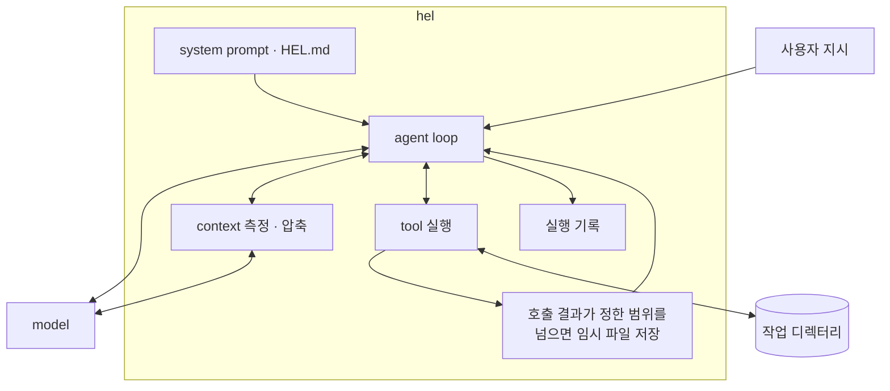
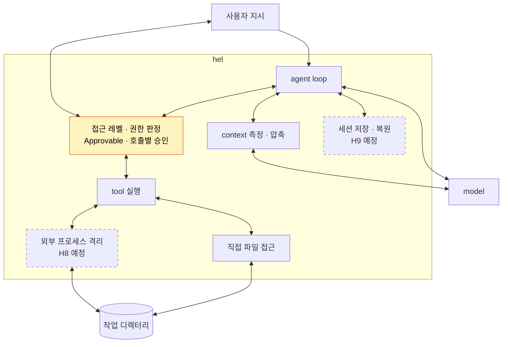

# Part IV 개요

> [!NOTE]
> - 시작 상태: [`h07`](https://github.com/jammer-droid/HEL/tree/h07) · 완료 상태: `h10` *(예정)*
> - 논문: [§10 Safety and Permission Models](https://arxiv.org/html/2609.00006v1#S10), [§16.6 Safety Architecture by Deployment Context](https://arxiv.org/html/2609.00006v1#S16.SS6)

## 현재 구조

[Part III](part3-context.md)를 진행하면서 `hel`은 대화가 길어지면 오래된 내용은 요약하고 최근 기록을 남기는 방식으로 model의 context window를 관리하고 harness에서 장기 기억을 관리할 수 있는 시스템을 갖출 수 있게 됐다.

- harness는 환경 정보, 저장소 규칙, tool 정의와 대화 기록을 model에게 보낸다. 압축한 구간은 요약으로 바뀐다.
- `hel`이 제공하는 전용 tool은 작업 디렉터리 경계를 검사한다. bash는 같은 디렉터리에서 시작하지만 밖으로 이동하거나 다른 경로에 접근할 수 있다.
- tool을 실행하기 전에 사용자 승인을 받는 단계는 없다.

## Part III에서 드러난 문제

[H6](../labs/h06-compaction/README.md)에서 model이 tool을 사용하고 일정 크기를 넘어가는 결과를 반환해야 하는 상황이라면 임시 파일에 저장하고, model에게는 이 경로를 알려주는 작업 방식을 만들었다.

그러나 임시 파일은 작업 디렉터리 밖에 있어 bash로는 읽을 수 있지만, `hel`이 제공하는 읽기 전용 도구인 `read_file`로는 읽지 못한다. 즉, model에게 필요한 접근 범위와 tool이 접근할 수 있는 범위가 서로 어긋나고 있는 상황이다.

또한 대화가 이어지는 동안 실행할 명령과 접근할 파일도 늘어난다. 허용한 명령이 예상하지 않은 파일을 변경하거나 통신할 수도 있고, 실패한 작업을 다시 시작할 때 어떤 대화와 파일 상태를 이어받을지도 정해야 한다.

## 논문이 보는 권한과 실행 환경

논문은 [§10](https://arxiv.org/html/2609.00006v1#S10)에서 실행 전 권한 판단과 OS 수준의 격리를 함께 다룬다. [§16.6](https://arxiv.org/html/2609.00006v1#S16.SS6)은 배포 환경에 따라 승인 정책과 격리를 선택하고, 정책을 별도 데이터로 관리하라고 권한다.

권한 정책으로 model이 요청한 작업을 실행해도 되는지 결정하고, OS 수준의 격리는 실행 중인 프로그램이 접근할 수 있는 파일과 네트워크의 범위를 제한할 수 있다.

## 이 Part에서 다룰 것

실행 전에 권한을 판단하는 단계를 만들고, 실행 환경의 접근 범위와 작업 재개 방법을 차례로 다룬다. Codex와 Claude Code를 참고해 각 단계가 어떻게 연결되는지 참고한다.

| Lab | 질문 | 더하는 구조 |
| --- | --- | --- |
| [H7 Permissions](../labs/h07-permissions/README.md) | 접근 레벨에 따라 미승인·금지 tool 호출을 막을 수 있는가? | 접근 레벨·Approvable·승인 처리 |
| H8 Sandbox | 허용한 실행의 접근 범위를 어떻게 제한할 것인가? | 실행 격리 *(예정)* |
| H9 Sessions & Checkpoints | 중단한 작업을 어떤 상태에서 다시 시작할 것인가? | 세션 저장·복원 *(예정)* |

## 이 Part를 마치면

- 각 tool의 Approvable 구현이 제공하는 호출 정보와 사용자가 선택한 접근 레벨로 실행 여부를 판단한다.
- 외부 프로세스에는 파일·네트워크 접근 범위를 설정한다. 직접 파일을 다루는 tool의 경계 검사와 구분하며, 구체적인 격리 방식은 H8에서 정한다.
- 세션을 저장하고 이어 가는 범위는 H9에서 정한다. 파일 상태를 되돌리는 것과 대화를 복원하는 것을 구분한다.
- 이후 Part V에서는 이 실행 흐름에 외부 tool과 여러 agent를 연결할 때의 경계를 다룬다.
