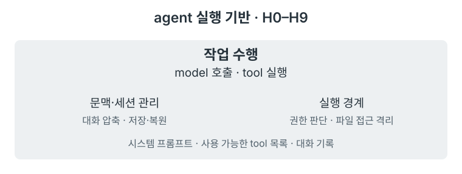
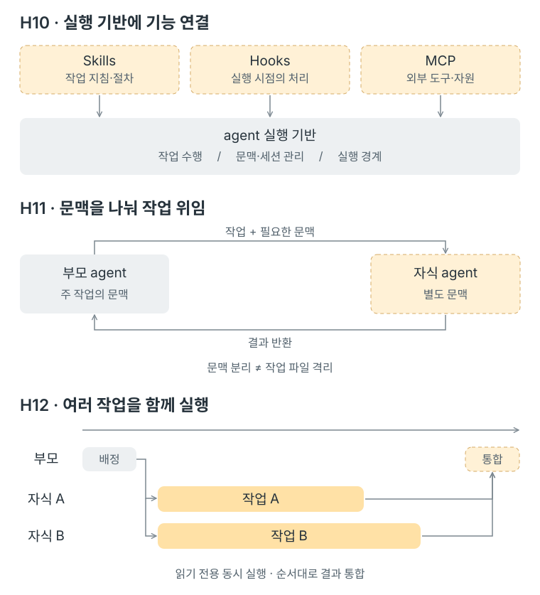

# Part V 개요

> [!NOTE]
> - 시작 상태: [`h10`](https://github.com/jammer-droid/HEL/tree/h10) · 완료 상태: [`h13`](https://github.com/jammer-droid/HEL/tree/h13)
> - 논문: [§12 Extensibility Mechanisms](https://arxiv.org/html/2609.00006v1#S12), [§11 Multi-Agent Orchestration](https://arxiv.org/html/2609.00006v1#S11)

## 현재 구조

[Part IV](part4-safety-runtime.md)까지 진행하면서 `hel`은 tool 실행의 권한과 파일 접근 범위를 확인하고, 종료한 대화를 다시 이어갈 수 있게 됐다. 지금까지 만든 기능을 작업 수행, 문맥·세션 관리, 실행 경계로 묶으면 다음과 같다.

harness는 시스템 프롬프트, 사용 가능한 tool 목록, 대화 기록을 model에게 보낸다. 시스템 프롬프트에는 OS·shell·작업 경로와 `HEL.md`의 내용이 들어간다. 오래된 대화는 요약으로 바꾸고, 답변이 끝나면 세션을 저장한다. model은 이 문맥에서 다음 행동을 선택하고 tool로 필요한 파일을 찾는다.

## Part IV에서 드러난 문제

**같은 실행 경로의 공유.** [H8의 FAQ](../labs/h08-sandbox/faq.md)에서는 여러 `hel` 인스턴스가 같은 프로젝트를 사용하는 문제에 대해 이야기하고 있다. 인스턴스별 임시 저장 공간을 나눠도 프로젝트 파일은 공유되기 때문이다. 두 agent가 같은 파일을 고친다면 각자의 실행 경계를 지키면서도 서로의 변경을 덮어쓸 수 있다.

**작업의 위임.** [H9](../labs/h09-sessions-checkpoints/)에서는 세션의 대화를 저장하고 재개하는 구조를 만들었다. 일부 작업을 다른 agent에게 맡기려면 그 agent에게 어떤 대화를 보여줄지, 어떤 tool과 파일에 접근하게 할지, 작업이 끝나면 어떤 결과를 돌려받을지 정해야 한다.

**기능 확장.** 작업에 필요한 기능을 추가하는 방법도 살펴본다. 프로젝트별 작업 절차를 불러오거나 외부 서비스의 tool을 사용하려면, 기존 실행 흐름에 그런 기능을 연결할 자리가 필요하다.

## 논문이 보는 확장과 작업 위임

논문 [§12](https://arxiv.org/html/2609.00006v1#S12)는 Skills, Hooks, MCP처럼 서로 다른 위치에서 작동하는 확장 방식을 다룬다. Skills는 model이 읽을 작업 지침과 스크립트를 묶고, Hooks는 tool 실행 전후 같은 시점에 처리를 연결한다. MCP는 외부 서버가 제공하는 tool과 자원에 접근하는 통신 규약이다. [§16.8](https://arxiv.org/html/2609.00006v1#S16.SS8)은 작업 절차에는 Skills를, 외부 연동에는 MCP를 활용하도록 권한다.

[§11](https://arxiv.org/html/2609.00006v1#S11)은 작업을 맡긴 뒤 기다리는 순차 위임부터 여러 자식 agent를 동시에 실행하는 구조까지 비교한다. 여기서 작업 위임과 병렬 실행은 구분할 필요가 있다. 개별 문맥에서 작업한 결과를 돌려받는 효과는 한 번에 하나의 자식 agent만 실행해도 살펴볼 수 있다. [§16.7](https://arxiv.org/html/2609.00006v1#S16.SS7)은 병렬로 문맥을 나누는 이점이 분명한 작업을 찾은 뒤 다중 agent 구조를 도입하라고 권한다.

## 이 Part에서 다룰 것

기존 loop에 기능을 연결하는 방법부터 시작해, 일부 작업을 별도 agent에게 맡기고 여러 작업을 함께 실행하는 구조로 넓혀 간다. Codex와 Claude Code를 참고하면서 각 단계에서 필요한 문맥과 실행 경계를 살펴본다.

| Lab | 질문 | 더하는 구조 |
| --- | --- | --- |
| [H10 Skills / Hooks / MCP](../labs/h10-skills-hooks-mcp/) | 핵심 loop를 계속 고치지 않고 기능을 어떻게 확장할 것인가? | 작업 지침 로딩·실행 시점의 확장 지점·외부 tool 연결 |
| [H11 Subagents](../labs/h11-subagents/) | 작업 위임과 별도 문맥은 언제 도움이 되는가? | 자식 agent 생성·문맥 전달·결과 반환 |
| [H12 Parallelism](../labs/h12-parallelism/) | 여러 작업을 동시에 실행하면 작업 완료에 도움이 되는가? | 읽기 전용 tool·자식 agent 동시 실행·요청 순서대로 결과 통합 |

H10에서는 지침을 읽는 것과 실제 코드를 실행하는 것의 차이를 살펴본다. 확장 기능을 연결할 때도 기존 권한 판단과 접근 범위가 어떻게 적용되는지 확인한다.

H11에서는 부모가 넘길 작업과 문맥, 자식이 돌려줄 결과를 다룬다. 문맥을 나누면 부모가 처리할 기록을 줄일 수 있지만, 자식에게 필요한 정보가 빠지거나 같은 파일을 다시 탐색하는 비용이 생길 수 있다.

H12에서는 동시에 진행할 수 있는 작업을 구분하고, 결과를 합치는 과정을 살펴본다. 같은 파일을 고치는 작업을 나누는 방법은 Claude Code와 Codex의 방식으로 살펴본다. 실행 시간과 token 사용량뿐 아니라 작업이 제대로 완료됐는지도 함께 확인한다.

각 Lab의 구체적인 구현 범위와 비교할 작업은 해당 Lab에서 정한다.

## 이 Part를 마치면

기존 실행 기반에 기능을 연결하고, 작업을 나누는 구조를 차례로 더한다.

작업 위임 그림의 작업 전달·결과 반환 관계는 논문 [그림 6](https://arxiv.org/html/2609.00006v1#S11.F6)의 순차 위임 패턴을 재구성했다. 나머지는 이 Part에서 다룰 연결 지점과 실행 흐름을 나타낸다.

- 작업에 맞는 지침과 외부 tool을 기존 실행 흐름에서 사용할 수 있게 한다.
- 자식 agent에게 필요한 문맥을 전달하고, 반환된 결과로 부모의 작업을 이어간다. 대화를 나누는 것과 작업 파일을 나누는 것은 별도로 다룬다.
- 읽기 전용 tool 호출과 자식 agent를 동시에 실행하고, 결과는 요청한 순서대로 합친다. 쓰기 작업의 작업 공간 분리는 구조에 포함하지 않는다. 작업 분담이 주는 이점과 추가 비용은 각 Lab에서 확인한다.

이렇게 더한 구조가 어떤 작업에서 도움이 되는지는 Part VI의 H13 Harness Evaluation에서 모아 평가한다.
