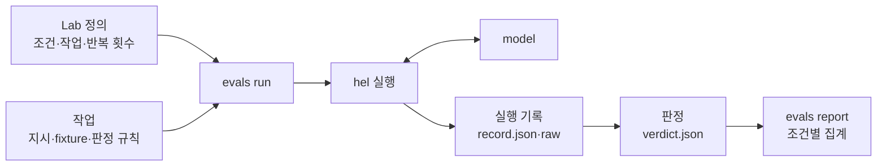
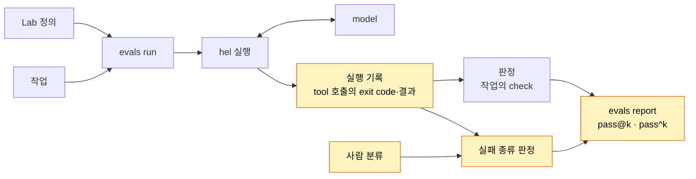

# Part VI 개요

> [!NOTE]
> - 시작 상태: [`h13`](https://github.com/jammer-droid/HEL/tree/h13) · 완료 상태: [`h14`](https://github.com/jammer-droid/HEL/tree/h14)
> - 논문: [§13.4 Trade-off Framework](https://arxiv.org/html/2609.00006v1#S13.SS4), [§15.5 The Scaffold–Capability Frontier](https://arxiv.org/html/2609.00006v1#S15.SS5), [§15.6 Threats to Validity](https://arxiv.org/html/2609.00006v1#S15.SS6), [§17.2 Future Work](https://arxiv.org/html/2609.00006v1#S17.SS2)

## 현재 구조

[Part V](part5-extensibility-orchestration.md)까지 진행하면서 `hel`은 기능을 연결하고, 작업을 자식 agent에게 맡기고, 여러 작업을 동시에 실행할 수 있게 됐다. 각 Lab에서는 기능을 더하기 전과 후의 `hel`에 같은 작업을 맡기고 결과를 비교했다.

지금까지 `hel`을 만들며 기능을 추가하고 기록을 하는 과정은 다음과 같다.

`evals`는 작업마다 새 작업 폴더를 만들고 `hel`을 실행한다. 실행이 끝나면 종료 사유, 최종 답, 입력·출력 token,  model 요청 수, 실행 시간, tool 호출 기록 등을 record에 남긴다.

판정은 작업에 정해 둔 규칙(최종 답의 값, 파일 내용, tool 호출 여부 등)으로 한다. model이 보고한 내용이 실제 실행과 맞는지, 실패한 명령이 정말 실패였는지(출력 형식이 달라 실패하는 경우도 있다.)는 실행 기록을 직접 읽어 판단했다.

## Part V에서 드러난 문제

**작업마다 다른 결과.** [H11](../labs/h11-subagents/)에서 작업을 자식 agent에게 맡기자 입력 token이 2.1~2.5배로 늘었다. 작업이 agent 하나로 충분히 처리할 수 있는 크기였기 때문이다. [H12](../labs/h12-parallelism/)에서는 자식 셋을 동시에 실행하자, 세 모듈을 나눠 조사하는 작업의 실행 시간 중앙값은 18.3초에서 10.9초로 줄었지만 파일 4개를 읽는 작업은 달라지지 않았다. 같은 기능도 어떤 작업을 맡기느냐에 따라 이득과 비용이 달라진다.

**쌓인 평가 항목.** Lab마다 그 기능을 확인하는 작은 작업을 새로 만들었고, 그 범위를 넘는 질문은 FAQ에 남겼다. MCP tool을 처음부터 모두 보낼지 필요할 때 불러올지([H10 FAQ](../labs/h10-skills-hooks-mcp/faq.md)), 자식에게 넘길 정보가 많을 때 어떤 방식이 나은지([H11 FAQ](../labs/h11-subagents/faq.md)), 자식 결과의 형식을 정하면 부모의 재확인이 줄어드는지([H12 FAQ](../labs/h12-parallelism/faq.md)) 같은 질문이다.

**측정 도구의 한계.** 측정 도구 자체가 틀릴 수 있는 지점도 있다. [H3 FAQ](../labs/h03-repository-context/faq.md)에서는 exit code가 0이 아니면 실패로 세는 규칙 때문에, 차이를 찾아 exit 1을 돌려준 `diff`가 실패로 기록됐다. [H10 FAQ](../labs/h10-skills-hooks-mcp/faq.md)에서는 압축 직후 `hel`의 token 추정이 사용 가능한 tool 목록을 세지 않아 실제 입력과 차이가 생겼다.

기능을 하나씩 더할 때는 그 기능만 보면 됐지만, 기능이 많아진 지금은 무엇을 기준으로 harness 전체를 평가하고, 어떤 순서로 고칠지 정해야 한다.

## 논문이 보는 harness 평가

논문은 11개 harness를 실행하지 않고 source code를 읽어 비교한다([§4](https://arxiv.org/html/2609.00006v1#S4), [§15.6](https://arxiv.org/html/2609.00006v1#S15.SS6)). 각 시스템이 공개한 benchmark 성공률은 model과 실행 설정이 달라 서로 비교할 수 없다고 밝히고, 같은 작업을 모든 시스템에 실행하는 비교는 비용 때문에 하지 않았다고 했다.

[§13.4](https://arxiv.org/html/2609.00006v1#S13.SS4)와 [§2.4](https://arxiv.org/html/2609.00006v1#S2.SS4)는 최소한의 harness도 benchmark에서 큰 harness와 비슷한 성공률을 보인다고 지적한다. 또한 harness가 정교해질수록 작업 완료보다 안전, 사용성, 확장성, 복구에 집중한다.

[§15.5](https://arxiv.org/html/2609.00006v1#S15.SS5)는 고정된 작업과 model에서 scaffold가 늘면 성공률이 처음에 빠르게 오르다 평평해진다는 직관을 제시하고, 이를 측정하려면 작업 분포, model, scaffold 복잡도 지표, 목표 성공률을 정해야 한다고 말한다. [§17.2](https://arxiv.org/html/2609.00006v1#S17.SS2)는 정답률과 함께 안전, 사용성, 비용, 확장성을 보는 평가 틀을 앞으로의 과제로 남긴다.

논문에서는 harness를 실제로 실행해서 평가하는 것을 다루지 않았다. 그래서 이번 Part에서는 harness를 직접 제작하는 회사와 개발자가 그 부분을 어떻게 하는지 살펴본다.

## 이 Part에서 다룰 것

harness를 만드는 회사와 개발자가 harness를 어떤 기준으로 평가하고 개선하는지 조사한다. 공개 benchmark가 성공을 어떻게 판정하는지, token·시간·비용을 어떻게 기록하는지, 실행마다 달라지는 결과를 어떻게 다루는지 살펴본다. 그 기준으로 지금까지 쌓인 평가 항목을 정리하고, 하나를 골라 문제 정의, 평가 방식, 계측 방법 순서로 개선한다.

| Lab | 질문 | 더하는 구조 |
| --- | --- | --- |
| [H13 Harness Evaluation](../labs/h13-harness-evaluation/) | harness를 어떤 기준으로 평가하고 개선할 수 있는가? | tool 호출의 실패 기록·실패 종류 판정·일관성 지표 |

쌓인 항목을 모두 다루지는 않는다. 평가 기준을 세우고, 쌓인 항목 중 하나를 골라 그 기준으로 고치는 과정을 기록한다.

## 이 Part를 마치면

- 평가의 구성 요소(task, trial, grader, transcript, outcome)와 실행 흐름에 `evals`를 대응시켜, 무엇을 재고 무엇을 재지 못하는지 정리한다.
- `hel`은 tool 호출마다 bash의 exit code와 실패한 호출의 결과를 기록하고, `evals`가 이 기록으로 실패의 종류를 판정한다. 판정 규칙을 고치면 저장된 기록을 다시 판정할 수 있고, 사람이 분류한 결과와 비교할 수 있다.
- report는 통과한 run 수와 함께 task별 pass@k·pass^k를 보여 준다.
- 실패 종류의 자동 판정은 오류 문구에 의존하므로, 처음 보는 원인은 사람이 기록을 읽어 확인한다. 회귀 확인, 참조 해법, model grader 같은 나머지 평가 항목은 H13 글의 분류 표에 남는다.
